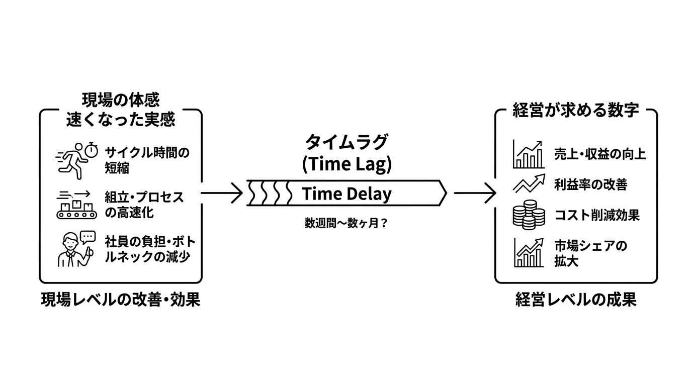
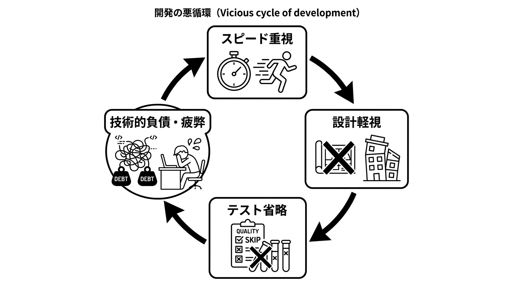

# 第1章 明日までに改善して！と言われる重圧

## 1-1 エンジニアが感じる「開発生産性」という言葉の重圧

### うちの開発って、遅くないか？

午前7時、湊太郎のスマートフォンが振動し、Slackの通知音が鳴った。今日も一日の始まりを、その音で知る。

**#general** チャンネルにはすでに数件のメッセージが届いている。定時後の同僚からの報告、今日の会議のリマインダー、そして昨日の夜中に飛んできた緊急対応のメッセージだ。

「またバグ対応か...」

ベッドから起き上がり、朝の支度をしながら、湊は今日のタスクを頭の中で整理する。昨日から引き続きのバグ修正、新機能の開発、そして来週のリリースに向けた準備。タスクリストを見るとすでに今日だけで10件以上の項目が並んでおり、朝のうちから気が重くなる。

窓際のパキラに水をやり、青々とした葉を眺める。

### 突然の重圧

オフィスに到着しコードエディタを起動する。昨日の作業を続ける準備をしていると、突然Slackの通知音が鳴った。

10:00 AM **田中部長** が **#general** でメンションしてきました

> 湊君、ちょっと話があるから会議室A-1に来て

湊は、何の話かもわからないまま会議室A-1へ向かい、廊下を歩きながら、来月の経営会議の話を部長がしていたのを思い出し、胸に嫌な予感が広がった。

### 「開発生産性が低い」という重い言葉

田中部長はため息をついた。エンジニア出身で管理職歴8年、現場と経営陣の板挟みは慣れたものだが、今日は特に疲れているように見える。

「湊君、率直に聞くけど、うちの開発って遅くないか？」

「遅い...ですか？」

「うん。他社と比べて開発生産性が低いんじゃないかと思ってさ。僕もエンジニアだったからわかるんだけど、経営陣からは『数字を出せ』と言われるんだ。なんとかしてくれないか？」

田中部長の言葉に、湊は返す言葉が出なかった。経営陣から数字を求められているというが、そもそも開発生産性をどう数値化すればいいのか。頭のなかで、プルリクエスト（PR）数やデプロイ頻度といった言葉が浮かんでは消える。それで経営が納得する「数字」になるのか、自分にもわからなかった。

*開発生産性って何？どうやって測るの？何をどう改善すればいいの？経営陣が求めている「数字」と、エンジニアが考える「生産性」は同じものなのか？*

「えーっと...具体的にはどのような指標で測られているんでしょうか？」

「それが問題なんだよ。数字で示せないから経営陣からも『もっと効率化できないのか』って言われるんだ。湊君なら何か良いアイデアがあるんじゃないかと思って」

湊は口を開いても言葉が出てこない。最近開発が思うように進まないことは感じていたが、それを「生産性が低い」と言われても何をどう改善すればいいのかわからなかった。

「申し訳ありません。すぐに改善策を考えてみます」

「頼むよ。来月の経営会議で報告しないといけないから何か具体的な数値で示せるものを準備してくれ」

### 困惑が伝染する

湊は自分の席に戻ると、同僚の山田健一が心配そうに湊を見ており、5名のチームメンバーが座るエリアに足を踏み入れたとたん、他のメンバーも視線を向けてきた。

リーダーになって3ヶ月。こういう話をチームに伝えるのはまだ慣れない。

「どうした？部長に呼ばれたって聞いたけど」

山田の声に他のメンバーも作業の手を止めた。12年のエンジニア経験を持つテックリードの山田はいつも冷静で、湊はその姿を頼もしく思いながら、チーム全員に向き直った。

「みんなちょっと時間もらえる？部長から開発生産性向上について相談を受けたんだ」

チームの若手エンジニア、佐藤が不安そうに聞いた。声が少し震えている。

「開発生産性向上...ですか？また何か問題があったんですか？」

湊は首を横に振り、事情を説明し始めた。

「問題というより、経営陣から開発部全体の生産性について指摘があったらしい。で、部長が僕に何か改善策を考えてほしいって」

「山田さん、開発生産性って何だと思います？」

山田が腕を組み、しばらく天井を見てから口を開く。

「うーん、コード量？リリース頻度？正直、『生産性』の定義は時代とともに変わってきた。昔はコード量だったが、今は...よくわからないな」

山田は少し間を置き、同じ調子で続ける。

「コード量で測れば、無駄なコードを書けば数字は上がる。リリース頻度で測れば、小さな変更を細かくリリースすれば数字は上がる。でも、それって本当に生産性が上がったことになるのか？他社と比較しても意味がないと思うんだよね。自分たちの過去と比べて改善しているかが重要なんじゃないか。そもそも、開発の難しさを一つの数字や特効薬で解消できるなんて話は、昔から現実的じゃないって言われている」

山田も困惑している様子だった。

「僕も同じことを考えていました。確かに最近開発が思うように進まない気がするんですがそれをどう数値化すればいいのか...」

佐藤がディスプレイから目を離して、不満そうに口を開いた。

「でも湊さん、うちのプロダクトって、SaaSだから顧客からの機能追加要望が多いじゃないですか。勤怠管理モジュールだけでも先月3件、経費精算モジュールも4件。それ全部対応しながら新機能も作ってって、正直手一杯ですよ」

佐藤は息をついて、さらに言葉を続ける。

「僕、プロジェクト管理モジュールの改修やってるんですけど仕様がコロコロ変わって...。これ以上スピード上げろって言われても」

湊はチームメンバーの疲れた表情を見て胸が痛んだ。リーダーとしてこの状況をどう改善すればいいのか。それなのに、また自分で決めなければと一人で抱え込もうとしている自分がいる。

### プロジェクトマネージャー（PM）からの緊急案件

その時、Slackの通知音が再び鳴った。今度は飛鳥さくらPMからのメッセージだった。営業出身で3年前にPMに転身した飛鳥からだった。

12:31 PM **飛鳥さくら** が **#project-urgent** でメンションしてきました

> 緊急案件が入りました！来月末リリース必須で相談したいです。
> 
> 詳細は後で共有しますが、とりあえず全員で対応をお願いします。
> この案件は売上に直結する重要な機能なので、絶対に遅れたくないです！

湊の焦りは最高潮に達した。部長からの課題も手つかずのまま、ここに緊急案件が重なる。湊は無意識に椅子の肘掛けを握りしめていた。 

### 湊の決断

チームメンバー全員が湊を見ている。リーダーとしての判断を求められている。

山田が、湊の顔を一瞥してから冷静に口を開いた。

「とりあえず飛鳥さんと話をして現実的なスケジュールを組むしかないんじゃないか？まず詳細を聞かないと判断できない。湊君、焦る気持ちはわかるけど、一つずつ整理していこう」

佐藤が心配そうに言う。

「でも湊さん、今のプロジェクトもあるし本当に来月末なんて間に合うんですか？経費精算モジュールのバグ修正もまだ残ってるんですよね。優先順位どうしますか？」

手がキーボードの上で止まったまま、何度もため息をついている。

湊は深呼吸した。ここで判断しなければならない。

「わかった。まず飛鳥さんと要件を詰めて見積もりを出そう。それからチームで作業分担を相談する。今抱えてるタスクの優先順位も含めて明日の朝イチでミーティングしましょう」

山田が頷く。

「それがいいな。慌てて動いても余計混乱するだけだ」

湊も頷いたが、内心では不安が募るばかりだった。生産性向上という漠然とした課題と、具体的な緊急案件。どちらも重要だが、どう両立すればいいのかわからない。深く息を吸って今日のタスクリストを見直すと、新たに追加された「生産性の可視化と向上の検討」という項目がリストの一番上に赤い文字で書かれており、改めてプレッシャーを感じた。それでも、今は一歩ずつ進むしかない。

### 解説：「開発生産性」という言葉が持つ構造的問題

#### ストーリーで描かれる「重圧」
「開発生産性」という言葉は便利な言葉です。

開発組織に問題があったり開発が遅れたりすると、現場以外のビジネスサイドやエンジニア組織のマネージャーから、そうした言葉が投げかけられることがあります。

なぜ「開発生産性向上」が重圧になるのか。
それは、**「何が問題か」が関係者で共有されていない**ときによく現れる課題だからです。

つまり、経営・事業・PM・開発で、「生産性」で何を見ているか（指標）も、何を問題と感じているかもずれている。この**ずれの構造**が重圧の背景にあります。「生産性」の本質（後述する「約束の信頼性」）を語る前に、「何が問題か」を関係者で揃える段階でつまずいている、という状態です。

- **定義の不在と突然の要求**: 経営層から「開発生産性を上げろ」と言われるが、「開発生産性」の意味が関係者間で共有されていない。エンジニアが見ている指標（プルリクエスト数、デプロイ頻度）と経営層が求めているもの（計画信頼性、予測可能性）が根本的に異なり、具体的に何をどう改善すればいいのかわからない
- **測定方法の不在**: 「数字を出せ」と言われるが、どう数値化すればいいのかわからない。コード行数やリリース頻度では本質を捉えられず、適切な測定方法が見つからない

#### 数値を上げることだけが、開発生産性ではない
その上で、湊が直面した状況は多くのエンジニアが経験する典型的な問題です。

まず前提として、開発生産性の本質を語る上は、開発現場以外から見たときに **「開発組織が『いつまでに何ができるか』と語った約束が、どれだけ信頼できるか」** や **「約束の期間でどのぐらいのクオリティーのモノが完成してくるか」という期待感のズレ**なのです。

つまり、開発組織の速度や件数ではなく、「事業責任者やプロダクトマネージャー（PdM）が『この組織の言葉を信じて意思決定できるか』という **信頼性（Predictability / Reliability）** なのです。
開発組織はPR数やデプロイ頻度を見ていますが、事業責任者やPdMは市場やユーザーの変化に臨機応変に対応しながら「欲しいタイミングで欲しいものが出るか」という計画信頼性を見ています。

ただ単に**数値を定義し、向上させれば良いというだけではありません**。

この指標のずれが、たとえ生産性の数値が改善しているはずなのに「良くなった実感」がないというギャップが生まれる原因です。

例えば、従来の測定方法では開発生産性の本質を捉えられません。

- **コード行数**: 書けば書くほど生産的？でも品質は？
- **リリース頻度**: 速ければ速いほど良い？でもバグは？
- **ストーリーポイント**: チームごとに基準が違う
- **付加価値が提供できた数**: どうやって計測するの？

さらに、マトリクスで表現すればステークホルダーごとに「生産性」の意味が異なります。

- **経営層**: 売上・コスト削減（利益率）への貢献度合い
- **PM**: ユーザー価値・機能完成度・スケジュール遵守・競合優位性
- **エンジニア**: 開発スピード・コード品質・技術的負債・持続可能性

この認識のズレが、湊が感じた「**何をすればいいのかわからない**」という重圧の正体です。

#### 体感と価値のギャップ

また、ここで一つ、押さえておきたい視点があります。**「作業が速くなった」という体感は、そのまま「価値が増えた」ことを意味しません**。
これを**体感と価値のギャップ**といいます。

開発生産性を語るときは、何を「価値」として測るかを関係者で揃えることが欠かせません。
価値は、プロダクトが良くなったか（顧客価値が向上したか）、売上・利益が改善したかといった**最終成果**でしか確定しません。
したがって、現場の「速くなった実感」は先に現れ、経営の求める「数字」や「生産性」はあとからしか見えません。
ソフトウェアに対する機能追加やリファクタリングなどを積み上げた結果、経営の求める「数字」や「生産性」に表れてきますが、それはあとからしか見えません。さらに結果として数字として売上が上がったとしても、それがその期間に開発した機能のおかげなのかマーケティングや営業、市場の流れなのかといった切り分けをしていくのも難しい要因です。
この「先に感じるもの」と「あとで測れるもの」のズレが、体感と価値のギャップそのものです。

#### この状況で最初にすべきこと

こうしたずれを踏まえると、まず手をつけるべきは「開発生産性」という言葉の定義と構造を関係者間で合意することです。次の三つの問いを、関係者で確認することから始めましょう。

- 何のために生産性を向上させるのか？
- どの指標で測定するのか？
- その数値を誰の / 何のために使うのか？

これらを合意することで議論がしやすくなります。

## 1-2 スピード優先がもたらす負のスパイラル

### 仕様も決まらないまま始まった開発

飛鳥からの緊急案件のメッセージから3日が過ぎた。

その間、湊は開発生産性の向上策を考えようとしてみたが、答えは見つからなかった。経営が求める「数字」と、現場が感じる「遅さの理由」が噛み合わない。3日目の午後、ようやく要件定義のミーティングが設定された。

午後2時、急遽開催された要件定義ミーティング。
会議室の窓から差し込む光がホワイトボードを照らし、湊のチーム5名全員とPMの飛鳥がテーブルを囲んでいた。

飛鳥が資料を画面共有しながら早口で説明を始めた。営業出身らしい勢いで話が進む。

「今回の機能はユーザーの行動分析機能です。具体的には...」

山田が資料を見ながら眉をひそめる。

「飛鳥さん、この分析機能って勤怠管理モジュールとの連携が必要ですよね？既存のデータベース構造だと結構大がかりな改修になりそうですが」

飛鳥は資料に目を落とし、少し焦った様子で答える。癖で、スピード重視の判断が出る。上司から「他社がユーザー行動分析機能を最近リリースして好評だ。このまま出遅れたら契約を失いかねない、来月末の大口顧客との商談の前にぜひ欲しい」と詰められたのは昨日のことだ。

「その辺りは後で詳細を詰めるので、とりあえず大枠で進めてください。競合他社に離されないようにしないと。市場を取られたら取り返すのは大変なんです」

佐藤が心配そうに聞く。

「後で詰めるって、いつ頃までに仕様が固まる予定ですか？来月末リリースですよね？」

飛鳥は時計を一瞥してから言う。

「遅くとも2週間後には...」

佐藤が小声で呟く。

「2週間後に仕様確定して、実装とテストで2週間...かなりギリギリですね」

説明を聞きながら湊は違和感を覚えていた。詳細な仕様がまだ決まっていないのに来月末リリースというのは現実的ではないのではないか？

「飛鳥さん、すみません。具体的な仕様についてもう少し詳しく教えていただけますか？特にどのデータをどう分析するのか、そこが決まらないと設計できないです」

飛鳥は手を振るようにして続けた。

「あー、詳細は後で決めるからとりあえず大枠で進めて欲しいです。とにかく早くリリースすることが重要だから」

湊の違和感はさらに強くなった。部長から「開発が遅くないか」と言われた直後だ。ここで「仕様が固まっていないから」と断れば、それも技術スキルの問題だと責められそうで、反論できなかった。チームを守るなら仕様を詰めるべきだとわかっている。それなのに、リーダー3ヶ月目の自分には、PMに強く意見する自信がまだ足りなかった。

「わかりました。大枠で進めさせていただきます」

ミーティング後、会議室を出てチームで打ち合わせをした。廊下には誰もおらず、冷房の音だけが響いている。

山田が厳しい表情で口を開いた。

「湊さん、これ本当に大丈夫ですか？仕様が曖昧すぎますよ」

「わかっています。でも部長からは生産性向上って言われてますし、断れませんでした...」

佐藤が不安そうに聞く。

「どこから手をつければいいんですか？要件定義段階なら修正コストは1倍ですが、実装してからの手戻りは肌感5-10倍になりますよね」

山田が頷く。

「その通りだ。過去のプロジェクトでも、仕様変更1件で平均3日の手戻りが発生した」

湊は決断し、方針を口にした。

「とりあえずダミーデータで動く画面だけ先に作りましょう。仕様が決まってからロジックを実装します。佐藤君と他のメンバーでユーザーインターフェース（UI）の作成、山田さんと僕でデータベース設計の案を複数パターン用意しておきます」

山田が頷く。

「それしかないですね。でも後で大幅な手戻りになる可能性が高いですよ」

「それでも動かないよりはマシです。まず動く画面を形にしないと」

### 仕様変更が止まらない

湊はすぐに開発を開始した。しかし仕様が曖昧なまま進めるのは予想以上に困難で、どのようなデータを取得すべきか、どのような分析結果を表示すべきか、判断に迷う場面が続出する。

開発を始めた最初の1週間は、ダミーデータで動くUIの形が見え始め、チームにも手応えがあった。佐藤が画面の骨組みを仕上げ、山田と湊がデータベース設計の案を並べ、「このままいけば何とかなるかもしれない」という空気が一時、チームを包んだ。

しかし2週目に入った頃から、仕様変更の波が押し寄せ始めた。
そして案の定、連日の仕様変更が次々と発生した。

11:55 AM : **飛鳥さくら** が **#project-urgent** でメッセージを送信

> やっぱり、 ユーザーの滞在時間も分析に含めてください。要求定義に加えました。
> 
> "REQ14 : ユーザーの滞在時間を分析対象とできる"

13:45 PM :**飛鳥さくら** が **#project-urgent** でメッセージを送信

> 一覧表示の部分、CSVでエクスポートする機能も欲しいです！
> 
> "REQ15 : 指定した期間の分析結果を一覧表示・CSVエクスポートする機能"

Slackの通知音が鳴り止まない。湊は作業を中断して次々と送られてくる仕様変更に対応する必要があった。

「また仕様が変わった...」

湊は今日作ったコードを見直し、大幅な修正が必要になることを悟った。せっかく書いたコードの多くが無駄になってしまう。

夜10時のオフィス。天井の照明だけがついたフロアに、湊のチーム5名全員がそれぞれのデスクで作業を続けている。キーボードを叩く音が時折響く以外は静かだ。

佐藤が疲れた声で口を開いた。

「湊さん、経費精算モジュールとの連携部分、また仕様変わったんですけど...UIの配置も、さっきのSlackで変更指示が来ました」

佐藤は息をついて続ける。

「今月の残業時間、もう50時間超えてます...」

山田も疲れた表情で言う。

「僕も45時間。このペースじゃ持たない。新機能追加に3日かかってたのが今は1週間かかるし、バグ修正のたびに別の場所が壊れる」

他のメンバーも頭を抱えている。

深夜12時過ぎ、湊は帰宅した。玄関を開けるとリビングのテーブルに昨日のビール缶が2本残っており、冷蔵庫から新しいビールを取り出し一気に飲み干した。

水をやる気力も残っていない。

---

翌朝のオフィス。

まだ人がまばらな時間帯に湊が出社すると、山田がすでに席についていた。湊が「昨日の仕様変更で、数日かけて書いたコードがほぼやり直しだ…」と呟くと、山田が振り返った。

「技術的負債も溜まっていく一方だな...」

山田の表情は疲れ切っている。

「新機能を追加するたびに既存のコードが複雑になっていく。スピードを優先して単体テストすら疎かになっているから、変更の影響範囲がわからない。一箇所を修正したら、どこまで影響するか予測できない。だから、予想外の場所でエラーが出る」

その時、QA部（品質保証）の高橋美咲が開発チームのエリアにやってきた。QA経験3年の高橋は、細かいところまで気を配ってくれる。

「湊さん、ちょっといいですか？」

高橋の顔には明らかな疲労の色が浮かんでいた。彼女は少し息をついてから口を開く。

「正直、テスト時間が全然足りないんです。このままじゃまずいですよ。私、バグのあるプロダクトをユーザーに届けたくないんです」

高橋は同じ調子で続ける。

「仕様変更や追加が週に3-5回で、テストケースも毎回見直さないといけない。でもリリース日は変わらないから検証時間がどんどん削られていく」

湊は申し訳なさそうな表情になる。

「すみません、仕様変更が多くて...」

山田が横から口を開いた。

「QA部にも相当な負担かけてるな。高橋さんたちも他のプロジェクトあるだろうに」

高橋は首を横に振る。

「湊さんのせいじゃないよ。でもこのままだと品質が心配...正直、十分なテストができる自信がない」

湊は深く頭を下げ、「本当に申し訳ないです」とだけ言った。

湊は疑問に思った。確かにコードを書くスピードは速くしたいが、その分品質を犠牲にしているのではないか。出力量やリリース数だけを追いかけると、かえって長時間労働や手戻りが増して、全体としての生産性は落ちる。そんな指摘が、以前目にしたレポートのなかにあったことを思い出した。

深夜2時、湊はコンビニ弁当を食べながらコードエディタの画面を見つめていた。今日だけで仕様変更が2回もあった。そのたびに書いたコードを修正し、テストケースを見直しドキュメントを更新する必要があった。

帰宅するとテーブルには今日のビール缶が3本追加されていた。昨日の2本と合わせて5本。
空き缶の山が自分の疲弊を物語っている。

*（みんな残業をして生産量を上げている。本当に生産性向上なのだろうか？）*

### 人手を足して間に合わせる、という話

リリースまで残り1週間。まだ仕様変更が止まらない中、湊は飛鳥に相談した。リリース日を少しだけ先に延ばせないか、品質を詰める時間が欲しいと。

飛鳥は困った顔で首を横に振った。

「営業がもう顧客に『来月末でリリースします』って案内しちゃってるんだ。今から変えられないよ。
その代わり、人手を足して間に合わせる話を田中部長がしているみたい」

湊はそれ以上、言い出せなかった。
遅れたプロジェクトに人を追加すると、かえって遅くなるという『人月の神話』について書かれた記事で読んだような話を、湊は思い出していた。

### リリース後の悪夢

数週間が経ち、湊は早めにオフィスに到着し、QA部のテスト結果を見ながらリリースの準備を整えようとしていた。しかしテスト結果を見て、湊の顔が青ざめた。

高橋が慌てて湊のところにやってきた。足早に近づく音が、静まり返ったオフィスに響く。

「湊さん、大変です。今回クリティカルが3件、その他含めて15件ありました」

湊はテスト結果を確認した。確かにユーザー登録機能でエラーが発生するバグ、データ分析結果が正しく表示されないバグ、そして画面が固まるバグなど、深刻な問題が複数あった。

その時、飛鳥が慌ててやってきた。資料を抱えたまま、息を切らしている。

「今週末、リリースしないと間に合わない！なんとかして！」

飛鳥の表情は必死だ。

「でもこのバグは修正に時間がかかりそうです...」

「致命的なバグだけ修正して他は後回しにできない？」

湊は迷った。確かに一部のバグは致命的ではないかもしれない。でもユーザーに影響を与える可能性があるバグをそのままリリースするのは責任として重い。

「このバグは致命的じゃないから...リリースしよう」

湊は苦渋の決断を下した。部長からのプレッシャー、飛鳥からの要請、そしてチーム全体の疲労を考えると、完璧を求めている余裕はなかった。

できるだけの修正を行い、リリースは予定の日付通り実行された。湊は祈るような気持ちで、ユーザーからの反応を待った。

リリース後30分、サポートチームから緊急連絡が入った。

「ユーザーからエラー報告が殺到しています！リリース後30分で、すでに20件以上のエラー報告が入っています。ログインできない、データが表示されない、画面が固まるなどの報告が多数入っています！」

湊は動けなくなった。リリース後、30分で20件以上のエラー報告。通常ならリリース後1週間で数件程度のバグ報告があるだけだったのに、今回は30分で20件。数字が頭のなかで反復され、異常な事態だという実感だけがのしかかる。

サポートチームのリーダーが続ける。

「特に、ログイン機能のエラーが深刻です。問い合わせ内容の7割が特定のデバイスからログインできないという状況です。データ分析機能も、結果が正しく表示されないという報告が5件以上入っています。」

湊は画面を見つめた。エラーログには、次々と新しいエラーが記録されていく。1分ごとに、新しいエラーが発生している。止めようとしても、波のように押し寄せてくる。湊は画面から目を逸らし、天井を仰いだ。

--- 

湊は急いで障害対応を開始した。しかし、修正したコードが他の部分に影響を与え新たなバグを生み出している可能性もあり、チーム全体がパニック状態になった。

「どうしよう...」

湊は絶望的な気持ちになった。生産性という名の開発スピードを上げようとして結果的に品質を下げ、ユーザーに迷惑をかけてしまった。これでは本末転倒だ。

### 解説：スピード重視の技術的背景と問題点

#### ストーリーで描かれる「重圧」

湊はなぜ、飛鳥の「とりあえず大枠で進めて」に反論できなかったのか。そして、結果として品質を犠牲にしてしまったのか。

その背景には、スピード優先という重圧があります。

- **「とにかく早く」という圧力**: PMや経営層から「競合に後れを取る前にリリースしろ」という圧力がかかり、仕様が曖昧なまま開発を進めざるを得ない。要件定義の時間を十分に確保できない
- **仕様変更の連鎖反応**: 詳細が決まらないまま開発を開始するため、仕様変更が週に3-5回発生し、手戻りが続く。要件定義段階なら修正コストは1倍だが、実装段階では5-10倍になる
- **負のスパイラルの形成**: 急いだ実装の後にバグが発生し、修正工数が増え、さらなるスピード重視へとつながる悪循環が生まれている。短期的にスピードが上がっても、長期的には品質の低下により開発速度が大幅に低下する
- **技術的負債の蓄積が始まる**: 急いだ実装によりコードが複雑化し始めている。新機能追加に3日かかっていたのが1週間かかるようになり、バグ修正のたびに別の場所が壊れる状態になっている
- **チーム疲弊の兆候**: 残業が常態化（月40-60時間）し、残業で工数をカバーするようになる
- **逼迫する中での人員追加**: スケジュールが逼迫するなかで人を追加する判断はよくあるが新しい人がワークするまで時間がかかるケースも多い

スピード重視が負のスパイラルを生んでおり、本質に目が向く前に悪化が続いている、という構造です。

#### なぜスピード重視が負のスパイラルを生むのか

スピード重視の開発で起こる典型的な問題

- **設計の軽視**: 十分な設計時間を取らずに実装を開始
- **テストの省略**: 品質保証の時間が削減される
- **技術的負債の蓄積**: 急いだ実装がコードの複雑化を招く
- **チームの疲弊**: 長時間労働が判断力とモチベーションを低下させる

これらが連鎖することで、仕様変更の後に急いだ実装が続き、バグ発生と修正工数増加を経て、さらなるスピード重視へとつながる「負のスパイラル」が形成されます。

「品質とスピードはトレードオフ」と言われますが、短期的にスピードが上がっても、長期的には品質の低下により開発速度が大幅に低下します。

開発者生産性の研究では、生産性は単一指標では測れないことが繰り返し指摘されています。
たとえば、「SPACE」というフレームワークでは、開発者生産性を満足度（Satisfaction）・パフォーマンス・活動量（Activity）・コミュニケーション・効率（Efficiency）の多次元で扱うべきだとし、活動量だけを増やすと長時間労働や悪いシステムの力技でかえって悪化しうると警告しています。コード量やリリース数に偏った測定は、実態を過大評価したり歪めたりするおそれがあります。

#### 遅れたプロジェクトに人を追加すると逆効果になりうる（ブルックスの法則）

ストーリーでは、飛鳥が「人手を足して間に合わせる話を部長がしているみたい」と語っています。しかし、遅れているソフトウェアプロジェクトに人員を追加すると、かえってさらに遅くなる——という指摘が、フレデリック・ブルックスの『人月の神話』にはあります（いわゆる**ブルックスの法則**）。理由としては、新メンバーのオンボーディングに既存メンバーの時間が割かれ、コミュニケーション・調整コストが増大すること、そして設計や仕様の理解など「分割しにくい仕事」は人数を増やしても並列化できないことが挙げられます。スケジュールが逼迫しているときに「人を足せば何とかなる」と判断しがちですが、現場の負荷や手戻りが増すだけになりかねません。

#### ではどうするか。人を足す以外の選択肢と解決の流れ

では、遅れや負のスパイラルに対して、人を足す以外に何ができるでしょうか。1-2の文脈（仕様が固まらないまま着手、仕様変更多発、リリース日固定）を踏まえると、次のような選択肢があります。

- **スコープの見直し**（今回のリリースに含める機能を切り出し、範囲を明確にする）
- **リリース日の調整**（顧客・営業と「品質を確保するにはいつなら現実的か」を再議論する）
- **仕様を固めてから着手する**（「大枠で進める」をやめ、要件定義を一段落つけてから実装に入る）
- **品質とスピードのトレードオフを関係者で明示する**（「この日程ならこの範囲・この品質」を合意する）

などがあります。まずは「何を、いつまでに、どの品質で届けるか」を関係者で揃え、そのうえでスコープか日程か品質のどれを動かすかを決める流れが有効です。具体的な進め方は第2章以降で扱います。

## 1-3 「このままで無理だ」という気づき

リリース後の混乱のなかで、湊はようやく根本を問い直し始めていた。

### 徹夜の対応、限界を超えたチーム

リリース翌日の朝、湊のチーム全員が徹夜で障害対応を行っていた。窓の外はすでに明るいが、オフィスにはモニターの光だけが浮かび、ユーザーからの報告は相変わらず多く、チーム全体が対応に追われている。

山田が、画面から目を離して疲れた声で口を開いた。

「湊さん、データベースの接続エラーはこっちで対応しています。でも根本原因がまだ特定できていません。エラーログを見ると、接続タイムアウトが頻発しているんですが、なぜタイムアウトが起きているのか、まだわからないんです」

佐藤がパニックになっている。

「ログイン画面のエラー、原因わかりません...。コードを見直しても、どこがおかしいのかわからない。急いで書いたコードだから、どこに問題があるのか特定するのに時間がかかって...」

佐藤の声は震えていた。湊は佐藤の様子を見て、心配になる。

山田が、佐藤の様子を一瞥してから助け船を出した。

「佐藤君、そっちは僕が見ます。君は経費精算モジュールのバグ対応に集中して。無理しすぎないで」

山田は佐藤の肩を軽く叩いたが、佐藤はその手を振り払う。

「大丈夫です。自分でなんとかします」

その時、QA部の高橋が開発エリアに駆け込んできた。高橋の顔は青ざめている。

「湊さん、また新しいエラーが報告されました。今度は勤怠管理モジュールです。ユーザーから『勤怠データが表示されない』という報告が10件以上入っています」

「ありがとうございます。すぐに確認します」

湊はログを確認しエラーの原因を特定しようとしていた。しかし急いで修正したコードが複雑になりすぎて、どこに問題があるのか特定するのに時間がかかった。

山田が湊の隣に来て小声で口を開いた。

「湊さん、チームのみんなもう限界ですよ。佐藤なんか昨日から一睡もしてません。高橋さんも、徹夜でバグ報告を整理しています。このままでは、チームが崩壊してしまいます」

湊は周りを見渡した。確かにチーム全員の顔に疲労の色が濃い。佐藤は画面を見つめながら何度も頭を抱えている。高橋は報告書を書きながら時々涙を拭いている。山田もコーヒーを何杯も飲んでいるが、疲労は隠せない。リーダーとして、ここで何かしなければ。

「わかりました。優先順位をつけましょう。致命的なバグから順に対応します。それ以外は一旦ペンディングにして、みんな順番に仮眠を取りましょう」

### 部長からの追及

午後3時、田中部長から呼び出しがあった。部長室のドアをノックし、湊は重い足取りで中に入った。

「湊君、昨日のトラブルはどういうことだ？」

田中部長の表情は厳しい。経営陣からの追及を受けたのだろう。管理職としての板挟みの苦しさが、その表情から伝わってくる。

「申し訳ありません。バグの修正が不十分でした」

「生産性の話をしたばっかりなのに、これじゃ逆効果じゃないか。ユーザーからのクレームも来ているし、サポートチームも対応に追われていて全体的に工数が増えている」

湊は返答に困った。確かに生産性向上を求められて、結果的に大きな問題を引き起こしてしまった。

「とりあえず今回の件の報告書を作成してくれ。経営陣への説明も必要になる。それと改善策も考えてみてくれ」

改善策を考えることはできる。でも、その改善策がどれだけの効果をもたらすのか、投資対効果（ROI）やコスト削減効果を経営が使う用語で説明する方法が、湊にはわからなかった。

「はい、承知いたしました。改善策を考えてみます」

湊は答えたが、内心では不安が残った。改善策を提案しても「投資対効果がわからない」と却下されるのではないか。エンジニアと経営層の間には、お金の話ができる共通言語がない。そう思いながら、湊は深々と頭を下げた。

### 山田からの温かい言葉

席に戻ると、山田が話しかけてくれた。

「どうだった？」

「報告書を書くことになりました。それと...今回の件はチームのみんなには本当に申し訳ないことをしました」

山田は少し黙ってから湊の肩を叩く。

「湊くん、あなたのせいじゃないですよ。でも、このままじゃチームが持たないのは確かです」

### 一人の夜、枯れかけたパキラ

夜10時、オフィスには湊一人が残っていた。他のメンバーは疲労困憊で帰宅し、湊は報告書の作成を続けている。佐藤は最後まで残ろうとしたが湊が無理やり帰らせた。リーダーとしてこれ以上メンバーを巻き込むわけにはいかない。また一人で抱え込もうとしている。リーダー3ヶ月目の自分には、まだチームに頼る勇気が足りない。

結局、湊は深夜0時過ぎに帰宅した。リビングに目をやると窓際のパキラの葉が茶色く枯れかけていた。水をやったのはいつだっただろう。

「ああ...」

湊は枯れかけたパキラの前で立ち止まった。水をやるのを忘れていたのは、自分がオフィスに縛りつけられていた日々と重なる。葉の端から広がる茶色は、今の自分に重なって見えた。チームのみんなも同じように疲弊している。このままでは本当に持続不可能だ。

*「そもそも開発生産性って何なんだろう？」*

改めて、湊は手を止めて考えてみる。

- コードを書くスピードが速いこと？
- リリース頻度が高いこと？
- バグが少ないこと？
- ユーザーに価値を提供できること？

湊はノートに走り書きした。測ってるものが立場や視点によって違う。

*スピードだけを追求しても、結果的に品質が下がり、ユーザーに迷惑をかけてしまう。それでは本当の意味での生産性向上にはならない。ビジネス要求とエンジニアリングの優先度のずれをどう埋めればいいのか。*

湊はノートに書き出した。

**今回の失敗から学んだこと**
1. 仕様が曖昧なまま開発を進めることの危険性
2. スピードと品質のバランスの重要性
3. チーム全体の疲労が品質に与える影響
4. 技術的負債の蓄積が将来の開発速度に与える影響

湊は深く考え込んだ。スピードと品質を両立するにはどうすればいいのか。部長からは生産性向上を求められている。でも今回のような失敗を繰り返すわけにはいかない。このままでは持続不可能だ。何か根本的な解決策が必要だ。

湊は決意を新たにした。明日から開発生産性についてもっと深く学んでみよう。そしてチーム全体で話し合い本当の意味での生産性向上とは何かを探ってみよう。

*一人で抱え込むのではなくみんなで考えてみる必要がある。*

まだ若いリーダーだが、今回の失敗から学ぶことは多い。山田の12年の経験、高橋の品質への責任感、チーム全員の力を借りれば、きっと道は開ける。

湊は最後にノートに一行書き加えた。

**明日やること**
- 開発生産性について多角的な視点で調べる
- 山田さんに相談する
- チーム全体で話し合う機会を作る

翌朝、湊はチームメンバー全員にSlackでメッセージを送った。

> おはようございます。昨日は本当にお疲れ様でした。
> 
> 今日の午後、チームミーティングを開きたいと思います。
> 今回の件を踏まえて、これからの開発の進め方について
> みんなで話し合いたいです。
> 
> 一人ひとりの意見を聞かせてください。

山田からすぐに返信が来た。

> 了解。必要なことだと思う。

佐藤や他のメンバーからも賛同のリアクションが返ってきた。

湊は少し希望を感じた。チーム全体で考えれば何か道が開けるかもしれない。

湊がノートに書き出した「今回の失敗から学んだこと」は、落とし穴を書き出したメモのたたきになった。

### 解説：持続可能な開発への転換点

#### ストーリーで描かれる「重圧」

リリース後30分で、20件のエラー報告。この数字が意味するのは、速度と品質のどちらかを選ぶという問いが、そもそも間違っていたということです。

- **リリース後の惨状**: リリース後30分で20件以上のエラー報告が殺到し、チーム全員が徹夜で障害対応を行う。リリース後のバグ修正コストは開発時の数倍になり、本来の開発が完全に停止してしまう
- **改善への障壁**: 改善提案をしても「ROIがわからない」と却下される。エンジニアと経営層の間で、お金の話ができる共通言語がない。効果測定方法が確立されていないため、説得力のある説明ができない
- **転換点への気づき**: 「そもそも開発生産性って何なんだろう」という根本的な疑問が生まれ、問題の本質を理解する必要性を感じ始めている。一人で抱え込むのではなく、チーム全体で考えてみる必要があることに気づき始めている

持続可能な開発を進めるには、開発生産性を考える際にソフトウェアの複雑性を理解し、技術を手段として適切な場所に適用していくことが欠かせません。

#### ソフトウェアは複雑だ
また、ソフトウェア開発の構造的な**複雑性**にも着目が必要です。
ソフトウェア工学の古典である フレデリック・ブルックス の「No Silver Bullet（銀の弾丸はない）」や「The Mythical Man-Month（人月の神話）」では、ソフトウェアの困難さは「本質的複雑性」と「偶有的複雑性」に分かれるとされています。本質的作業とは頭のなかで概念構造体を作ること、偶有的作業とはそれをプログラミング言語で表現し、メモリやスピードの制約内で実装に写像する過程のこと、とブルックスは述べています。

**本質的複雑性**は、解こうとしている問題そのものが持つ、避けられない複雑さです。ビジネスロジックやドメインのルールに現れるような、問題そのものに内在する複雑さで手段としての技術では解消できず、一つの指標で表しきれません。例えば、業務上のルールやドメインの制約が挙げられます。

- 複雑性（本質的に多くの状態をもつ。要素が増えるほど相互作用が非線形に増大する）
- 適合性（自然科学と違い、既存の制度や慣習への適合）
- 可変性（ソフトウェアはハードウェアと比べて変更が多い）
- 不可視性（目に見えず、図示が難しい）

という4つに整理できる「本質的複雑性の四騎士」という考え方もあります。これらに効く本質的な「**銀の弾丸はない**」とブルックスは言っています。

**偶有的複雑性**は、解決方法や設計・実装の選択に起因し、本質的問題に付随する複雑さです。例えば、技術的負債、不適切なツール選択、実装の手間、バグ、パフォーマンス問題のほか、負債化したコードやツール・アーキテクチャの選び方などが挙げられます。
本質的複雑性と違い、これらは適切な選択やリファクタリングである程度**回避可能**です。
技術で削減しやすく、開発AIエージェントもここを高速化しやすい領域といえます。

整理すると次のように対比できます。

|  | 本質的複雑性 | 偶有的複雑性 |
|--|--|--|
| **由来** | 解くべき課題の性質そのもの | やり方・設計・実装の選び方に起因する |
| **主な作業** | 概念モデルを頭のなかで組み立てる | コードやシステムに落とし込む過程 |
| **減らせるか** | 取り除くことができない | 設計の見直しやリファクタで一定程度減らせる |
| **例** | 業務上のルール、ドメインの制約 | 負債化したコード、ツールやアーキテクチャの選び方 |

重要なのは、偶有的複雑性は本質的複雑性に「**付随**」するという関係です。
解こうとしている問題（本質）のとらえ方や切り出し方が不十分だと、実装まわりに余計な複雑さが増えやすくなります。逆に、本質的な問題を適切に狭めたり整理したりできていると、付随する偶有的複雑性も抑えやすくなります。

つまり、開発生産性の文脈で考えていくと、**本質的な複雑性にきちんと向き合う**ことは、付随する偶有的な複雑さを増やさないようにするだけでなく、実装の手間や手戻りを減らすことにもつながり、結果として開発生産性の向上に寄与していくということです。

一方、本質をほったらかしにしてツールの導入やリファクタだけに手を入れても、根本の複雑さは残ったままなので、生産性向上には限界があります。そのため、開発生産性を語るときは、本質的な複雑さと偶有的な複雑さのどちらに手を入れているかを意識し、一つの指標や手法で両方を一挙に解消できるとは考えない方がよい、という洞察が今でも有効です。

こうしたソフトウェア開発の複雑さ一つとっても、開発計画が遅れることは単なる能力不足ではなく、構造的に説明可能な情報が関係者間で欠けているかもしれません。

この重圧の背景には、**持続不可能な開発がもたらす構造的な問題が顕在化し、「どう変えるべきか」を考える転換点に到達している**という状況があります。問題が顕在化し、悪化を経験したうえで、ようやく変え方を考え始めているのです。一つの特効薬に頼らず、関係者で定義と測定を合わせ、説明可能な情報を整えていくことが求められます。

---

## 章のまとめ

本章では湊太郎が「開発生産性向上」という重圧に直面した経験を描きました。「開発生産性」の意味が関係者間で共有されないまま、スピードを重視した結果、品質を犠牲にし、チームを疲弊させてしまう流れが描かれています。

### 学んだポイント

1. **定義の不在**: 「開発生産性」の意味が経営層・PM・エンジニアで共有されておらず、何を測るかも合意されていない
2. **本質は信頼性**: 生産性の本質は「開発組織の約束（いつまでに何ができるか）がどれだけ信頼できるか」であり、PR数・デプロイ頻度だけでは事業側の信頼性は測れない
3. **本当の問題**: 遅れること自体ではなく、「なぜ遅れたのか」「次はどう変わるのか」を説明できないことが問題です
4. **スピードと品質・チーム**: スピードだけを追求すると品質低下と負のスパイラルにつながり、チーム疲弊や技術的負債の蓄積を招く

### 次章への展望

湊は今回の失敗を通じて開発生産性について根本的に考え直す必要性を感じました。次の章では湊が「そもそも開発生産性とは何か」という疑問に向き合い、関係者間で定義と測定を合わせ、説明可能性を高めていくために、多角的な視点から生産性を理解していく過程を描きます。

一人で抱え込まずチーム全体で問題を共有し段階的に改善していく。次の章でその過程を追う。

---

## 参考文献

- フレデリック・ブルックス, "No Silver Bullet — Essence and Accidents of Software Engineering"
- ブルックス, "The Mythical Man-Month: Essays on Software Engineering" (1975/1995). 書籍（Addison-Wesley）
- Forsgren, N. et al. "The SPACE of Developer Productivity." ACM Queue, 2021. 開発者生産性を Satisfaction / Performance / Activity / Communication / Efficiency の多次元で扱う枠組み。活動量だけの増加は長時間労働や悪いシステムの力技で悪化しうると警告。
- DORA（DevOps Research and Assessment）. DORA metrics guide. https://dora.dev/guides/dora-metrics/ スピードと安定性の対でフローを捉える指標。

---

## 手法1 開発生産性の危険な落とし穴チェックリスト

湊の経験を通じて明らかになった、開発生産性向上の際に陥りがちな落とし穴をチェックリストとして整理しました。これらの項目に当てはまるものがないか確認してみましょう。

### チェック項目

#### 1. 定義・認識・説明可能性に関する落とし穴
- [ ] 関係者間で「開発生産性」の定義が合意されていない
- [ ] 経営層・PMと開発組織で、重視している指標（例: 計画信頼性 vs PR数・デプロイ頻度）がずれている
- [ ] 「なぜ遅れたのか」「次はどう変わるのか」を説明するための情報が整っていない
- [ ] 開発の遅れやコストを、経営層とエンジニアが話す共通言語がない

#### 2. 要件定義・仕様管理に関する落とし穴
- [ ] 仕様が曖昧なまま開発を開始している
- [ ] 仕様変更が頻繁に発生し、開発計画が狂っている
- [ ] 仕様変更の影響範囲を十分に検討していない
- [ ] ステークホルダー間で仕様の認識が一致していない
- [ ] 仕様書が古くなり、実際の実装と乖離している

#### 3. スケジュール・工数管理に関する落とし穴
- [ ] テスト工数を十分に見積もっていない
- [ ] バグ修正の工数を見積もりに含めていない
- [ ] 技術的負債の返済時間を確保していない
- [ ] 緊急対応のためのバッファ時間がない
- [ ] チームメンバーの疲労度を考慮していない

#### 4. 品質管理に関する落とし穴
- [ ] スピードを優先して品質を犠牲にしている
- [ ] テストケースが不十分で、バグを見逃している
- [ ] コードレビューの時間が確保できていない
- [ ] 技術的負債が蓄積し続けている
- [ ] リリース後の障害対応に追われている

#### 5. チーム運営に関する落とし穴
- [ ] チームメンバーが疲弊している
- [ ] 残業が常態化している
- [ ] メンバー間のコミュニケーションが不足している
- [ ] 責任の所在が不明確で、問題が放置されている
- [ ] チーム全体のモチベーションが低下している

#### 6. 指標・評価に関する落とし穴
- [ ] コード行数やリリース頻度だけで生産性を測っている
- [ ] 短期的な指標に偏重している
- [ ] 品質やユーザー満足度を考慮していない
- [ ] 技術的負債の影響を数値化していない
- [ ] チームの成長や学習時間を評価に含めていない
- [ ] 事業責任者・PdMが求める「計画信頼性・予測可能性」を測定・共有していない
- [ ] 開発組織の内部指標（PR数など）の改善が、事業側の「良くなった実感」に結びついていない

### チェック結果の見方

**0〜6個**: 比較的良好な状態です。現在の取り組みを継続しつつ、改善の余地がある項目に取り組んでみてください。

**7〜12個**: 注意が必要な状態です。特に深刻な項目から優先的に対策を検討することをお勧めします。

**13個以上**: 危険な状態です。早急にチーム全体で問題を共有し、根本的な改善に取り組む必要があります。

### 改善のヒント

1. **定義と測定の合意**: 関係者間で「開発生産性」の定義と、何をどう測るかを合意する。事業側が求める計画信頼性と、開発組織の内部指標の違いを明らかにし、「なぜ遅れたか」「次はどう変わるか」を説明できる情報を整える
2. **仕様管理の改善**: 要件定義の時間を十分に確保しステークホルダー間での合意形成を図る
3. **工数見積もりの精度向上**: 過去の実績データを活用しテストやバグ修正の工数も含める
4. **品質の可視化**: バグ発生率、テストカバレッジ、コードの複雑度などの指標を定期的に確認する
5. **チームの健康管理**: 残業時間の上限設定、定期的な振り返り、メンバーの声を聞く機会の確保
6. **多面的な評価**: スピードだけでなく品質、ユーザー満足度、チームの成長も含めた総合的な評価

### 次のステップ

このチェックリストで問題が発見された場合、次の章では湊がこれらの問題にどう取り組んだかを学べます。関係者間で定義を合わせながら、一人で抱え込まずチーム全体で問題を共有し段階的に改善していきます。