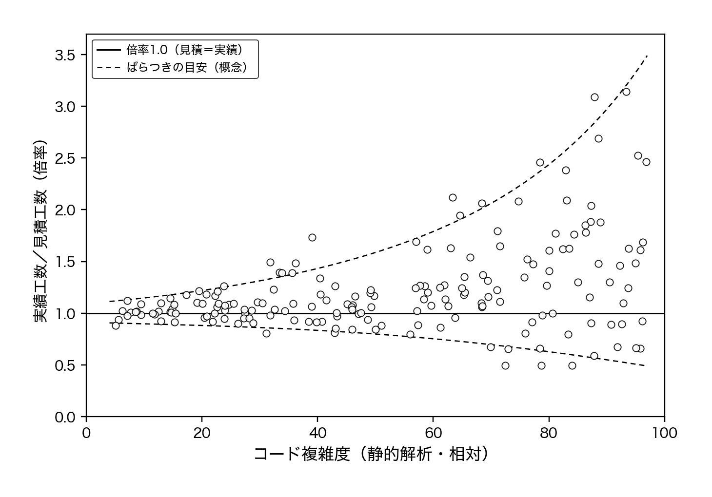
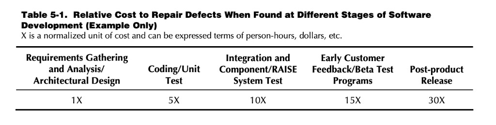
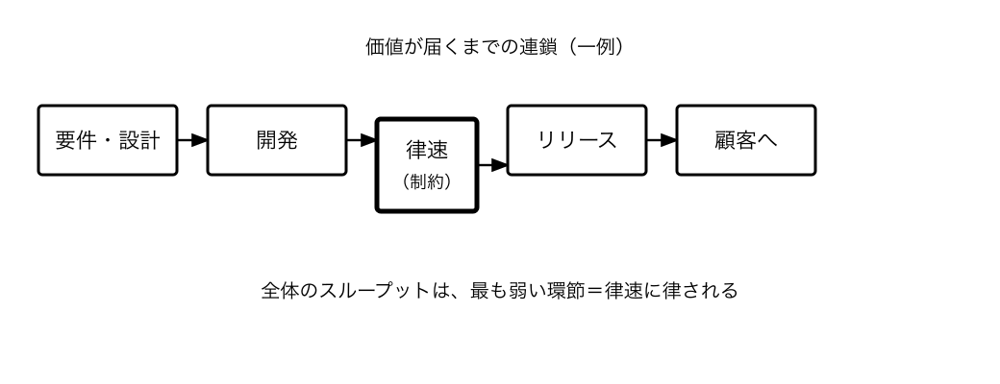
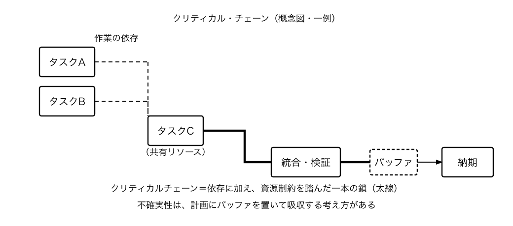
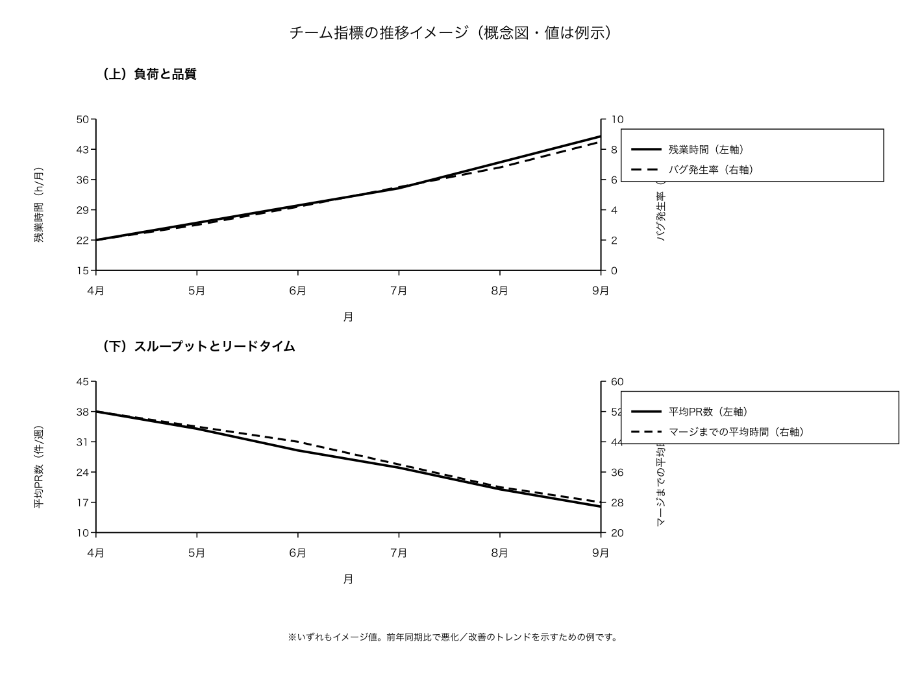
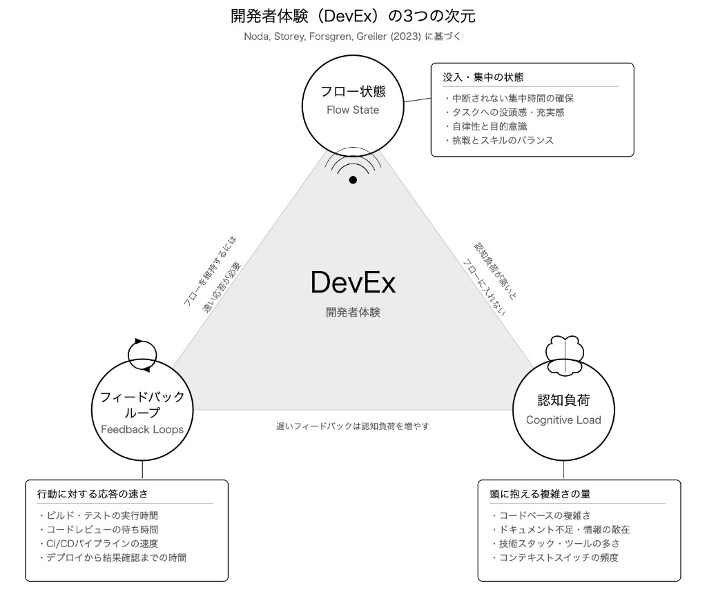

# 第2章 開発生産性の目的を求められる重圧

## 2-1 開発生産性の多角的理解と、他者の視点を想像する重要性

### 深夜の自問自答

午後のチームミーティングで、今回の件と今後の進め方について話し合った。山田や佐藤からは率直な意見が出たが、開発生産性をどう定義するかはまとまらず、それぞれの立場で捉え方が違うことが改めてはっきりした。

その夜、先日の障害対応が一段落してチームメンバーは帰宅したが、湊は一人オフィスに残った。午後10時。デスクの上には障害の失敗を振り返る資料、過去のプロジェクトデータ、そして今日の会議のメモが広がっている。

湊はコーヒーカップを手に取り、冷めたコーヒーを一口飲んだ。

「開発生産性って、結局何なんだろう？ 」

先日、田中部長から言われた言葉が頭に浮かぶ。「開発生産性を可視化し、向上させてほしい」。でも、その「数字」とは何なのか。コード行数なのか、リリース数なのか、それとも別の何かなのか。答えが定まらないまま、湊はブラウザを開き、検索バーに打ち込んだ。

「開発生産性 指標」

「開発生産性向上 エンジニア」

検索結果には様々な記事が並ぶ。湊は一つ一つクリックして読んでいく。

ある記事は「コード行数で測るべき」と主張している。1日あたりのコード行数、1週間あたりのコード行数。でも、湊は首を横に振る。コード行数だけでは、無駄なコードを書けば数字は上がり、リファクタリングでコードを削減すれば数字は下がる。これが開発生産性の指標として適切なのか。

別の記事は「機能リリース数が重要」と書いている。月に何個の機能をリリースしたか。でも、今回の失敗を思い出す。急いで機能をリリースした結果、バグだらけのシステムを世に出してしまった。チームは徹夜で障害対応に追われ、ユーザーからのクレームも殺到した。

さらに別の記事では「ストーリーポイント」や「ベロシティ」といった言葉が出てくる。アジャイル開発の指標だ。でも、これも完璧ではない。ストーリーポイントは見積もりの精度に依存するし、ベロシティはチームの成熟度によって変わる。

「どれも一理あるけど、どれも完璧じゃないな……」

### 検索結果に並ぶ指標の数々

湊は画面を見つめた。検索結果には他にも様々な指標が並んでいる。

「デプロイ頻度」「変更のリードタイム」「変更失敗率」「回復時間」。DORAメトリクスという言葉も出てくる。でも、これらも技術的な指標に偏っている気がする。

さらに別の記事では「**物的生産性**」という言葉が出てくる。投入量に対する生産量の比率。労働時間あたりのコード行数、機能リリース数など。数値は出しやすい。でも、品質や価値は測れない。無駄なコードを書いても数字は上がってしまう。

そして「**付加価値生産性**」という記事もある。ビジネス価値やユーザー価値を生み出す効率性。これは理想的な指標だと思う。
……でも、どう測るのか。ユーザー価値は数値化しにくい。ビジネス価値も、すぐには見えない。

「コード行数？ 機能リリース数？ でも、今回の失敗を考えると……」

確かに機能はリリースできた。でも、その後の障害対応でチームは疲弊した。ユーザーからの信頼も失った。長期的に見ると、これは開発生産性が高いと言えるのだろうか。

湊はノートに書き出し始めた。コード行数、リリース数、ストーリーポイント。いずれも数値は出せるが、品質や価値は測れない。

どれも一面的だ。もっと多角的な視点が必要なのではないか。

湊はコーヒーを淹れに行きデスクに戻った。オフィスには誰もおらず、静まり返った空間で、湊は改めて考える。
こういう根本的な問いに向き合うのはエンジニアになって初めてだった。

これまで湊は「**与えられたタスクをこなす**」ことに集中していたが、リーダーになって3カ月、もっと大きな視点で物事を考える必要があると感じていた。

### エレベーターでの偶然の出会い

翌朝8時、湊は早めに出社した。答えは見つからなかったので、山田に相談しようと決めていた。エレベーターホールで、彼と偶然一緒になった。
朝の光がガラス越しに差し込み、まだ人の気配が少ない時間帯だ。

「おはよう、湊くん。昨日はお疲れさま。まだ早い時間だね」

「おはようございます。山田さん、先日の障害の件は、本当にすみませんでした」

「湊のせいじゃないよ。構造的な問題だと思う。急いでリリースした結果、バグが出た。でも、その背景には仕様の曖昧さやスケジュールの圧力があった。一人の責任じゃない」

エレベーターが1階に到着し、二人はオフィスのカフェコーナーへ向かった。まだ誰もいない静かな空間で、自動販売機のコーヒーを手に立ち話が始まる。

「山田さん、実は昨日、開発生産性について考えていたんです。コード行数とか機能リリース数とか、いろんな指標があるけど、どれも一面的な気がして……」

湊の質問に山田は腕を組み、少し考えてから答える。

「難しい質問だね。でも、技術的負債を返済する時間も開発生産性をあげる一部だと思うんだよね」

「技術的負債……ですか」

「うん。過去のデータを見てると、開発速度がかなり低下してる。仮説としては技術的負債の蓄積と思っているが、それをどう上司に説明すればいいのか、僕も悩んでるんだ」

山田は自分のノートPCを開き、コードの複雑度と見積もり精度を並べた散布図を見せた。

「これ、同じ規模の機能開発に、今は明らかに時間がかかってる。静的解析ツールで見るとコードベースが複雑になって、どこを触っても影響範囲が広がるからね」

湊は画面を見つめた。複雑度が低いほど実績は見積もりに近くまとまっているが、複雑になるほど点が上下に広がり、予測が外れやすくなっている。同じ見積りの立て方でも、コードベースの状態次第で実工数が読めなくなっているのだ。

「これ、部長に見せたことあるんですか？ 」

「何度か。でも、『スピードが落ちてる』としか受け取られない。なぜ遅くなったのか、技術的負債の返済にどれだけ時間がかかるのかは、なかなか理解してもらえないんだ」

山田はコーヒーを一口飲み、少し声を落とした。

「正直さ、僕は技術の話なら何時間でもできるけど、経営層に伝わる言葉で話すのが苦手なんだ。前の会社でも、リファクタリングの必要性を説明しようとして、結局『**で、売上にどう効くの？ **』と返されて黙ってしまった。それ以来ずっと、この壁を超えられていない」

山田は少し間を置いてから、話を続ける。

「例えば、先月のプロジェクト管理モジュールの改修。経験上数日で終わるはずだった。でも、既存コードが複雑すぎて、影響範囲の調査に1日かかった。テストがないから、変更がどこまで影響するかわからない。ドメインモデルも曖昧で、モジュール間の依存関係が把握しにくい。リファクタリングに2日、実装に3日かかった。想定よりずっとかかった」

「技術的負債の返済に時間をかけるべきだったんですか？ 」

「そうだね。でも、その時間を確保するのが難しい。新機能の開発が優先されるから。結果として、技術的負債は蓄積し続ける。そして開発速度はさらに低下する。負のスパイラルだ」

「そう考えると、僕はできなかったが他の人の意見も聞いて見てもいいかもしれない。特に高橋さんとか」

「高橋さん……ですか」

「うん。品質の視点から見た開発生産性って、僕たちエンジニアとは違うと思うんだ。湊がリーダーとしていろんな視点を理解するのは大事かもしれない」

山田の助言は納得感があった。
「ありがとうございます。ランチの時にでも、高橋さんに聞いてみます」

山田と別れたあと、湊は一瞬考えた。山田さんの立場なら、技術的負債を返済したいのに上司に伝わらず、もどかしい思いをしているのだろうな。

### QA部の高橋とのランチミーティング

昼12時。社内カフェテリアは混み合っている。話し声と食器の音が響くなか、湊は高橋を見つけ声をかけた。

「高橋さん、少しお時間いいですか？ 」

「湊さん、どうしました？ 」

高橋はトレイを持って立っていた。湊もトレイを持ち、二人は空いている席に座った。

「実は、開発生産性について考えていて。山田さんから、高橋さんの意見も聞いてみたらって言われて……」

「開発生産性ですか」

高橋は箸を置き、少し考えてから答える。

「正直、最近は品質を犠牲にした速度重視が多くて……」

「というと？ 」

「テスト工数がスケジュールに入らないんです。『これ、いつリリースするんですか？ 』って聞くと、『来週』とか言われて。でも、十分なテストをする時間がない」

高橋の声には責任感が滲んでいた。

「例えば、先月の経費精算モジュールの新機能。リリース2週間前にテスト依頼が来た。でも、テストケースを作成するのに1週間、実際のテストに1週間かかる。合計2週間。でも、開発側は『1週間でテストしてほしい』って言うんです」

「それは……」

「無理です。テストを急いでやると、見落としが出る。結果として、リリース後にバグが見つかる。そして、そのバグ修正にまた時間がかかる」

高橋はスマートフォンを取り出し、保存していた資料を見せた。

「バグが多いと、結局あとから体感で倍以上の工数がかかるんですよ。しかも、バグの修正コストは、見つかるのが遅いほど段階的に増大していくんです。昨日の障害対応、どれだけの工数がかかりましたか？ 」

湊は言葉に詰まった。確かにチーム全員で徹夜して対応した。もし開発中に見つけていれば、1人が数時間で修正できたはずだ。

「昨日の障害、もし開発中にテストで見つけていれば、1時間で修正できたはずです。でも、リリース後だったから、チーム全員で徹夜対応。ユーザーへの影響も大きかった。これって、本当に開発生産性が高いと言えるんでしょうか？ 」

高橋の言葉は、湊の中で何かが変わるきっかけになった。

*速度だけじゃダメなんだ……*

「品質も開発生産性のうちだと思うんですけどね。バグが少なければ、後で修正する時間がかからない。ユーザーからの信頼も得られる。長期的に見ると、品質を重視した方が開発生産性が高いはずなんです」

「でも、スケジュールの圧力があると……」

「わかります。でも、その圧力が結果として品質を下げ、長期的な開発生産性を下げていくんです」

「そして、プロジェクトの進捗が遅れていると指摘されるのも、プロセスの後半の方にある**開発の終盤やQAテストのときが多いんです。**
プロジェクト全体を見ると、本当は要件定義の追加や変更で時間をかけているのに、遅れが表に出た時点でQAテスト期間の開発生産性が疑われて、工数を詰めざるを得なくなるのも不満です」

高橋は箸を手に取り、ご飯を一口食べる。

「QA部として、私たちは品質を守る責任がある。でも、その時間が確保されない。これが続くと、チーム全体の開発生産性が下がるんです」

QA部という別組織からの視点は、湊にとって新鮮だった。機能を作り上げる視点とは違う、品質という軸での開発生産性の捉え方。これも欠かせない視点だ。高橋さんの立場なら、テスト時間が削られる不安が先に立ち、リリース優先のプレッシャーで言い出せない焦りもあるのだろうな、と湊は想像した。

### カスタマーサポートの鈴木との廊下での立ち話

午後3時。湊が自販機にコーヒーを買いに行くと、カスタマーサポート部の鈴木一郎と鉢合わせた。

「あ、鈴木さん。お疲れ様です」

「湊さん、ちょうどよかった。聞きたいことがあったんだ」

鈴木は缶コーヒーのプルタブを開けながら、淡々と話し始めた。

「先週のリリース後、問い合わせが3倍に増えた。うちのチーム、3人で回してるんだけど、全員が残業してる。ユーザーは『前まで使えてた機能が動かない』って怒ってる。新機能よりも、今使えてるものが壊れない方がよっぽど大事なんだよ、ユーザーにとっては」

湊は言葉に詰まった。開発チームの目線ではリリースできたことが「成果」だった。でも、サポートの現場ではそれが「問題の始まり」だった。

「開発生産性って、サポートの視点だとどう見えますか？ 」

「うーん、『ユーザーが困らないこと』かな。機能がいくら増えても、問い合わせが増えたら僕らの仕事は増える。品質が高ければ問い合わせは減る。それが一番の開発生産性だと思うよ」

湊は頷いた。山田の技術的負債、高橋の品質、そして鈴木のユーザー視点。それぞれの立場で「開発生産性」の意味が違う。その実感が、また一つ増えた。鈴木さんの立場なら、リリースのたびに問い合わせが増える現場のしわよせを、一番に受けているのだろうな。

### 飛鳥との夕方の対話

午後5時。会議室C-2で湊は飛鳥との1on1ミーティングに臨んでいた。

「湊君、昨日は大変だったね。でも、ビジネス的にはリリースできて良かったよ」

「……良かった、ですか？ 」

湊の声には疑問が滲んでいた。昨日のような対応の末に、これが「良かった」と言えるのか。口にした疑問が、そのまま胸に残る。

「いや、もちろんバグは良くないけど。でも、期日通りにリリースしたことで、営業チームが顧客に説明できたし、売上の目標も達成できそうなんだ」

飛鳥はノートPCの画面を湊に見せた。売上予測のグラフが表示されている。

今月の売上目標は1000万円。今回リリースした機能によって、新規顧客の獲得が見込まれている。グラフには、リリース後の売上予測が示されていた。

「でも、これって本当に開発生産性が高いと言えるんでしょうか？ 」

湊の質問に飛鳥は画面から目を上げた。しばらく窓の外を見てから、いつもと違う静かな声で言った。

「……正直に言うとね、この前のリリースの後、サポートチームの鈴木さんに『もう少し品質を上げてから出してほしい』って言われたんだ。ユーザーからのクレーム対応で、鈴木さんのチームも疲弊していた。私がスピードを優先した結果、他のチームにまで迷惑をかけていた。それがすごくこたえた」

飛鳥は少し息をついてから、同じ静かな声で続けた。

「……実は私も悩んでる。短期的な売上は大事だけど」

飛鳥は少し声を落とす。

「PMとしては、ユーザー価値の創出が一番大事だと思ってる。市場への迅速な対応も必要。でも、持続可能性も大事なんだよね」

「持続可能性……」

「うん。今回みたいなトラブルが続くと、ユーザーからの信頼を失う。サポートチームも疲弊する。長期的に見ると、ビジネスにとってマイナスなんだ」

飛鳥はコーヒーを一口飲み、例を挙げる。

「例えば、先月リリースした機能。リリース直後は売上が上がった。でも、バグが多くてユーザーからのクレームが続いた。結果として、解約が増えた。長期的にはマイナスだった」

「それでも、スピードを優先するんですか？ 」

「それが難しいところなんだ。競合他社に追従した機能や先進的な機能をリリースしないと、市場を取られる。でも、品質を犠牲にすると、長期的にはマイナスになる。バランスが難しい」

飛鳥は画面を閉じ、湊を見た。

「湊君はどう思う？ 開発生産性って何だと思う？ 」

湊は少し考えてから答える。

「正直、わかりません。コード行数でもないし、機能リリース数でもない。でも、何なのか……」

「私も同じことを考えてる。PMとして、機能リリース数は重要だ。でも、それだけじゃない。ユーザーが本当に価値を感じてくれるか。長期的に使ってもらえるか。それが大事だと思う」

「みんな違う視点で開発生産性を見てるんですね……」

湊の呟きに飛鳥は頷く。

「そうなんだよ。プロダクト部と開発部、QA部、それぞれが大事にしてるものが違う。それをどう調整するかが、私たちの仕事なんだけど」

飛鳥は少し間を置き、同じ調子で続ける。

「でも、それぞれの視点を理解することが第一歩だと思う。湊君がいろんな人に話を聞いてるって聞いたよ。それは良いことだと思う」

会議室を出た湊は、廊下を歩きながら自分のデスクに戻る。飛鳥さんの立場なら、売上とユーザー価値の板挟みで、スピードを求めつつ品質も気にしているのだろうな。冷房の音が響く廊下で、頭のなかを言葉が駆け巡る。技術的負債、品質、ユーザー価値。いずれも正しいのに、バラバラで噛み合わない。開発生産性という言葉は立場によって意味が変わる。

### 田中部長との再面談

翌日の午後3時。再び湊は会議室に呼ばれた。ドアをノックして中に入ると、田中部長が窓際の席で待っている。前回とは違い、今回は湊の方から相談したいことがあった。

「湊君、前回の件を踏まえて、改めて開発生産性について話そう」

田中部長の表情は前回よりも柔らかかった。今回は湊の努力を評価しているようだった。

湊は緊張しながらも、準備してきた質問を切り出した。

「部長の考える開発生産性って、具体的にはどういうものですか？ 」

田中部長は少し驚いた様子だったが、すぐに答える。

「経営層からは数字を求められるんだ。売上への貢献、コスト削減、市場投入速度。でも、現場の苦労もわかる」

「数字だけじゃ測れないものもありますよね？ 」

湊の質問に田中部長は深くため息をつく。しばらく黙ってから口を開いた。

「そうなんだよ。技術的負債の返済とか、チームの健全性とか、数字にしにくいものが多い。でも、経営会議では『具体的な数値』を求められる」

田中部長は経営会議で使われた資料を開いた。

「先月の経営会議で、開発部の開発生産性について質問された。『他社と比べてどうなのか』『数字で示せるのか』。でも、単純な数字では測れないものがある。それをどう説明すればいいのか、僕も悩んでるんだ」

「部長自身は何が大事だと思いますか？ 」

「……正直、バランスだと思う。短期的な成果と長期的な健全性。スピードと品質。でも、それをどう測るかが難しいんだ。リファクタリングに時間をかければ良いというわけでもなく、チームに技術的負債を返却するスキルも必要だ」

田中部長は窓の外を見た。

「そして、技術的負債の返済やチームの健全性は、必要だとわかっていても数字にしにくい。経営会議では説明が難しいんだ。」

「それでも、経営層には数字を求められる……」

「そうだ。だから難しい。短期的な数字を出すために、長期的な健全性を犠牲にする。でも、それでは持続できない。バランスが大事なんだ」

田中部長は湊を見た。

「湊君、いろんな人に話を聞いてるんだろう？ それは良いことだ。リーダーとしていろんな視点を理解するのは大事だからね」

「はい。山田さん、高橋さん、飛鳥さんにも話を聞きました」

「どうだった？ 」

湊は三人の話の要点を短くまとめた。山田さんは技術的負債の返済も開発生産性向上の一部だと。高橋さんは品質を重視した方が長期的には開発生産性が高いと。飛鳥さんはユーザー価値と持続可能性のバランスが大事だと。

田中部長は少し間を置いてから口を開いた。

「なるほど、みんなそれぞれ違う視点で開発生産性を見ている。エンジニアは技術的品質を、QAは品質保証を、PMはユーザー価値を重視する。でも、どれも正しい。そうなんだよ。だから難しい。共通の理解を作るのがリーダーの仕事なんだ。それぞれの視点を理解して、統合する。それができれば、チーム全体の開発生産性が上がるはずだ」

湊はこの時、初めて理解した。リーダーとしての自分の役割は、各職種の視点を理解し、相乗効果を作ることなのだと。

田中部長は少し間を置いて、資料をめくった。

「ただ、数字だけ追うと、肝心の目的を見失う。開発生産性でいちばん大事なのは、**信頼を作ることだと思うんだ**」

「信頼、僕も最近その観点に気がつき始めました」

「うん。開発生産性は、結局のところ『信頼を作る』ことに価値があると思うんだ。チームメンバー同士の信頼、他部署との信頼、ユーザーとの信頼。この信頼関係が構築されれば、長期的な価値につながる。でも、これを数字で測るのは難しい」

湊は深く頷く。確かに信頼関係は数値化しにくい。

「実は、事業責任者や経営層の視点で考えると、もっとシンプルなんだ。彼らが意図したタイミングで、意図した成果物が出てくれば、信頼が積まれる。そうすれば、開発生産性をチーム外から求めることはなくなるかもしれない」

田中部長は少し間を置き、同じ調子で続ける。

「逆に、計画から遅延が続くと、『開発生産性はどうなってるんだ』と聞かれる。信頼が失われているから、数字で測ろうとする。先月も、3週間の予定が5週間かかって、経営会議でそう言われた。逆に、意図したタイミングで成果物が出ていれば、そんな質問は出ない。」

湊はその言葉を聞いて、今までの遅れた開発を思い出していた。計画通りにリリースできなかった。その結果、田中部長から「開発生産性を向上させてほしい」と言われた。

「ただ、現実はそう簡単じゃない。事業責任者やPdMの要求は変動する。市場やユーザーの反応で優先順位が変わる。計画通りに進まないこともある。だからこそ、要求が変わっても対応できることが信頼につながる」

湊は深く頷く。確かに先日のプロジェクトでも、途中で仕様が変更された。市場の競合他社が似た機能をリリースしたため、急遽方向性を変えることになった。

田中部長は少し間を置いてから湊を見た。

「湊君、数字を出すことも大事だ。でも、それだけじゃない。数値を武器に理論武装をして壁を作るのではなく、みんなが何を開発現場に求めているかを**対話を通して理解し、マージしながら同じ方向を向いてもらうのがリーダーの仕事だと思うよ**」

### 信頼という言葉の重み

会議室を出た湊は、廊下に足を踏み出し、何歩か歩いた頃に新たな課題を感じていた。

それぞれの視点を理解することはできた。
でも、どうやって統合すればいいのか。共通の理解を作るには何が必要なのか。そして、信頼を作ることをどう実現すればいいのか。部長の「信頼を作る」という言葉が、胸のなかで重く残っている。

翌朝、出社するとSlackに飛鳥からのメッセージが届いていた。

 **飛鳥さくら** が **#project-dev** でメッセージを送信

> 湊君、昨日の話を考えたんだけど、次のプロジェクトでは
> 開発に入る前に仕様レビュー会を設けない？
> 先に認識を合わせてから進めたいんだ。

湊は画面をしばらく見つめた。昨日、飛鳥さんに話を聞きに行ったことが、こんなに早く形になるとは思っていなかった。対話に意味がある。その手応えが、胸の奥で小さく灯った。

---

### 解説：ステークホルダーごとに異なる「開発生産性」の定義と、他者の視点を想像する重要性

この節では、開発生産性の定義が職種ごとに異なること、物的生産性と付加価値生産性の違い（分子・分母と三階層の視点を含む）、エンジニアリングの枠組み（DORA・SPACE）と PM 寄りの枠組み（TOC・CCPM）の関係、そして信頼を作るという視点を整理します。

#### ストーリーで描かれる「重圧」

山田は技術的負債を、高橋は品質を、飛鳥はユーザー価値を、部長は数値と信頼を語った。同じ「開発生産性」という言葉で。

- **深夜の問い**: 「開発生産性って結局何なんだろう」。コード行数・リリース数・DORAメトリクスなど調べても、どれも一面的で答えが定まらない
- **職種ごとの定義の違い**: 山田（技術的負債・持続可能性）、高橋（品質・テスト時間）、飛鳥（ユーザー価値・市場対応）、田中部長（売上・コスト）。同じ「開発生産性」という言葉で、中身が違う
- **指標のズレ**: 物的生産性は数値化しやすいが品質を測れず、付加価値生産性は理想だが測定が難しい。「数字を出せ」と言われても、何を測ればよいか合意がない
- **コミュニケーションロス**: 立場ごとに「正しい」と言いながら、共通理解ができない

この重圧の背景には、**「開発生産性」の定義がステークホルダーごとにバラバラで、統合されていない構造**があります。まず「誰が何を開発生産性だと思っているか」を認識する段階でつまずいているのです。

#### なぜ視点によって定義が異なるのか

開発生産性は、立場によって重視する側面が異なります。

- **エンジニア**: コードの品質、技術的負債の管理、開発速度の持続可能性
- **QA**: バグの少なさ、テストカバレッジ、品質基準の達成
- **PM/PdM**: ユーザー価値の提供、機能リリースのスピード、市場への対応力
- **経営層**: 売上貢献、コスト効率、チーム全体のパフォーマンス

それぞれの視点は「正しい」が、統合されていないことで問題が起きます。エンジニアが技術的負債の返済を優先したいと考えても、PMは新機能のリリースを優先したいと考えます。QAがテスト時間を確保したいと考えても、経営層はコスト削減を優先します。

その中で共通理解をすると言っても、1つの同じ指標で見ようとするのは危険です。ソフトウェア開発の複雑性においては多角的な視点が必要です。立場が違う中で出てくる開発生産性の表現をオーバーラップさせながら接続してイメージです。詳しくは第6章で接続のイメージは扱っていきますが、まずはそれぞれの立場から見える開発生産性に関する考え方を見ていきましょう。

#### エンジニアリング領域での開発生産性フレークワーク
**エンジニアリング**の領域において開発生産性を多角的に捉えるうえでは、研究で使われている枠組みが参考になります。
　
**DORA（DevOps Research and Assessment）** は、Google Cloud の DORA チームによる継続研究で、ニコール・フォースグレン、ジェズ・ハンブル、ジーン・キム らの成果が書籍 **『Accelerate: The Science of Lean Software and DevOps』** にまとめられています。年次の **State of DevOps Report** では大規模な調査が続いており、ソフトウェアデリバリーのパフォーマンスを測る指標として**Four Keys**（四つの鍵）が提唱されています。

具体的には、**デプロイ頻度**（deployment frequency）・**変更リードタイム**（change lead time）の二つで「スピード」を、**変更失敗率**（change fail rate）・**サービス復元時間**（time to restore service）の二つで「安定性」を表し、これらを**対**で捉えてどちらか一方だけを追わないことを推奨しています。

統計的分析により、**「速度と安定性はトレードオフではない」** ことが示されており、コード行数やコミット数ではなく、デリバリーの速度と安定性という実際の価値に近い指標で評価する枠組みを提供しています。指標の具体的な目標値や測定方法は、第4章の「DORAの科学的アプローチとFour Keys」および章末の「手法4 脱・形骸化指標リスト」で扱います。

一方、**SPACE** は、フォースグレンらによる論文 *"The SPACE of Developer Productivity: There's more to it than you think"*（ACM Queue, 2021）で提唱された枠組みです。開発生産性を五つの次元で扱うべきだとしています。

五つの次元は次のとおりです。

| 頭文字 | 次元（英語） | 日本語 |
|--------|--------------|--------|
| **S** | Satisfaction and well-being | 満足度・ウェルビーイング |
| **P** | Performance | 成果・パフォーマンス |
| **A** | Activity | 活動量 |
| **C** | Communication and collaboration | コミュニケーション・協働 |
| **E** | Efficiency and flow | 効率・フロー |

これらの指標同士には **緊張関係（trade-off）** があり、活動量（A）だけを追うと、長時間労働や悪いシステムへの力技でかえって悪化しうると警告しています。

したがって、**単一の数値ではなく複数の軸を組み合わせて**見ることが推奨されます。

一つの数値だけでなく、複数の軸を組み合わせて見ることで、湊が感じた「どれも一面的だ」という違和感を解きほぐすヒントになります。

SPACEは「何を測るか」の多次元の地図を広げる枠組みです。これに対し、開発者体験（developer experience, DevEx）を**どこに手を入れるか**に絞って整理したのが、ノダらによる *DevEx: What Actually Drives Productivity?*（ACM Queue, Vol. 21, No. 2, 2023；*Communications of the ACM*, Vol. 66, No. 7, 2023 にも再掲）です。フィードバックループの速さ、認知負荷の高さ、フロー状態を維持できるか、の三つに要因を集約し、測定にはサーベイなどの**知覚的指標**と、ビルド時間やプルリクエスト滞留時間などの**ワークフロー指標**を対で用いることが推奨されています。客観的に速くても主観的なストレスが残る、逆に満足していてもプロセスが遅い、といったずれは、片方だけでは見落としやすい、という趣旨です。フォースグレンらの *The SPACE of Developer Productivity*（ACM Queue, 2021）が観測軸を五つに広げたうえで、ノダら（2023）が介入と測定の語彙を三軸にまとめ直した、という関係に近い、と捉えてよいでしょう。

#### 欠陥修正コストの段階的増大

ストーリーで高橋が「段階が遅くなるほど修正コストは何倍にも跳ね上がる」と感覚で話していた部分は、研究でも裏付けられています。

米国標準技術研究所（NIST）のレポート *The Economic Impacts of Inadequate Infrastructure for Software Testing*（2002年）では、欠陥を発見・修正する相対コストがライフサイクルの段階ごとに増大することが示されています。次のような相対コスト（基準を 1X として）を掲げています。

引用 : https://www.nist.gov/system/files/documents/director/planning/report02-3.pdf

- **設計・アーキテクチャ**: 1X（基準）
- **実装**: 5X
- **結合テスト**: 10X
- **顧客ベータテスト**: 15X
- **リリース後**: 30X

つまり、リリース後に見つかった欠陥の修正コストは、設計段階で見つけた場合の最大で約30倍になるという試算です。ストーリーでの「体感10倍」「段階が遅いほど何倍にもなる」という感覚は、こうした研究結果と整合的です。

#### 技術的負債と開発速度

さらに山田がストーリーの中で「開発速度がかなり低下している」と感じていた場面の背景には、技術的負債という考え方があります。現場では当たり前のように使われる言葉ですが、もともとは一人のエンジニアが上司に設計判断を説明するために生み出した比喩でした。

#### ワード・カニンガムにおける技術的負債の解釈
技術的負債という表現を最初に用いたのは、Wyatt Softwareで「WyCash」というポートフォリオ管理システムを開発していた**ワード・カニンガム**です。1992年のOOPSLAで発表された「The WyCash Portfolio Management System」という短い報告のなかで、最初のバージョンを出したあとに大きなリファクタリングを行う必要性を、**金融における債務のメタファーになぞらえて説明しました**。完全ではない設計のままコードを出荷すると、後から構造を整理して返済する義務が生まれ、その間は利息にあたる余分な手間が積み上がっていくという考え方です。

後年のインタビューや動画でカニンガム自身は、技術的負債は雑なコードを書くことを正当化するための言葉ではないとはっきり述べています。不十分な理解のもとで最初の解を出荷すること自体は、学びを優先するための合理的な判断になりえますが、その後の学習によって問題の理解が進んだときに、コードを設計し直さずに放置することが利息を膨らませると説明しています。本来のメタファーは、意図や判断を伴って将来の返済コストを引き受ける行為として技術的負債を捉えていると言えます。

#### マーティン・ファウラーの整理
マーティン・ファウラーは 2009年頃の「Technical Debt Quadrant」という記事で、技術的負債を「**無謀か慎重か**」と「**意図的か不注意か**」という**二つの軸**で整理しました。無謀で意図的な負債は「設計する時間がないから仕方ない」といった短期志向の決定で、利子だけが膨らみやすい状態です。慎重で意図的な負債は、価値が大きいと判断してあえて早く出荷し、後で返済することを見越した選択です。無謀で不注意な負債は、レイヤー構造の意味を理解しないまま壊してしまうようなケースです。慎重で不注意な負債は、当時は最善を尽くしたつもりでも時間が経ってから「本当はこうすべきだった」と気づき、その時点で自分たちがどれだけ質入れしていたかを自覚するような状態を指します。

この四象限は、次のように整理できます。

|              | 無謀             | 慎重                     |
|--------------|------------------|--------------------------|
| 意図的       | 計画的な妥協     | スピード重視の妥協       |
| 不注意       | 無計画なミス     | 慎重さが裏目に出る       |

真の意味で技術的負債の返却を考えるために、将来の返済コストを理解したうえで**意図的に取った選択**で整なければいけないと整理しています。ただし現場では、こうした区別を意識しないまま広い意味で負債という言葉が使われています。

こうした原典や整理を踏まえると、「技術的負債が蓄積すると開発速度が落ちる」という感覚は単に主観的なものではないことが見えてきます。複数の研究では、技術的負債が開発速度やリードタイムに与える影響が数値で報告されています。例えば、テレーズ・ベスカー、アントニオ・マルティーニ、ヤン・ボッシュ による縦断的調査とそのレプリケーション研究（Software Developer Productivity Loss Due to Technical Debt, Journal of Systems and Software, 2019）では、開発者の時間の23%前後から多い場合で36%程度が技術的負債（Technical Debt）に関わる活動に費やされていると推定されています。とくにアーキテクチャ設計の複雑さが開発生産性に大きな負の影響を与え、開発者が最も時間を浪費しているのは技術的負債の理解や測定そのものだという結果が示されています。

技術的負債が意図された判断の結果なのか、知識や設計力の不足から生まれたものなのか、あるいは両方が混ざっているのかによって、返済の優先順位やアプローチは変わってきます。どの種類の負債をどこまで許容し、どのタイミングで返済するかという判断が、実際の開発速度やリードタイムにどう影響するかは、第3章以降で扱います。

#### 物的生産性と付加価値生産性の違い

開発生産性を考える際、「物的生産性」と「付加価値生産性」の違いを押さえておきます。議論の土台として、まず**何を分子にし、何を分母にするか**を揃えないまま話し始めると、見えている景色がずれたまま衝突しやすい、という整理があります（広木大地「[開発生産性について議論する前に知っておきたいこと](https://qiita.com/hirokidaichi/items/53f0865398829bdebef1)」、Qiita、2022）。

経営学でいう開発生産性の骨格は、極めて単純に**アウトプット ÷ インプット**です。同じ「開発生産性」という語でも、分子に何を置くか（コード量か、売上か、付加価値か）、分母に何を置くか（人数か、人月か、人件費か、総事業コストか）で数値の意味は変わります。分母と分子が対応していない指標同士を比べても、改善の打ち手は見えません。

工場のように「何を作るか」が決まっている文脈では、従業員あたりの**生産量**（いわゆる物的労働生産性のイメージ）が分かりやすい一方、金額で見る**価値労働生産性**や、付加価値額に焦点を当てた**付加価値労働生産性**は、ビジネスモデルや価格転嫁の影響を強く受けます。ニュースで語られる「日本の労働生産性」がしばしば後者に近いとき、個人の「テキパキ感」と直結しないのはこうした構造による、という注意も、同じ記事で述べられています。

ソフトウェア開発では、ひとくちに「開発生産性」と言っても、次の**三階層**に分けて考えるとすれ違いが減ります。

| 階層 | 見るもの | コメント |
|------|----------|----------|
| レベル1：仕事量の開発生産性 | 作業としてどれだけこなしたか | チーム内の改善と測定がしやすいが、価値や売上まで含意しない |
| レベル2：期待付加価値の開発生産性 | 価値があると期待して選んだ施策を、どれだけリリースできたか | 実績の価値検証には時間がかかるため「期待」で見る |
| レベル3：実現付加価値の開発生産性 | 売上・KPI などへの実貢献 | 遅行指標になりがちだが、経営が最終的に見たい結果に近い |

経営側の関心はレベル3に寄りやすく、現場の話はレベル1に聞こえやすい。その結果、レベル3が低いからといって、すぐにレベル1の効率だけが悪いわけではない、という短絡が起きやすい、という指摘です。これは、本章前半で述べた「ステークホルダーごとに開発生産性の意味が違う」と同じ筋の話です。

このうえで、本章でストーリーと対応させている**物的生産性**と**付加価値生産性**に戻ります。

**物的生産性**は、投入量に対する産出量の比率で測られます。レベル1に近い「量」の指標として捉えると位置づけやすいです。具体的には次のような指標があります。

- 労働時間あたりのコード行数
- 1週間あたりの機能リリース数
- 1日あたりのコミット数

これらは数値化しやすく、測定も容易です。しかし無駄なコードを書けば数字は上がりますし、リファクタリングでコードを削減すれば数字は下がります。品質や価値は測れません。

一方、**付加価値生産性**は、ビジネス価値やユーザー価値を生み出す効率性を測ります。レベル2・3に近い議論と重なります。

- ユーザーが実際に使う機能の開発速度
- ビジネス目標達成への貢献度
- 長期的な価値創出の効率性

これは理想的な指標ですが、測定が難しいという課題があります。ユーザー価値は数値化しにくく、ビジネス価値もすぐには見えません。

開発生産性を考える際は、物的生産性と付加価値生産性の両方を意識し、バランスを取ることが重要です。**付加価値生産性と物的生産性を、エンジニアの責務や「回転数（曝露）」とどう結びつけて考えるか**は、第6章で改めて扱います。

#### プロジェクトマネジメントとエンジニアリングの接続
PdM や事業側のメンバーは、しばしば**プロジェクトのリードタイム**やマイルストーン・締切で「遅い／早い」を語ります。ここまで見てきたエンジニアリングの指標とは、同じ「開発生産性」でも**問いの置き方**がずれやすい、という前提を共有しておきます。

本章では「開発生産性」を、**フロー**（変更が価値として届く速さと安定性）と**価値・計画**（何をいつまでに約束するか）の両方を含む語として扱っています。前半で触れたとおり、DORAはデリバリーパイプラインの健全性（Four Keys）、SPACEは開発者の多次元の開発生産性を整理する枠組みです。定義の細部はそちらに譲り、ここでは「別レイヤーのレンズ」としてTOCと CPM を置きます。

**制約理論（Theory of Constraints, TOC）**は、システム全体のスループットは最も弱い環節である**制約**に律される、という考え方です。
DORAが主に見るのは、マージから本番までなどデリバリー工程のリードタイムと安定性です。SPACE は満足度・活動・フローなど、チーム内の**観測軸**を増やすための枠組みです。一方 **TOC** は、価値が顧客や事業に届くまでの **連鎖全体** で、どこが **律速（りっそく）** かを問います。
律速とは、一連のプロセス（化学反応、業務、工程など）において、全体の進行速度を決定づける「最も遅い段階・要因」のことです。

つまり、この場面でいえば、律速がレビュー待ち・承認・要件待ち・他部門のキャパなど**パイプラインの外**にあるとき、Four Keysだけを上げても、前節の**レベル2・3**の付加価値には届きにくい、というすれ違いが起きえます。どの工程やどのチームが律速になっているかを見ないまま、局所の作業量だけを増やしても、全体の付加価値や成果物の流れが速くなるとは限りません。万能の処方箋ではありませんが、「何を最適化しているか」を全体に引き上げるための視点のひとつです。

**クリティカル・チェーン（Critical Chain Project Management, CCPM）**は、クリティカルパスに加えて**資源制約**を踏まえたスケジューリングを扱う考え方です。変更リードタイム（DORA）が短くても、マイルストーンやリリース列車など**プロジェクト全体の締切**は、タスク依存と**資源の共有**によって別の長さになります。プロジェクトの長さは**クリティカルチェーン**で決まる、という整理に加え、不確実性を**バッファ**で吸収する設計が知られています。SPACEの活動量（A）のような「忙しさ」とは別物で、計画上の依存とキャパシティの話です。納期やコミットを語るときの言語として参照されることがあります。

エンジニアリング領域のDORA・SPACE、プロジェクトマネジメント領域のTOC・CCPMは、**対立する指標**ではなく、**問いとレイヤーが違うレンズ**です。重ねて使うと、開発生産性の会話が噛み合いやすくなります。財務や開発投資を分解して接続する**開発生産性ツリー**の数値因果は第6章で扱います。

約束の信頼性や計画の当たり外れは、全体の律速やバッファの話とも重なります。代表的な文献として、エリヤフ・M・ゴールドラットの『ザ・ゴール』や『クリティカルチェーン』などがあります。

#### 信頼を作ることに価値がある

ここまで様々な開発生産性に関する考え方に触れてきましたが、田中部長が語ったように開発生産性でいちばん大事なのは「信頼を作る」ことです。第1章で触れた約束の信頼性（計画したタイミングで成果物を出し、遅延が続くと信頼が失われる）と重なります。意図したタイミングで成果物を出し、要求が変動しても対応できることが信頼につながります。ストーリーで部長が話した内容を、共通理解を作るための対話や定量的な指標の選び方とあわせて、章末のステークホルダー視点マッピングでも扱います。

#### 共通理解を作るために

まずは対話から始めましょう。湊が行ったように、各職種の視点を理解することから始めます。

- 定期的な1on1で、相手が何を重視しているかを聞く
- チーム全体で「開発生産性とは何か」を議論する時間を作る
- 多面的な指標を組み合わせて測定する
- 業務プロセスの最適化の視点を取り入れる
- 信頼関係の構築を意識する

詳細な手法については、章末のステークホルダー視点マッピングのワークシートを参照してください。

湊が各職種にヒアリングしたあと、相手の立場に立って考えてみたように、**他者の視点を想像する**ことは共通理解への第一歩です。エンジニアだけの視点で進めると、優先順位の衝突・同じ言葉でも意味のすれ違い・目標の不一致による壁ができることがあります。「この人はどんなゴールをイメージして開発生産性という言葉を使っているのか」を想像することが第一歩目です。

#### 次のステップ
では**何について**共通理解を深めればよいかを考えていきましょう。第1章で湊が抱いた「このままでは持続不可能だ」という気づきの先に、この問いがあります。山田と飛鳥が語った、継続的な技術的負債の返却、長期的なユーザー価値の持続性、そして部長の信頼を具体化すると、チームで、「**継続的にユーザー価値を作るための開発とは何か**」を定義し共有することが、次のステップとして浮かび上がります。

湊が次に考えるのも、この問いです。それぞれの視点を理解し、想像することを通じて統合の難しさは見えましたが、持続可能な開発を実現するには何が必要なのか。次節では、持続可能な開発について掘り下げます。

---

## 2-2 持続可能な開発とは何かを模索する

共通理解や信頼の土台のうえで、**何について**合意するかが問われます。技術的負債と持続可能性、信頼を具体化すると、継続的にユーザー価値を作るための開発、すなわち持続可能な開発とは何かをチームで定義することが次の課題になります。その問いを抱え、湊は、

### 持続可能な開発を探求する

自宅に戻り、湊はリビングのテーブルにノートPCを開いた。
湊は今日一日で得た気づきを振り返っていた。

山田さん、高橋さん、飛鳥さん、田中部長。それぞれの視点を聞いて、湊は開発生産性という言葉が持つ多面性を理解した。

でも、それだけでは不十分だ。
それぞれの視点を理解しても、統合する方法がわからず、共通の理解を作るには何が必要なのか、まだ手がかりが掴めない。

湊は、過去のプロジェクトデータを振り返るところから始めた。
平均PR数 / デプロイ数の推移、バグの発生率、残業時間。様々な数字が画面に並ぶ。出力量だけでなく、集中して取り組める時間や状態が持続可能性には効く、という指摘が、ふと頭に浮かんだ。

去年の同じ時期に比べて、チームの残業はかなり増えている。平均PR数や、PRがマージ時間されるまでの平均時間が低下し、バグの発生率は増加している。

グラフを見ると、明確なトレンドが見える。開発速度は少しずつ落ち、バグの発生率は上がり、残業時間も増加の一途だ。

「**これは継続的に安定して開発ができるチームなのか？ **」

湊は自問する。短期的には機能をリリースできている。でも、長期的に見ると、チームは疲弊し、開発速度は低下し、バグの発生率は増加している。

このままでは、さらに悪化するのではないか。技術的負債は蓄積し続け、開発速度はさらに低下する。チームメンバーは疲弊し、離職する人も出てくるかもしれない。

技術的負債の影響も、品質の効果も、チームの健全性も、**いまは測れていない**。測れないものを、どう可視化すれば共通の理解につながるのか。湊はノートに書き出し始めた。

**持続可能な開発とは何か**

昼間に読んだ記事を思い出す。**DORA**はデリバリーの速さと安定性を対で見る話、**SPACE**は満足度・活動・フローなど観測の次元を複数並べる枠組みだった。それを頭に置きながら、持続可能性を書き出してみる。

- 短期的な成果だけでなく、長期的な健全性も考慮する
- 技術的負債を適切に管理する（いまの成果と、あとからの手戻りのバランス）
- 品質を維持しながら開発速度を保つ（速度と安定性を、どちらか一方に寄せない）
- チームの健全性を守る（満足度や協働など、出力量だけでは見えないものも）

### 測れない価値と、見える化という次の問い

でも、これらをどう測ればいいのか。測り方がまだ見えない。過去のプロジェクトデータには数字が並んでいるが、それだけでは不十分で、多面的な指標が要るのだと湊は思った。

**見えない開発生産性を見える化する方法**

問いははっきりしてきた。ノートに書いた言葉を心で繰り返しても、どう実現するかはまだ見えない。

窓の外を見ると、夜空に星が見える。湊は深呼吸をし、画面のグラフを一度閉じた。

「明日、もう一度山田さんに相談してみよう。見えない価値を可視化する方法について」

見えない価値を定量的でも定性的でも可視化し、理解してもらうことが、共通理解の第一歩だ。その思いを胸に、湊は画面を閉じた。

### 解説：持続可能な開発とは何か

#### ストーリーで描かれる「重圧」

残業時間のグラフは右肩上がり、開発速度のグラフは右肩下がり。二つの線が交差する先に何があるのか。

- **データが示す持続不可能性**: 残業時間の増加、開発速度の低下、バグ発生率の増加。グラフが「持続可能な開発ではない」ことを示している
- **技術的負債と体制の追いつかなさ**: 技術的負債の蓄積で開発速度が落ち、スケジュールだけが先行しチームの体制・スキルが追いつかない。このままでは悪化し、離職もあり得る
- **見えない価値の可視化の壁**: 技術的負債の影響・品質向上の効果・チームの健全性を「どう可視化すれば、みんなが共通の理解を持てるか」がわからない
- **短期と長期のバランス**: 短期的にはリリースできているが、長期的な健全性をどう測り・どう話すかが未確立で、持続可能な開発への道筋が描けない

この重圧の背景には、**短期的成果は出ている一方で、長期的健全性を測る指標と共通言語がなく、「持続可能か」を説明できない構造**があります。第3章「測れない価値の可視化」へつなぐ転換点に立っているのです。

なお、残業の増加や開発速度の低下といった傾向は、技術的負債や品質圧力の影響について述べた研究（本節 2-1 の解説「技術的負債と開発速度」を参照）とも整合的です。

#### なぜ持続可能性を押さえるのか

湊が最後に気づいた「持続可能性」は、開発生産性を考える上で押さえるべき視点の一つです。

短期的な成果だけを追求すると、以下の問題が起きます。

- **技術的負債の蓄積**: 急いで開発した結果、コードの品質が低下し、将来的な開発速度が低下する
- **チームの疲弊**: 残業が続き、メンバーのモチベーションが低下する
- **品質の低下**: テスト時間を削減した結果、バグが増加し、後で修正コストがかかる

持続可能な開発とは、短期的な成果だけでなく、長期的な健全性も考慮することです。

開発者体験（DevEx）の研究では、開発生産性を「アウトプットの量」だけで測るのではなく、**フィードバックループ・認知負荷・フロー状態**の三つの軸で捉えることが提唱されています（ノダら、*DevEx: What Actually Drives Productivity?*, ACM Queue, Vol. 21, No. 2, 2023）。とくに、アウトプット量よりも「フロー状態を維持できる時間」の長さに、開発生産性の本質が現れるとされています。大規模調査では、フロー状態を確保できた開発者はそうでない開発者より生産的だと感じた、といった傾向も報告されています（フォースグレンら、*DevEx in Action: A Study of Its Tangible Impacts*, ACM Queue, Vol. 21, No. 6, 2024；*Communications of the ACM*, Vol. 67, No. 1, 2024）。湊が「残業が増え、開発速度は落ち、バグは増えている」とデータに気づいたように、持続可能な開発には、出力量だけでなく、チームが集中して取り組める状態をどう維持するかという視点が欠かせません。

#### 持続可能な開発に必要なこと

持続可能な開発を実現するには、以下の要素が必要です。

- **短期的な成果と長期的な健全性のバランス**: 新機能の開発と技術的負債の返済を両立する
- **技術的負債の適切な管理**: 定期的にリファクタリングの時間を確保する
- **チームの健全性の維持**: 残業時間を適切に管理し、メンバーのモチベーションを維持する
- **品質の維持**: テスト時間を確保し、バグの発生を防ぐ

#### 次のステップ

湊が次に取り組むのは、「見えない価値の可視化」です。技術的負債の影響、品質向上の効果、チームの健全性をどう測定し、共通の理解につなげるのか。

次の章では、この「見えない開発生産性を見える化する」方法について詳しく見ていきます。

---

## 手法2 ステークホルダー視点マッピング

帰りの電車で湊がメモアプリに書いた視点の整理は、ステークホルダー視点マッピングの最初の一歩でした。以下のワークシートは、湊のように各職種の視点を体系的に整理するためのものです。

### ステークホルダーマップの作成

**目的**: チームに関わる各職種が何を重視しているかを可視化する

**手順**:
1. 関係者をリストアップする（エンジニア、QA、PM、管理職、営業、サポートなど）
2. 各職種が「開発生産性」に関して何を重視しているかをヒアリング
3. 表やマップにまとめる

**テンプレート例**:

| 職種 | 重視する指標 | 測定方法 | 懸念事項 |
|------|-------------|---------|---------|
| エンジニア | コード品質、技術的負債 | コードレビュー、静的解析 | 技術的負債の増加 |
| QA | バグの少なさ、テストカバレッジ | バグ数、カバレッジ% | テスト時間の不足 |
| PM | ユーザー価値、リリース速度 | 機能リリース数、ユーザー満足度 | 市場競争力の低下 |
| 管理職 | 売上貢献、コスト効率 | 売上、工数 | 予算超過 |

### 対話のテンプレート

各職種と対話する際の質問例です。

**エンジニアへの質問**:
- 現在の開発で一番の課題は何ですか？
- 技術的負債が開発速度にどう影響していますか？
- 理想的な開発環境とはどういうものですか？

**QAへの質問**:
- テスト工数は十分に確保されていますか？
- バグが多い原因はどこにあると思いますか？
- 品質を保つために必要なことは何ですか？

**PMへの質問**:
- ユーザーにとって最も価値のある機能は何ですか？
- リリースのスピードと品質、どちらを優先すべきですか？
- ビジネス目標を達成するために必要なことは何ですか？

**管理職への質問**:
- 経営層から求められている目標は何ですか？
- 現場の課題をどう理解していますか？
- 短期的な成果と長期的な健全性、どうバランスを取りますか？

### 実践のステップ

**ステップ1: 1on1の実施**
- 各職種と30分〜1時間の1on1を実施
- 上記の質問を使ってヒアリング
- メモを取り、後でまとめる

**ステップ2: マップの作成**
- ヒアリング内容を表やマップにまとめる
- 視点の違いを明確にする
- 共通点と相違点を可視化する

**ステップ3: チーム共有**
- チームミーティングで共有
- 「それぞれの視点を理解する」ことを目的にする
- 批判ではなく、理解と対話を促す

**ステップ4: 共通理解の構築**
- 各職種の視点を統合した「共通の定義」を作る
- 多面的な指標を設定する
- 定期的に見直す（3カ月ごとなど）

### チェックリスト

**実施前**:
- [ ] 関係者をリストアップした
- [ ] 1on1の時間を確保した
- [ ] 質問を準備した

**実施中**:
- [ ] 各職種の視点を理解できた
- [ ] メモを取り、整理した
- [ ] 共通点と相違点を見つけた

**実施後**:
- [ ] マップを作成した
- [ ] チームに共有した
- [ ] 共通の定義を作り始めた

---

## 第2章のまとめ

湊は、各職種へのヒアリングを通じて、「開発生産性」という言葉が持つ多面性に気づきました。

**主な学び**:
- エンジニア、QA、PM、管理職、それぞれ異なる視点で開発生産性を見ている
- どの視点も「正しい」が、統合されていないことで問題が起きる
- エンジニアとして他者の視点を想像することの重要性
- 持続可能な開発とは、短期的な成果だけでなく、長期的な健全性も考慮すること

**次章への課題**:
- 「見えない価値」をどう可視化するか（可視化は、共通理解や説明可能性を高める第一歩になる）
- 技術的負債、品質向上の効果、チームの健全性をどう測定するか
- 持続可能な開発を実現するための具体的な方法

次の章では、湊が「測れない開発生産性」にどう向き合うのかを見ていきます。

---

## 参考文献

- DORA（DevOps Research and Assessment）. Google Cloud の DORA チームによる継続研究。『Accelerate: The Science of Lean Software and DevOps』（Gene Kim, Jez Humble, Nicole Forsgren 著）にまとめられ、Four Keys は https://dora.dev/guides/dora-metrics/ で公開。デプロイ頻度・変更リードタイムと変更失敗率・復旧時間を対で捉える指標。
- Forsgren, N., Storey, M.-A., Maddila, C., Zimmermann, T., Houck, B., Butler, J. "The SPACE of Developer Productivity: There's more to it than you think." ACM Queue, 2021. 開発生産性を Satisfaction / Performance / Activity / Communication / Efficiency の多次元で扱う枠組み。
- Noda, A., Storey, M.-A., Forsgren, N., Greiler, M. "DevEx: What Actually Drives Productivity?" ACM Queue, Vol. 21, No. 2, 2023; *Communications of the ACM*, Vol. 66, No. 7, 2023. フィードバックループ・認知負荷・フロー状態の三軸、知覚的指標とワークフロー指標の併用。
- Forsgren, N., Kalliamvakou, E., Noda, A., Greiler, M., Houck, B., Storey, M.-A. "DevEx in Action: A Study of Its Tangible Impacts." ACM Queue, Vol. 21, No. 6, 2024; *Communications of the ACM*, Vol. 67, No. 1, 2024. DevExの三次元と個人・チーム・組織のアウトカムの関係を大規模データで分析。
- 開発者体験・ウェルビーイング：仕事満足度と知覚的生産性の双方向の因果、自己評価の開発生産性と相関する仕事への熱意・ピアサポート・有益なフィードバック。
- Ward Cunningham, "The WyCash Portfolio Management System", Addendum to the Proceedings of OOPSLA '92, ACM SIGPLAN OOPS Messenger, 1992. 技術的負債というメタファーを初めて提示し、完全ではない設計のままコードを出荷することを金融上の債務になぞらえて説明した短い報告。
- Martin Fowler, "Technical Debt Quadrant", martinfowler.com, 2009. 技術的負債を「意図的／無意識」と「慎重／無謀」の二つの軸で四つの象限に整理し、意図的で慎重な負債を戦略的な判断として位置づけた記事。
- Terese Besker, Antonio Martini, Jan Bosch, "Software Developer Productivity Loss Due to Technical Debt — A Replication and Extension Study", Journal of Systems and Software, Vol. 156, 2019, pp. 41–61. 技術的負債が開発者の開発生産性に与える影響を縦断的に測定し、平均で開発時間の 23〜36% が技術的負債に起因する活動に費やされていると推定した研究とそのレプリケーション・拡張。
- Eliyahu M. Goldratt, *The Goal: A Process of Ongoing Improvement*, North River Press, 1984（邦訳『ザ・ゴール』）。制約理論（TOC）を物語形式で提示し、律速箇所と全体スループットの考え方を説いた書籍。
- Eliyahu M. Goldratt, *Critical Chain*, North River Press, 1997（邦訳『クリティカルチェーン』）。クリティカルチェーンとバッファによるプロジェクト管理の考え方を述べた書籍。