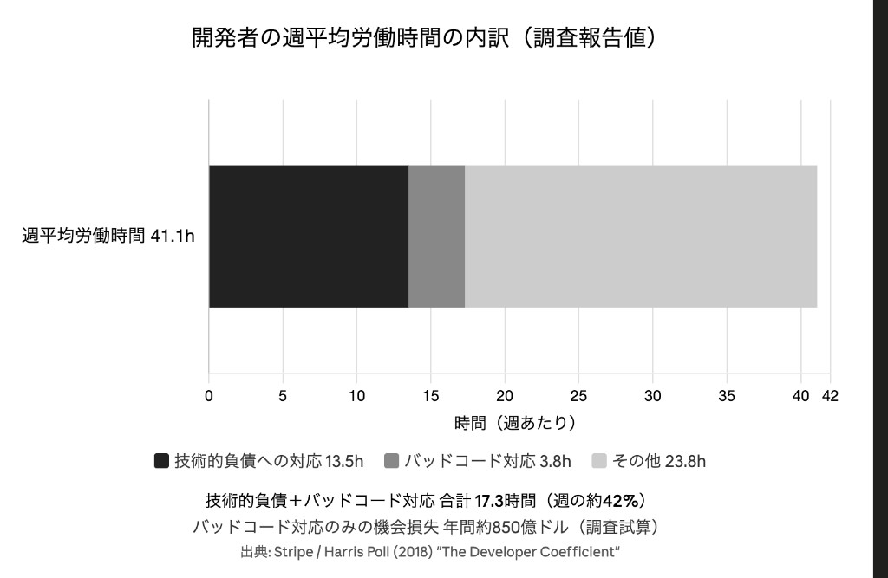
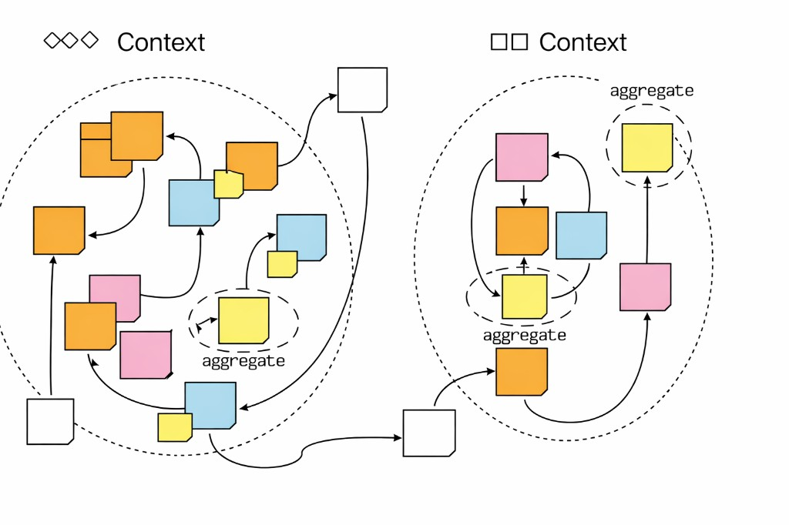
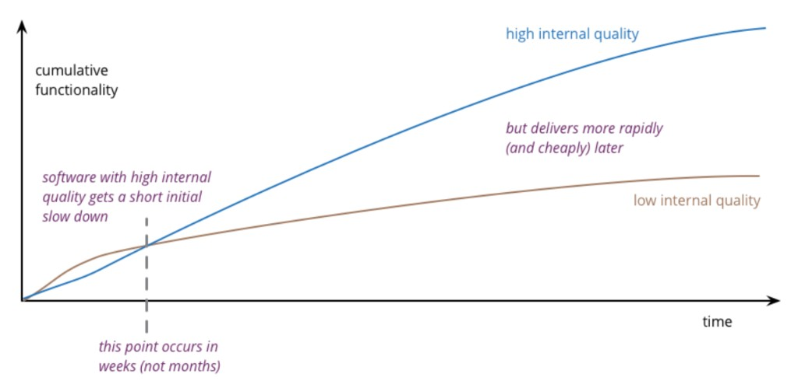
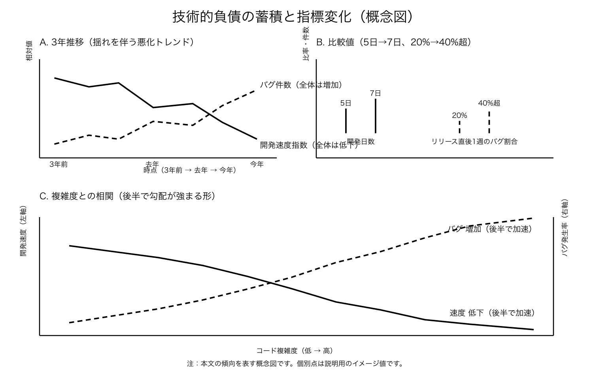
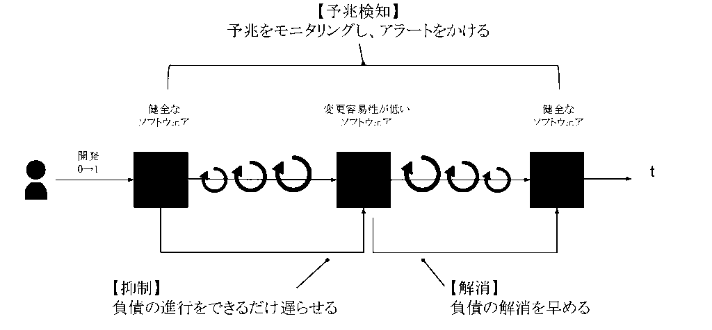

# 第3章 測れない開発生産性を求められる重圧

## 3-1 技術的負債の蓄積と長期的な開発速度の関係

### 部長への相談と壁

リリース後の混乱が少し落ち着いた頃、湊は田中部長の元を訪れた。技術的負債が開発速度を落としている。
まずはそれを口頭で伝え、理解を得たいと思ったからだ。

「部長、今回の障害の背景には、長年積み重なった技術的負債があると思います。コードが複雑になりすぎていて、変更の影響範囲が読めない。だからバグが増え、開発も遅くなっている。この部分を可視化して、計画的に返済していく必要があると思います」

田中部長は資料に目を落としたまま、しばらく黙っていた。

「技術的負債か。それはわかる。僕もエンジニアだったから、コードが複雑になれば開発は遅くなるくらいは理解している」

湊は少し希望を感じた。だが部長の次の言葉で、その希望は砕かれた。

「ただね、経営会議では『具体的な数値』を求められるんだ。『技術的負債があります』じゃ説明にならない。どんな影響があるのか、どれだけの工数がかかっているのか、返済にどれくらいの期間が見込まれるのか。数字がないと、予算も承認されない」

湊は返す言葉が出なかった。感覚としては「遅くなっている」とわかっていても、それを示すデータをまだ持っていない。部長は続けた。

「湊君、数字で示してくれ。完璧な数値じゃなくていいんだ。議論をするためのたたき台があれば、僕も上に説明できる」

部屋から出た湊は、廊下を歩きながら決意した。
感覚だけでは足りない。技術的負債が開発速度にどう影響しているかを、データで可視化する。そのために、まずは過去のプロジェクトデータを集め、分析するところから始めよう。

### 疲弊するチーム

ランチタイム。湊のチーム5名が社内カフェテリアに集まっていた。窓際のテーブルに五人分のトレイが並ぶ。

### 技術的負債の現実と向き合う

普段は別々に食べることが多いが、今日は自然と同じテーブルに座った。

山田が箸を置き、しばらく黙ってから真剣な表情で話し始める。

「開発速度、3年前と比べて半分以下に落ちてるんだ」

「半分以下……ですか？ 」

佐藤が驚いた様子で聞き返す。

「うん。同じ規模の機能開発に、以前は3日かかっていたのが、今は1週間かかる。コードが複雑になりすぎて、どこを触っても影響範囲が広がるからね。スピードを優先してテストを書かないことが、影響範囲を見えなくしている。テストがないと、変更がどこまで影響するかわからない。だから、一箇所を修正すると、予想外の場所でエラーが出る」

「それに、CI/CDの整備にもあまりリソースを回せていなくて、負債が溜まったままなんだ。パイプラインが不安定で、リリースのたびにヒヤヒヤする。本番に出すのも怖い」

山田はノートPCを開き、湊にも見せた過去のプロジェクトデータを見せた。グラフには明確な下降トレンドが示されている。

「先日開発した機能、過去に似たような機能を開発したときは3日だったのが今は1週間かかる。バグ修正のたびに別の場所が壊れる。テスト追加が困難な構造になっている」

他のメンバーも頷く。誰もが同じ問題を感じていた。

「勤怠管理モジュールと経費精算モジュールの連携が複雑すぎる。一箇所を修正すると、予想外の場所でエラーが出る」

「プロジェクト管理モジュールも同じ。データベースの構造が複雑で、新しい機能を追加するのが大変」

佐藤が小さく呟いた。「経費精算まわりのあの機能、自分で書いたのに半年経つと他人のコードみたいで読めないんですよね」

山田は少し間を置き、最後にこう口を開く。

「そうだね。ドメイン駆動設計を採用しているんだけど、根本的にはイベントストーミングでのモデリングができていない。ドメインモデルが曖昧なまま開発が進んで、積み重なった技術的負債と膨れ上がった設計の乱雑さが問題になっている」

湊はメンバーの話を聞きながら、改めて問題の深刻さを実感していた。

「でも、これって開発生産性指標に表れるんですか？ 」

湊の質問に山田は首を横に振り、少し苦笑いしながら答える。

「表れないんだよ。だから問題なんだ。平均PR数は増えているし、デプロイ数も増えている。でも、だんだん速度は低下していく。見た目の指標と実際の開発生産性が乖離している」

単純な数値だけでは実態が歪むこと、指標を評価に直結させるとかえって行動がゆがむ——そんな話が、以前読んだどこかにあった。湊はそれを思い出していた。

「測れない開発生産性の低下……」

湊は呟く。技術的負債の影響は、従来の開発生産性指標では測れない。でも、確実に開発速度を低下させている。

「これをどう説明すればいいんだろう」

湊の疑問は、チーム全体の疑問でもあった。開発側と事業側で測っているものが違う。だから数字を出しても「良くなった」と伝わらない。問題は遅れの理由や次の見通しを説明できないことだ。能力不足ではなく、説明に使える情報が足りていないのだと、湊は感じていた。

### 解説：技術的負債が開発速度に与える影響

この節では、技術的負債が開発速度に与える影響、開発組織と事業側の視点の違い、そして可視化の重要性を整理します。

#### ストーリーで描かれる「重圧」

なぜ「測れない開発生産性を求められる」が重圧になるのか。**何が起きているかが見えないうちは**、その問いが構造的な課題としてのしかかります。

- **バグ対応と新規開発の両立の難しさ** リリース直後は障害対応が続き、新規開発の予定が後ろにずれやすい。本章のストーリーでは混乱が一段落したあとも、部長は数値根拠を求め、湊は「遅れている」と感じていても示せない状態にいる
- **見た目の指標と実際の開発生産性の乖離** 平均PR数やデプロイ数は増えているように見える一方、同じ規模の機能開発にはかつてより時間がかかる。従来の開発生産性指標では測れないが、確実に開発速度を低下させている
- **説明できないもどかしさ** 開発組織が見ているもの（リードタイム、デプロイ頻度など）と事業責任者・PdMが見ているもの（計画信頼性・予測可能性）は異なる。「なぜ遅れたのか」を説明できないことが問題だと気づき始めている

この重圧の背景には、**技術的負債が開発速度を確実に低下させているのに、従来の開発生産性指標では測れず説明できない構造**があります。

技術的負債は単一の数値で表しづらいため、**多角的な視点で予兆を検知**し、早めに手を打つことがとくに重要です。何が起きているかを可視化する必要性に直面しているのです。

#### Stripe調査が示す「時間の流出」

Stripe / Harris Poll（2018）"The Developer Coefficient" は、米・英・仏・独・シンガポールの5カ国で、開発者1,000名超とCxO 1,000名超を対象に実施された大規模調査です。技術的負債の影響を金額ベースで示したレポートとして、経営向けの説明でも広く参照されています。

同調査では、開発者の週平均労働時間41.1時間のうち、技術的負債への対応に13.5時間、バッドコード対応に3.8時間、合計17.3時間が費やされると報告されています。これは週の約42%に相当し、新しい価値を作る前に、既存システムの維持と修復で時間が先に失われる構造を示しています。さらに、各国の開発者人口と平均給与を基に、バッドコード対応だけで年間約850億ドルの機会損失が発生しているという試算も提示されています。

また同レポートは、開発者をより効果的に活用できれば今後10年間でグローバルGDPを3兆ドル押し上げうる潜在力があること、開発者の約3分の2がバッドコード対応時間を「過剰」と認識していることも示しています。この数字は「自社も必ず同じ比率になる」と断定するためではなく、現場の体感を定量の問いに変えるための基準線として使うのが実務的です。部長が求める「説明のたたき台」を作るには、まず自社でも同じ問いを立てる必要があります。たとえば、週次の時間配分を「新規開発」「保守・修復」「調査・待ち時間」に分けるだけでも、どこで速度が失われているかを議論しやすくなります。

このStripeの議論は、**産業横断の時間配分と機会損失**の見立てに焦点を当てます。この節の後半で触れるMartin Fowlerの内部品質の議論は、主に**チーム内の変更コストと設計の持続可能性**に焦点を当てており、両者は補完関係にあります。

#### なぜ技術的負債が開発速度を低下させるのか

技術的負債が蓄積すると、以下の問題が発生します。

- **コードの複雑度の増加** 循環的複雑度が10を超えるコードが増えると、理解と修正に時間がかかる
- **結合度の高さ** モジュール間の依存関係が密で、一箇所の変更が広範囲に影響する
- **テストカバレッジの不足** リファクタリング時の安全性が確保できず、変更を躊躇する
- **CI/CD整備の不足によるパイプラインの不安定さ** CI/CDの整備に十分なリソースを回せていないと、リリースのたびに不安がつのり、本番デプロイに対する心理的ハードルが高まる。開発速度の低下に加え、リリースを躊躇する悪循環や、本番品質への不安がさらに重くのしかかる
- **ドメインモデルの曖昧さ** ドメイン駆動設計を採用していても、イベントストーミングでのモデリングができていないと、ドメインモデルが曖昧なまま開発が進む。これにより「積み重なった技術的負債」と「膨れ上がった設計の乱雑さ」が発生し、開発速度が大幅に低下する

技術的負債の根本原因の一つとして、ドメインモデルの曖昧さがあります。ドメイン駆動設計を採用していても、イベントストーミングでのモデリングができていないと、以下の問題が発生します。

- **ビジネスロジックの散在** ビジネスロジックがコード全体に散在し、どこに何があるかわからなくなる
- **設計の乱雑さ** ドメインの境界が不明確で、モジュール間の依存関係が複雑になる
- **影響範囲の不明確化** 一つの変更がどこまで影響するか予測できず、予想外の場所でエラーが発生する
- **技術的負債の蓄積** 曖昧なモデルの上に機能を追加し続けることで、技術的負債が雪だるま式に増大する

**共通した認知を作るイベントストーミングの価値**

イベントストーミング（Event Storming）は、Alberto Brandolini 氏が提唱したワークショップ形式のモデリング手法です。壁一面のボードに付箋を貼りながら、ドメインで起きる出来事（ドメインイベント）を過去形でタイムラインに並べ、必要に応じてコマンド、役割、外部システム、集約、境界づけられたコンテキストへと段階的に肉付けし、コンテキスト間の関係まで辿っていきます。ドメイン駆動設計では議論が**戦略的設計**（どこをどう境界として切るか）と**戦術的設計**（どう実装するか）に分かれて語られることが多く、イベントストーミングは前者、すなわちビジネスプロセス全体の把握と境界の合意形成に向いた技法として位置づけられます。

ファシリテータ、ドメインエキスパート、開発者／技術側、プロダクトマネージャーなどが同席し、UML など特定の表記法に精通していなくても、付箋と短い文言から議論に参加しやすい、という特徴があります。断片的に持ち寄った業務知識を、イベントの流れという「見える骨格」に載せ替えることで、複数シナリオの抜け漏れを繰り返し確認しやすくなります。

ここでの価値は、**プルリクエスト数やデプロイ頻度、コード行数やコミット数など、活動量を示す単一指標だけでは捉えきれない種類の開発生産性**を支えることにあります。いわゆる「測れない開発生産性」の困りどころは、数字だけ見ると活動量は十分に見えるのに、現場では手戻り・調整・暗黙の前提の食い違いが律速になっている、と説明しづらい点にありがちです。イベントストーミングは、セッション後に残るボードそのものが、事業側と開発側が同じ前提で「どこが律速で、どこが認識のずれか」「なぜその変更は遅い／危ないのか」を語るための**共有物語と共有語彙**になります。メトリクスが示す数値の裏側を補う説明可能なモデルが、納期や優先順位の説明責任に直結し、単一指標では捉えきれない開発生産性の議論を前に進める土台になります。

また**技術的負債**の多くは、境界の曖昧さや誤った抽象化の上に機能が積み上がることで生じます。イベントストーミングは、実装が進む前にドメインの流れと境界を可視化し、どこに集約を置くか、どのコンテキストに何を含めるかを先に議論する場を用意します。曖昧なまま手を動かすほど、あとからのリファクタリングコストと認知負荷が増えるため、「先にモデルを揃える」ことは負債の増え方を抑えるうえで有効です。すでに負債がたまっている状況でも、どの境界から手を付けるか、どの依存を切るかの投資判断を、関係者で同じ図を見ながら話せるようになる、という意味でも効いてきます。

- **共通理解の形成** 全員が同じドメインモデルを共有し、認識のずれを防げる
- **設計の明確化** ドメインの境界とエンティティの関係が明確になり、設計の乱雑さを防げる
- **影響範囲の可視化** イベントの流れを追うことで、変更の影響範囲を事前に把握できる

**事業への貢献が実証されているシステムこそ、ドメイン駆動設計の価値が高い**

すでにユーザーに価値を提供しているシステムは、長期的な持続可能性が重要です。ドメイン駆動設計とイベントストーミングを活用することで、積み重なった技術的負債と膨れ上がった設計の乱雑さを刷新し、将来の開発速度を大幅に向上させることができます。これは、新規システムよりも既存システムの方が、ドメイン駆動設計の投資対効果が高い理由です。

- **知識の属人化** 特定のメンバーにしか理解できないコードや設計が増えると、そのメンバーが不在の際に開発が停滞する。コードの意図が不明確で、設計判断の背景が共有されていないため、新しいメンバーがコードベースを理解するのに時間がかかる。メンバーの離脱リスクにより、技術的負債がさらに増大する
- **依存関係の管理不足** 古いライブラリやフレームワークのバージョンアップができていないと、セキュリティパッチが適用されず、リスクが蓄積する。将来的なメジャーアップデートの負荷が増大し、技術的負債として残る
- **ドキュメントの不足** コードの意図が不明確で、理解に時間がかかる

第2章でも紹介した開発者体験の研究では、認知負荷の高さやフロー状態の維持が開発生産性の体感と結びつけて論じられます。ノダら、*DevEx: What Actually Drives Productivity?*, ACM Queue, Vol. 21, No. 2, 2023では、コード品質の改善が開発生産性の向上に先行する、と報告されており、読みにくいコードが積み上がるほど理解コストが増え、**フローが切れやすい**、という現場の感覚と整合的です。

#### 技術的負債と認知的負債の違い

技術的負債は、コードや設計の妥協が将来の修正コストを増大させる状態を指します。これとは別に、**認知的負債**（Cognitive Debt）という考え方があります。
認知的負債は、コードやシステムは動いているが、「なぜそのように動いているか」「なぜその設計になったか」を組織や個人が理解できていない状態を指します。技術的負債がコードや設計そのものに存在するのに対し、認知的負債は人間側の理解の欠如であり、テストも通り機能も出るため、開発速度の指標には表れません。

技術的負債は静的解析やメトリクスである程度可視化できますが、**認知的負債は現状ほぼ可視化されません**。表面化するのは数ヶ月後、平均復旧時間（MTTR）の悪化などの遅行指標として現れることが多いです。組織はストーリーポイントやマージ数など目に見える出力を評価しがちで、「出荷したなら理解しているはず」という前提が崩れているいま、理解を測れない以上、短期的スピードばかりが最適化される力学が働きやすくなります。

#### 高品質ソフトウェアは実際には安く作れる

一つの誤解としてスピードを優先するには品質を犠牲にしないといけないという論調です。
Martin Fowlerは *Is High Quality Software Worth the Cost?*（以下、同記事）で、**ソフトウェアの内部品質については、この「代物と値段」のトレードオフの仕方そのものがそもそもずれている**と論じています。

同記事ではまず、品質の指し示すものが多いことを踏まえ、**外部品質**（UI の使いやすさ、欠陥の少なさなど）と**内部品質**（モジュール分割、命名、データが業務を反映しているかといった設計の見通しのよさなど）に分けます。ユーザーは前者を評価できますが、後者は非常に見えにくいです。
外側の品質なら「お金を払ってでも上げるか」を選べますが、内側だけを「見えないのに割高だ」と売り分けることは難しい側面があります。
それでも開発者が内部品質にこだわるのは、仕事の大半が**既存コードの読み解きと変更**だからです。ロジックのねじれや意味のわかりにくい名前など、いわゆる **cruft**（理想の設計との差分）が増えるほど、変更の見当がつくまでの時間が伸び、見逃した不具合の修正にも時間を取られます。

顧客にとって内部品質が効くのは、**新しい機能を足す速さとコスト**が変わる点です。当面は同じように見える製品でも、内部品質の低い側は数ヶ月後には機能追加が遅れ、競合に替えられうる、という議論が同記事にあります。また、縦軸に積み上がった機能、横軸に時間とコストをとった**概念図（擬似グラフ）** では、内部品質が低いと最初は急に進んで見えても、やがてわずかな変更にも広い範囲の理解が要り、開発生産性の落ち込みが急になる、と整理されています。一方、内部品質を高く保つと、その落差を抑えられます。

出力や開発生産性を厳密に数値化することは難しく、グラフに具体的な数値は置けませんが、Martin Fowlerが熟練した開発者に聞いた範囲では、**「数週間も経たないうちに」低品質のコードがチームの速度を鈍らせる** 、という見立てが紹介されます。

出典：Martin Fowler「Is High Quality Software Worth the Cost?」の概念図（*Design Stamina Hypothesis*）。

よいチームでも**Cruft（不要なコードや設定）**は必ず生じます。要件は開発とともに学習で変わり、言語やライブラリも変わるため、「一年ほど作って初めて、どう組むべきだったかが見えた」ことは珍しくない、とも書かれています。差は、優れたチームが**自動テスト・頻繁なリファクタリング・継続的インテグレーション**でCruftの蓄積を早めに削ることです（調理すれば汚れるが、汚れを溜めて乾かさない、というキッチンの比喩）。

ここでFowlerが強調するのは**経済的な説明**です。「プロとしてきちんと書くから時間がかかる」と言うと、相手には「品質にはコストがかかる」と読まれ、議論が不利になりがちです。実際には内部品質が高いほど**将来の変更が安く済み**、結果としてトータルでは安くつくという逆説を踏まえることが必要です。

記事の議論と対応づけて整理すると、理由はおおむね次のとおりです。

1. **開発速度の維持** : 時間とともに開発生産性が急落するカーブを抑え、チームが機能を積み上げやすい状態を保てる。内部品質を軽視した「今日は早い」選択が、数週間単位で周囲の速度を落としうる、という注意も同記事の含意です。
2. **欠陥やテストとの相乗効果** : 同記事でも、問題を早く表面化して直す土台として自動テストなどが語られます。テストカバレッジが高いと早期発見しやすく、第2章で触れたようにリリース後の修正は相対的に極めて高価になりがちです。内部品質とテストを組み合わせることで、そのリスクを抑えられます。
3. **将来の変更コストの削減** : Cruftが少なく、モジュールや命名が整っていれば、機能追加や修正のたびの読み解きと手戻りが減り、長期的なコストが低くなる。

つまり内部品質への投資は「コスト」ではなく「**将来のコスト削減への投資**」として位置づけるべきです。

3-2では、ここまでの因果を前提に、予兆検知・抑制・解消を実データでどう運用するかを見ていきます。

---

## 3-2 「今は動くから」の先にある持続不可能な開発組織

### データ収集への挑戦

あの夜、測れない価値を可視化する方法について山田さんに相談しようと決めた。その意志を、数字で現状を把握する形で実行した。その夜、湊は一人オフィスに残っていた。他のメンバーは帰宅し、天井の照明だけがついた静まり返ったフロアで、湊は過去のプロジェクトデータを整理していた。

Gitのライフサイクル、チケット管理、バグ報告数。過去3年分のデータを集計し、スプレッドシートに整理していく。社内で使っているコード品質ツールのレポートを開き、負債レベルや重大度別の指摘件数、解消に必要な工数の推移を同じスプレッドシートに追記した。

バグ報告数は社内のバグ管理システムから、月ごとの発生件数を集計した。リリース日とバグ報告日の関係も確認し、リリース直後にどれだけのバグが発見されたかを時系列で追った。

スプレッドシートにデータを入力しながら、湊はパターンを探していた。技術的負債の影響を数値で示せないか。それができれば、チーム全体で問題を共有できるかもしれない。

数時間後、湊はいくつかの発見をしていた。

去年の同じ時期、ある機能の開発には平均して5日かかっていた。でも、今年は7日かかる。同じ規模の機能なのに、開発時間が1.4倍になっている。チケットの開始日と完了日から計算した類似規模の機能のリードタイムで、ランチの会話で山田が口にした「3日から1週間」と同じ物差しで見た比較だった。3年前と比べると、開発速度は50%低下していた。

バグ発生率も月5件から月15件に増加している。特に、リリース直後の1週間で発見されるバグの割合が、3年前は全体の20%だったのが、今は40%を超えている。

スプレッドシートにグラフを描くと、明確な相関関係が示されていた。コードの複雑度が増すにつれて、開発速度は低下し、バグ発生率は増加している。先に述べた「3年前比で約50%」という見立てとも整合する、技術的負債の影響を示すデータになっていた。

### データが語る現実

「これが技術的負債の影響なのか……」

湊はグラフを見つめながら考える。でも、これだけでは不十分だ。どう伝えればみんなが理解してくれるのか、どう説明すれば技術的負債の返済に時間を割いてもらえるのか。答えはまだ見えない。投資が増えても生産性の数字に表れない、個人の努力と組織の成果のあいだにはギャップがある——そんな論点が、以前目にした文章にあったことを思い出した。

### 孤独な作業と挫折感

数日間、湊は孤独な分析作業を続けていた。毎晩、オフィスに一人残り、データを集計し、グラフを作成し、説明文を書いた。数字は揃ったが、このままでは人を動かせる気がしない。そんな思いが消えない。

作成した資料を見直しては修正を繰り返し、グラフを追加し、説明を書き直し、また見直す。ただ、筋の通る説明にはまだ届いていない気がした。湊は資料を印刷して机に広げ、何度も読み返した。経営層やPMに説明するには、まだ抽象的すぎる気がした。

「**これって本当に意味があるのかな？ **」

湊は自己不信に陥っていた。一人で作業を続けても、誰も見てくれないかもしれない。山田さんに相談した時は励まされたが、実際にチームに共有するとなると、また別の不安が湧いてくる。もし、みんなが「そんなの当たり前だよ」と一蹴したらどうしよう。もし、データの解釈が間違っていたらどうしよう。

でも、「何もしないより、やってみる価値はある」という決意だけは揺らがなかった。今回は違う。データという武器がある。それをどう使うかは、自分次第だ。

### 自己不信の深まり

リビングのテーブルには空き缶が2本だけ。先日の失敗直後と比べると、少し落ち着いてきた証拠だ。でも、窓際のパキラはまだ元気がない。水をやったばかりだが、葉が少し垂れている。

湊はノートPCを閉じ、深く息を吸う。

「明日、もう一度山田さんに相談してみよう」

### 「今は動くから」の先にある問題

翌日のランチタイム。社内カフェテリアの騒がしさのなか、湊は山田に作成した資料を見せた。

「山田さん、これを見てもらえますか？ 」

山田は画面を見つめながら、時々頷く。

「おお、これは面白い。開発速度とバグ発生率の相関関係が明確に示されているね」

「でも、これだけでは不十分な気がして……」

湊の不安そうな声に、山田は箸を置いて少し考えてから答える。

「確かに、データだけでは伝わらないかもしれない。でも、これは重要な第一歩だ。『今は動くから』という言葉の先に、どんな問題が待っているかを示している」

山田は画面を指さした。

「この前の決済まわり機能、見積もり5日で実績2週間だったよね。ああいう**見積もりのズレが続いていると計画が立てづらくなるし**、負債のサインにもなる」

山田は少し声を落とした。

「そういうズレが続くと、開発組織への信頼が揺らぎやすくて、経営や管理側から、詰められたり細かく見られたりしやすくなるんだよね」

山田が続けた。

「同じモジュールで**似たような障害**が何度も起きている。再発防止のタスクがたまっていて、手が回っていないんだ。ポストモーテムを眺めていると、障害件数が多かったり、デプロイのたびに同じ箇所でこけたり、決済まわりのタイムアウトが何度も出たりする。こうした傾向も、**技術負債がどこかに蓄まっている証拠**になり得るんだ」

山田は箸を戻してまとめるように言った。

「開発速度やバグの推移に加えて、そういう見積もりと実績のズレとか、同じ障害の繰り返しとか、プロダクトごとに勘所を決めて計測してアラートをかけると、もっと早く手を打てるんだよね」

湊は思い当たった。データに手が届かなかったあの観点を、山田が現場の感覚で言い当てている。

「『今は動くから』……」

「うん。多くのチームが『今は動くから、後でリファクタリングする』と言って先送りにする。でも、その『後で』はなかなか来なくて、気づいたときには手をつけにくい状態になりがちなんだ」

山田は少し間を置いてから続けた。「コードは動くけど、なぜそう動くかを誰も説明できなくなっている部分が増えている。設計変更や障害対応のとき、そこがじゃまになりやすいんだ」

山田の言葉は、湊のチームの現状を的確に表現していた。

「このデータが示しているのは、『今は動くから』という判断の先に、かなり厳しい開発環境に近づいている、ということだと思う。開発速度が50%低下し、バグ発生率が3倍になる。これが続くと、いずれ開発が止まりかねない」

湊は深く頷いた。確かにこのままでは開発が止まる一歩手前なのだと、改めて実感する。

「でも、どうすれば……」

「まずは、この問題をチーム全体で共有することだ。一人で抱え込まず、みんなで考えよう」

山田の言葉に、湊は少し希望を感じた。

### 解説：「今は動くから」の先にある持続不可能性

#### ストーリーで描かれる「重圧」

**データはあるが伝え方がわからない**。そんな状態のとき、「投資判断につなげたい」という重圧はとりわけ重くのしかかります。湊が経験したのも同じ構造からです。

- **データが示す深刻さ** 過去3年分のデータで、開発速度の50%低下とバグ発生率の増加（月5件から月15件）の相関を発見した。技術的負債の影響を数値で示すところまでは届いている
- **伝え方の壁** 「どう伝えれば理解してもらえるのか」「技術的負債の返済に時間を割いてもらうための説明方法がわからない」という疑問が消えない
- **孤独な作業と挫折感** 一人で分析を続け、資料を作り直しては見直す繰り返し。誰も見てくれないかもしれないという不安と、それでもやり続ける決意のあいだで揺れている
- **「今は動くから」の先** データが「持続可能な開発ではない」ことを示している。このままでは開発が止まってしまう可能性を肌で感じ始めている

この重圧の背景には、**問題をデータで示せても、ROIや説明の仕方がわからず投資判断につながらない構造**があります。持続不可能性を認識したうえで、どう転換するかを模索する段階にあるのです。

#### なぜ「今は動くから」が問題になるのか

湊がデータ分析で発見した問題は、多くのチームが直面する典型的な課題です。

「今は動くから、後でリファクタリングする」という判断は、短期的には合理的に見えます。しかし以下の理由で問題が発生します。

- **「後で」は永遠に来ない** 新機能開発が優先され、リファクタリングの時間が確保されない
- **負債の雪だるま式増大** 技術的負債が蓄積し、将来的な開発速度が大幅に低下する
- **修正コストの増大** 後から修正するほど、コストが指数関数的に増加する
- **テスト不足による影響範囲の不明確化** ストーリーで山田が話した通り、テストがないと影響範囲が把握できず、予想外の場所でエラーが発生する。これが持続不可能性を加速させる
- **ドメインモデルの曖昧さ** ドメイン境界の崩れは技術的負債と持続不可能性を加速させる。因果の骨格は3-1の解説のとおりであり、イベントストーミングでのモデリング不足がその典型例である

技術的負債の蓄積と開発速度低下の関係は、本節3-1の解説で述べた通りです。コードの変更量や行数が増えてもリファクタリングが減り重複が増えると、中長期的には開発速度が落ちるという知見は、GitClearの大規模分析（参考文献参照）でも報告されています。「今は動くから」と先送りにすると、そうした負のスパイラルに陥りやすいのです。

#### 技術的負債は、予兆検知・抑制・解消で運用する

技術的負債の対応は、予兆検知・抑制・解消を分けて運用すると整理しやすくなります。予兆検知では、負債のキャッチアップポイントを定点で見ます。計画見積もりと実績の差分、コード変更やレビューにかかる時間、障害の再発防止策の完了状況、メンバーのエンゲージメントスコアの低下など、プロダクトごとに指標を決めて継続監視します。

抑制では、負債が増え続ける流れを止めます。リファクタリングやライブラリ更新の工数を、将来への投資として先に確保できているかを見ます。解消では、主にリプレイスも視野に入れて期限と体制を決め、既存チームで進めるか、専門チームを切り出すかを選択します。

検知の観点としては、次の四つが有効です。

- **計画と実績の差分** 見積もりとリリース時点の実績のズレが大きいと、負債の蓄積が一因になっている可能性があります
- **変更・レビュー時間の増加** 同じような変更量でも開発やレビューに要する時間が伸びてくれば、複雑性の増大や属人化の兆候と解釈できます
- **障害と再発防止策** 障害件数に加え、再発防止策の完了が追いついているか、同じ箇所やプロセスで障害を繰り返していないかをみます
- **エンゲージメントの低下** 技術的負債によるストレスがチームの士気に表れることがあるため、モチベーションやエンゲージメントのトレンドを予兆の一つに含めるとよいでしょう

石垣雅人（2025）「技術負債の『予兆検知』と『状況異変』のススメ」では、技術的負債が蓄積したときに現れる予兆のモニタリングやアラート、プロダクトごとの勘所に加え、上記の四観点に近い形で検知の観点を整理しており、本章の整理とも整合します。

#### 予兆検知としての静的解析ツールの有用性と限界

コード品質を可視化する手段の一つに、**静的解析ツール**（コード品質ツール）があります。循環的複雑度・コード重複率・コードスメルなどを自動で算出でき、コード品質の時系列トレンドを追うことで、悪化の兆しを数値で検知しやすくなります。検出した問題を修復に要する時間やコストとして算出する機能をもつツールでは、ステークホルダーと「○人日」「金額」で負債規模を共有しやすく、投資判断や優先づけに使えるのも良い部分でしょう。

静的解析の必要性を測るうえで1つの文献を紹介すると、Besker, Martini, Bosch（2018）"Technical Debt Cripples Software Developer Productivity: A Longitudinal Study on Developers' Daily Software Development Work" は、開発者43名が日々の作業を記録する**縦断的研究**を行いました。この中で技術的負債が存在しなければ不要だった追加作業が、開発時間の平均 **約23%** を占めると報告されています。

同系列の知見として重要なのは、負債の「利息」を払う以前に、**どこにどれだけ負債があるかを理解し測ろうとする活動**が、追加作業のなかで特に時間を消費する、という点です。だからこそ、静的解析やダッシュボード、チケットやGitとあわせた可視化は、贅沢ではなく**投資判断の前提をそろえるための先行コスト**として位置づけられます。湊がチームで数字を出そうとする動きは、まさにこの「把握・測定」を組織に持ち込む試みです。

CI/CDに組み込めば、コミット時点で問題を検知し、新たな負債の流入を抑えやすくなります。Gitのライフサイクル・チケット・バグ報告と並べて静的解析ツールのメトリクスを見ることで、**多角的な予兆検知**の一端を担えます。

一方で、静的解析には**限界**があります。設計の質や前述したドメインモデルの曖昧さは静的解析だけでは測れません。コンポーネント間の不適切な依存関係やドメイン境界の崩れといった**アーキテクチャ上の負債**は、静的解析だけでは捉えきれません。

またしっかり運用しないと誤検知が多くなり、逆に重要な指摘が見逃されたりとトリアージに時間を取られたりする報告もあります。開発者の意図やビジネス上の理由（意図的なワークアラウンドなど）は理解できず、「悪いコード」と判定されることもあります。属人化・レビューや開発プロセスの負荷・障害の再発パターンは、ツールの出力だけでは見えません。開発速度やビジネスインパクトとの因果も、静的解析のみでは説明できません。そのため、Gitのライフサイクル・チケット・障害件数・計画と実績の差分などと組み合わせ、多角的に捉える必要があります。コメント内の自認された技術的負債（TODOやFIXMEなど）の確認や、動的解析・アーキテクチャ解析の併用も、死角を補う助けになります。

加えて、次のような兆候を早期に追うと、負債の蓄積に気づきやすいです。ビルド時間の延長、コードレビュー時間の増加、依存関係の古さ（ライブラリやフレームワークのバージョン遅れ）、知識の属人化（特定モジュールを説明できる人が限られる）です。これらを見逃すと、やがて開発が止まる一歩手前の状態に陥り、市場投入遅れや競争優位の喪失につながります。下記の「持続不可能な開発環境の兆候」は、すでにその一歩手前か、陥りつつあるときのサインとして参照してください。

#### 持続不可能な開発環境の兆候　

以下の兆候が見られたら、持続不可能な開発環境に陥っている可能性があります。

- **開発速度の継続的な低下** 同じ規模の機能開発に、以前の2倍以上の時間がかかる
- **バグ発生率の増加** 新機能追加のたびにバグが増える
- **修正の連鎖** 一箇所を修正すると、別の場所で問題が発生する
- **テスト追加の困難** 新しいテストを追加することが困難になる

これらの兆候を見逃すと、いずれ開発が止まってしまう可能性があります。

#### 持続可能な開発への転換

持続可能な開発を実現するには、以下の取り組みが必要です。

- **技術的負債の可視化** 問題を数値で示し、チーム全体で共有する
- **リファクタリング時間の確保** 開発時間の10-20%を技術的負債の返済に充てる
- **継続的な改善** 「ボーイスカウトルール」（「来た時よりも美しく」を合言葉に、コードを触るたびに少しずつ改善する）を実践する

詳細な手法については、章末の測れない価値の可視化ダッシュボードのワークシートを参照してください。

---

## 3-3 エンジニアとしての説明責任を果たす方法

### 山田からの後押し

夜10時。湊が資料の説明文を打ち直していると、背後から声がかかった。フロアには湊のデスクの明かりだけがついている。

「まだいたの？ 何やってるの？ 」

振り返ると、山田が立っていた。

「昼にお見せしたグラフの続きで、経営層向けの文章を考えてます」

ランチで相関までは見てもらった。それでも、部長やPMにどう渡せば伝わるか、言葉がまだ固まらない。

「グラフのところは昼に一緒に見たし、今夜は言葉の組み立てに集中していいと思うよ」

「データは揃ったんですが、経営層やPMにどう見せれば伝わるか、まだ自信がなくて……」

「データの中身は、もう十分だと思う。あとは**どう伝えるか**の話だね。例えば、開発速度が50%低下しているということは、同じ機能を開発するのに2倍の時間がかかる。つまり、開発コストが2倍になる。これを金額に換算すれば、経営層にも伝わりやすいかもしれない」

「コスト換算……ですか」

「うん。技術的負債の返済に時間をかけることは、長期的なコスト削減につながるかもしれない。でも、それをどう説明すればいいかが難しいんだよね」

湊は深く頷く。昼のランチで数字の筋道は認めてもらった。今夜は、その先の**言い方**を、口頭でもらっている気がした。技術的な課題をコスト的な言葉で説明できれば、理解してもらいやすいかもしれない。

開発生産性の本質は、部長や山田さんとの話のなかで何度も触れてきた、約束の信頼性だ。技術的負債の返済は、**その信頼性を高める投資だと**、湊は考えた。

### 緊張の高まり

山田はコーヒーを淹れながら、湯気の立つカップを手に口を開いた。
しばらく黙った後、少し声を落として言った。

「実はさ、僕も5年前に同じことをやろうとしたことがある。技術的負債のデータを集めて、当時のリーダーに見せたんだ。でも一人で抱え込んで、うまく伝えられなくて、結局『で？ 』って言われて終わった」

湊は驚いた。山田がそんな経験をしていたとは知らなかった。

「だから湊君、無理に一人で抱えなくていいから。チームに見せてみたらいい」

山田はいつもの調子に戻り、カップを傾けた。

「湊君、これをチームに共有してみたら？ 」

「でも、みんな忙しいし……」

「むしろ、みんなが感じてることを数字で示してるじゃない。これは価値のあることだよ」

「来週のチームミーティングで時間をもらおう。10分でいいから、この発見を共有してみよう」

山田の言葉に、湊は少し勇気をもらった。

山田はコーヒーを一口飲み、同じ調子で続ける。

「エンジニアとして、**説明責任を果たすことは大事だ**。でも、一人で抱え込む必要はない。チーム全体で考えれば、きっと道は開ける」

湊は深く頷く。一人で抱え込むのではなく、チーム全体で問題を共有する。それが第一歩なのかもしれない。

### チームミーティングでの勇気ある提案

翌週水曜日のチームミーティング。会議室の窓から午後の光が差し込み、湊は手に汗をかきながら資料を準備していた。

プロジェクターに接続し、スライドを開く。5名のチームメンバー全員が湊を見ている。

「すみません、10分だけ時間をください」

湊は一度息を吸い、緊張しながら作成した資料を画面に映した。

「測れない開発生産性の可視化について、お話ししたいことがあります」

チームメンバーは最初、ざわめいていた。でも、湊がデータを説明し始めると、徐々に真剣な表情に変わっていった。

「きっかけは、田中部長が経営会議用に**具体的な数値のたたき台**を求めていたことです。開発側と事業側では見ているものが違うので、PMや部長に『なぜ遅れたのか』を説明する材料を、自分たちでも持ちたいと思いました」

「開発速度が3年前と比べて50%低下していると仮説を立てています。バグ発生率も月5件から月15件に増加しています。これは技術的負債の蓄積による影響だと考えられます。ランチのとき山田さんも話していた通り、平均PR数やデプロイ数だけ見ると活動は活発に見えますが、同じ規模の機能にかかる時間は伸びています。見た目の指標と実態がずれている、という点もこのグラフに表れています」

湊はグラフを指差しながら続ける。時系列グラフには、明確な下降トレンドが示されている。

「去年の同じ時期、ある機能の開発には平均して5日かかっていました。でも、いまは平均して7日かかります。同じ規模の機能なのに、開発時間が1.4倍になっています。加えて、リリース直後の1週間に見つかるバグの割合は、3年前は全体の約20%だったのが、いまは40%を超えています」

湊は資料を指さした。

「このデータに加えて、見積もりと実績のズレや同じような障害の繰り返しを追っていくと、もっと早く負債に気づけて、手を打ちやすくなると思います」

佐藤が画面に身を乗り出した。

「これ、本当ですか？ 自分たちの感覚と一致してる……」

別のメンバーも小さく呟いた。

「確かに、最近開発が遅くなってる気がしてた」

湊は同じ調子で続ける。

「技術的負債の返済に時間をかけることは、短期的には開発速度が低下するように見えます。でも、長期的には開発速度の低下を防ぎ、コスト削減につながります」

湊は資料を指差しながら、さらに続ける。

「これは、残業で残った夜に山田さんと話したコスト換算の続きです。同じ作業量なら倍の時間は、開発コストも約2倍に読み替えられます。返済に時間をかけるのは、その長期的なコストを抑える話だと伝えたいです」

山田が画面を見つめ、しばらく黙ってから口を開いた。

「データで見ると、かなり手応えがあるね。このままだと、開発速度はさらに落ちやすいから、早めに手を打ちたいところだね」

佐藤が手を挙げた。

「湊さん、このデータって、どうやって集めたんですか？ 」

「Gitのライフサイクル、チケット管理の見積もりやレポート、バグ報告数、障害件数を集計しました。あわせて、コード品質ツールのレポートから負債レベルや重大度別の指摘件数、解消に必要な工数も取り込んでいます。ツールの算出では解消に十数人日かかると出ているので、投資判断の材料としても使えると思います。過去3年分のデータを分析して、パターンを探しました。具体的には、Gitのコミットログから機能開発にかかった時間やコードレビューの待ち時間、チケット管理の作成日と完了日を比較して、実際の開発期間を計算しました」

山田が頷いた。

「なるほど。データの根拠が明確だから、説得力があるね」

別のメンバーがしばらく黙ってから質問した。

「でも、どうすればいいんですか？ 」

「まずは、技術的負債の返済時間を確保することだと思います。
開発時間の10-20%をリファクタリングに充てる。それから、継続的な改善を心がける。コードを触るたびに、少しずつ綺麗にする。もちろん、時間だけ確保しても本当にリファクタリングが成功するかわからないけど、まずは自分たちが良いと思う設計について考えるところから始めたいです」

湊の提案に、チームメンバーは真剣に聞き入っていた。佐藤がメモを取りながら頷いている。

「これは良い提案だと思う。でも、PMや部長にどう説明すればいいんだろう」

山田の質問に、湊は資料に目を落とし、少し考えてから答えた。

「コスト換算で説明するのはどうでしょうか。
先ほどお話しした通り、開発コストを約2倍と読み替えられるなら、返済に時間を割く合理性も伝わりやすいと思います。例えば、開発時間の20%を返済に充てれば、将来的には速度が戻り、コスト削減につながる、という筋立てです」

「それなら、説得力があるかもしれないね」

山田が頷いた。他のメンバーも同意の表情を見せた。

ミーティング後、複数のメンバーから個別に声をかけられた。

「もっと詳しく話を聞かせて。データの集計方法とか、教えてほしい」

「一緒に改善策を考えよう。技術的負債の返済、どこから始めればいい？ 」

メンバーの声が耳に残るなか、湊は実感した。一人じゃできないことも、チームならできる。チーム全体で問題を共有し、改善に取り組む。それが持続可能な開発への第一歩なのかもしれない。

### 解説：エンジニアとしての説明責任を果たす方法

#### ストーリーで描かれる「重圧」

**どう変えるかを考え始めるとき**に現れやすいのが、「説明責任を果たすにはどうすればいいか」という重圧です。湊が経験した重圧も、ここから生じています。

- **山田の後押し** ランチで資料を見せて相関や「今は動くから」の先を一緒に整理したうえで、残業の夜は画面を見せず、経営向けの**見せ方**としてコスト換算の話を口頭でもらう。続くコーヒーの場で「無理に一人で抱えなくていい」「チームに共有してみたら？ 」と後押しされ、説明責任を果たすことの意味を実感していく
- **勇気ある提案** チームミーティングで、部長が求めた数値のたたき台と「なぜ遅れたか」の説明材料という動機を示したうえ、開発速度・バグ件数に加え平均PR数・デプロイ数と実態の乖離、リリース直後バグ割合の変化、見積もりと実績のズレや障害の繰り返しを追う多角的な見方を述べ、夜に話したコスト換算の続きとして開発コスト約2倍の読み替えを説明し、メンバーから「もっと詳しく話を聞かせて」「一緒に改善策を考えよう」という反応を得る
- **説明の難しさ** 専門用語の壁、数値化の困難、時間的制約で、技術的課題を非技術者に説明することの難しさを経験してきた。説明できないと技術的負債の返済に時間を割いてもらえない
- **転換点** データの可視化とコスト換算によって、説明責任を果たす具体的な方法にようやく手が届いた。チーム全体で共有することで、次の一歩を踏み出そうとしている

この重圧の背景には、**説明責任を果たさないと投資判断が得られず問題が悪化する一方で、可視化・コスト換算・チーム共有、そして予兆のモニタリングや多角的な観点での検知によって説明責任を果たす道筋が見え始めている**という構造があります。転換の入り口に立っているのです。

この章の前半の解説で触れたStripe調査と同趣旨で、開発者時間のかなりの割合が保守や修復に吸われうる、という見立ては、湊が行った「速度低下をコスト換算に読み替える」説明の**外付けの基準線**にもなります。技術的な課題を財務の言葉に翻訳すると、開発側と事業側で同じ論点を共有しやすくなるからです。

#### 説明責任を支える補助線（経営の見えなさと認知的負債）

湊がやろうとしていることは、技術的負債が開発速度やコストに与える影響を可視化し、「なぜ遅れたのか」「なぜ今ここに投資するのか」を説明できるようにすることです。これは、第1章から一貫してきた「約束の信頼性」を取り戻すための説明責任そのものです。

#### McKinseyが語る「デジタル・ダークマター」と経営の問い

McKinsey Digital（2022）"Demystifying Digital Dark Matter: A New Standard to Tame Technical Debt" および McKinsey Digital（2023）"Breaking Technical Debt's Vicious Cycle to Modernize Your Business" は、技術的負債を**デジタル・ダークマター**（暗黒物質）にたとえ、存在と影響は感じられる一方で、財務諸表や標準的なIT指標だけでは捉えきれない、と整理しています。放置すると、新規機能や近代化に回すべき予算・時間が、目立たない形で吸い取られていく、という含意です。

同レポート系のCIO向け調査では、回答者の**約30%**が、新製品開発に充てるべき技術予算の**20%超**を技術的負債関連の問題解決に回している、と答えています（対象企業の規模・業界で解釈は変わるため、自社では別途ヒアリングや配分の見える化が必要です）。

経営会議が本当に欲しいのは「負債があるか」というラベルではなく、**いま何が失われていて、返済すると何が戻るか**です。可視化とコスト換算は、その問いに答えるための共通言語になります。湊がデータと金額の言葉をそろえようとするのは、この「ダークマターを説明可能な数字に翻訳する」作業でもあります。

#### 認知的負債と出力速度

一方で、この章の前半で触れたように、技術的負債とは別に、コードやシステムは動いているのに「なぜそう動くのか」を誰も説明できない状態、つまり**認知的負債**も見逃せません。Rockoderの記事 *Cognitive Debt: When Velocity Exceeds Comprehension*（ウェブ連載 *Beyond the Code*）では、AI支援開発が出力の加速と理解の形成とを切り離し、後者は人間の処理速度に縛られる、と述べ、そのギャップそのものを cognitive debt と呼んでいます。原文では次のように書かれています（いずれも同記事の英語原文の引用です）。

> Output accelerates. But absorption cannot accelerate proportionally. The cognitive work of truly understanding what was built, why it was built that way, and how it relates to everything else remains bounded by human processing speed.
>
> This gap between output velocity and comprehension velocity is cognitive debt.

同じ記事では、短期間に多くを出荷したあと、設計変更や障害対応の局面で「誰も説明できない」ことが具体的なコストとして現れる場面も示されています。

> Six months later, an architectural change required modifying those features. No one on the team could explain why certain components existed or how they interacted.
>
> What would have been a ten-minute fix when someone understood the system becomes a four-hour forensic investigation when no one does.

短期的には機能が出荷されても、数ヶ月から数年後、大きな障害や設計変更のタイミングで説明責任の欠如が復旧時間や変更コストの跳ね上がりとして表面化しうる、という整理です。

技術的負債をデータで説明できるようにすることと、自分たちが理解していない部分（認知的負債）を意識的に減らすことは、本質的には同じ説明責任の裏表です。湊が行っているような可視化と対話の積み重ねは、「コードそのものの負債」と「理解の負債」の両方を少しずつ返済していくプロセスでもあります。

#### 開発生産性の定量性が難儀である理由

開発生産性の本質は第1章で述べた通り、約束の信頼性にあります。単にコードを書く速度やコミット数ではなく、約束した期日に正確に成果物を届けられるかという信頼性を意味します。

エンジニアとしての説明責任を果たすことは、この信頼性を高めるために不可欠です。なぜなら、技術的負債が蓄積している状態では、予測不可能なバグや遅延が発生し、約束を守れなくなるからです。

チームやプロダクトのスケールから一歩ひろげると、**なぜ投資や活動量の増が、すぐには生産性の統計に現れにくいのか**という問いが、経済学と情報システム研究のなかで繰り返し議論されてきました。

ここからは物語の枠を少し広げ、**投資と生産性の統計のあいだに生じるズレ**を、経済学・情報システム研究がどう検討してきたかを順に見ていきます。現場の感覚を言語化する手がかりとして、代表的な指摘とその後の整理を要点に絞って紹介します。

「投資が増えても生産性統計には見えない」という指摘の由来を少し補っておきましょう。ノーベル賞経済学者ロバート・ソローは、1987年にニューヨーク・タイムズ書評（Cohen & Zysman の "Manufacturing Matters" の書評、タイトル "We'd better watch out."）のなかで、学術論文ではなく書評の一文として、のちに「ソローのパラドックス」と呼ばれる指摘を残しました。1970〜80年代、米国ではIT・コンピュータへの投資が爆発的に増え、計算能力も桁違いに伸びました。にもかかわらず労働生産性の成長率は、1960年代の3%超から1980年代には約1%に低下していました。つまり「**技術はあちこちで見えるのに、生産性の数字には出てこない**」という乖離が、その指摘の核心です。「コンピュータ時代はどこにでも見えるが、生産性統計には見えない」という有名な一句として、いまも引用されています。

この乖離を「生産性パラドックス」として学術的に整理したのがエリック・ブリュンロルフソンです。1993年、Communications of the ACM に掲載された論文「The Productivity Paradox of Information Technology: Review and Assessment」で、彼は「生産性パラドックス」という用語を造語し、IT投資と停滞する生産性の関係を検証しました。

当時の多くの実証研究では、IT資本の産出への寄与がほぼゼロと推定されており、「投資しているのに統計には現れない」という逆説が集約されました。
ブリュンロルフソンは乖離の理由を以下の4つに分類しました。
- 測定問題（生産性統計の取り方ではITの効果が捉えきれない）
- タイムラグ（導入から効果発現まで時間がかかる）
- 利益の再分配（儲けが別の主体に移り集計では見えにくい）
- IT管理の失敗（導入・運用の不適切さで効果が出ない）
  
その後、Brynjolfsson & Hitt（1998）「Beyond the Productivity Paradox」をはじめとする後続研究では、**組織変革と補完的にITを導入した場合**にプラスのリターンがあることが示され、議論は「ITが重要かどうか」から「組織をどう再構築すればITの恩恵を得られるか」へと転換しました。

同様の構造は、いまはAIをめぐる議論にも繰り返し現れています。NBERの「Firm Data on AI」では、約70%の企業がAIを使用しているにもかかわらず、80%超が過去3年間で雇用・生産性に影響がなかったと回答しており、経済学者はソロー・パラドックスの再来と位置づけています。個人レベルの開発生産性向上と組織レベルの成果向上の間には構造的なギャップがあり、組織の適応（プロセス再設計、レビュー体制、品質管理）が追いついていないためと解釈できます。

このギャップを、**部分的に速くできる作業があっても全体の伸びに理論的な上限がある**という見方で整理する枠組み（アムダールの法則）や、開発プロセスへの当てはめられます。詳しくはAI導入に関する実証研究の扱いがある、第5章の解説に譲ります。

---

## 手法3 測れない価値の可視化ダッシュボード

湊が行ったように、技術的負債の影響を可視化することは、持続可能な開発を実現する上で押さえておくべき取り組みです。本節で扱う指標（開発速度・バグ発生率・コード複雑度など）は、DORAメトリクス（デプロイ頻度・変更リードタイム・変更失敗率・復旧時間。DORA metrics guide 参照）やフォースグレンほか（2021）のSPACEフレームワーク（活動量だけでなく満足度・効率・フロー状態を扱う）と整合的であり、単一のoutput/input比に依存しない多面的な測定がピーターセン（2011）の体系的レビューでも推奨されています。以下では、具体的な手法を紹介します。

### ダッシュボードの目的

**目的** 技術的負債の影響を数値で示し、チーム全体で問題を共有する

**効果**

- 問題の早期発見
- 投資判断の材料
- 共通理解の形成

### 測定すべき指標

#### 開発速度に関する指標

- **機能開発時間** 同じ規模の機能開発にどれだけ時間がかかるか
- **バグ修正時間** バグ修正にどれだけ時間がかかるか
- **コードレビュー時間** コードレビューにどれだけ時間がかかるか

#### 品質に関する指標

- **バグ発生率** 新機能追加のたびにどれだけバグが発生するか
- **テストカバレッジ** テストがどれだけコードをカバーしているか
- **ビルド時間** ビルドにどれだけ時間がかかるか

#### コードの複雑度に関する指標

- **循環的複雑度** コードの複雑度がどれだけ高いか
- **結合度** モジュール間の依存関係がどれだけ密か
- **コード重複率** コードの重複がどれだけあるか
- **デッドコード・到達不能コード** 実行されないコードパスの検知

静的解析ツールはコードの複雑度・重複率などを補足するが、設計の質やプロセスの問題は捉えきれない。Git・チケット・障害データとあわせて多角的に使うとよい。

### ダッシュボードの作成方法

#### ステップ1: データの収集

以下のデータを収集します。

- **Gitのライフサイクル** コミット数、変更行数、開発時間
- **チケット管理** タスクの完了時間、バグ報告数
- **CI/CDパイプライン** ビルド時間、テスト実行時間
- **静的解析ツール（コード品質ツール）** 負債レベル・重大度別指摘件数・解消工数などのメトリクス

#### ステップ2: データの分析

収集したデータを分析し、以下のパターンを探します。

- **開発速度の推移** 時間の経過とともに開発速度がどう変化しているか
- **バグ発生率の推移** 時間の経過とともにバグ発生率がどう変化しているか
- **コードの複雑度の推移** 時間の経過とともにコードの複雑度がどう変化しているか

#### ステップ3: 可視化

分析したデータをグラフで可視化します。

- **時系列グラフ** 開発速度、バグ発生率、コードの複雑度の推移
- **相関関係グラフ** 開発速度とバグ発生率の相関関係
- **コスト換算グラフ** 開発速度の低下をコストに換算

#### ステップ4: ダッシュボードの共有

作成したダッシュボードをチーム全体で共有します。

- **週次レビュー** 週に1回、ダッシュボードをレビューする
- **月次報告** 月に1回、経営層に報告する
- **四半期レビュー** 四半期ごとに、改善計画を立てる

### 実践のステップ

**ステップ1: データ収集の開始**

- Gitのライフサイクル、チケット管理の見積もりやレポート、バグ報告数、障害件数を集計
- 過去3年分のデータを分析
- パターンを探す

**ステップ2: 可視化の試行**

- スプレッドシートでグラフを作成
- 開発速度とバグ発生率の相関関係を可視化
- コスト換算を試みる

**ステップ3: チームでの共有**

- チームミーティングで資料を共有
- フィードバックを収集
- 改善計画を立てる

**ステップ4: 継続的な改善**

- 週次でデータを更新
- 月次で経営層に報告
- 四半期ごとに改善計画を見直す

### チェックリスト

**実施前**

- データ収集の方法を決定した
- 測定すべき指標を決定した
- ダッシュボードの目的を明確にした

**実施中**

- データを収集し、分析した
- グラフで可視化した
- チーム全体で共有した

**実施後**

- 週次でデータを更新している
- 月次で経営層に報告している
- 四半期ごとに改善計画を見直している

---

## 第3章のまとめ

本章では、湊が技術的負債の影響をデータで示し、ランチで山田とグラフの筋道を整理し、残業の夜には画面を見せずに経営向けの見せ方としてコスト換算の話を受け取り、チーム全体で問題を共有する過程を描きました。

### 学んだポイント

1. **技術的負債の可視化** 問題を数値で示すことで、チーム全体で問題を共有できる
2. **持続不可能な開発環境の兆候** 開発速度の低下、バグ発生率の増加などの兆候を早期に発見する重要性
3. **エンジニアとしての説明責任** 技術的な課題を説明し、投資判断の材料を提供する責任
4. **チーム全体での問題共有** 一人で抱え込まず、チーム全体で問題を共有することの重要性
5. **多角的な視点と予兆検知** 技術的負債は単一指標で捉えにくいため、計画と実績の差分・変更・レビュー時間・障害と再発防止・エンゲージメントなど多角的に予兆を検知し、早期に対応することが重要

### 次章への展望

湊は技術的負債の影響を可視化し、チーム全体で問題を共有することに成功しました。数字や指標だけでは本質的な課題は見えない。次の章では、湊がチームを巻き込んで本音の「痛み」を出し合い、小手先の指標に頼らず本質的な問題を特定していく過程を描きます。

一人で抱え込まずチーム全体で問題を共有し改善に取り組む。次の章でその先を描く。

---

## 参考文献

本章でデータ・指標を論じる際に参照した文献を、本文での言及順に挙げる。

- **Stripe / Harris Poll.** (2018). "The Developer Coefficient: Software engineering efficiency and its $3 trillion impact on global GDP." https://stripe.com/reports/developer-coefficient-2018
- **Noda, A. et al.** (2023). "DevEx: What Actually Drives Productivity?" ACM Queue, Vol. 21, No. 2. フィードバックループ・認知負荷・フロー状態の三軸。
- **Martin Fowler.** "Is High Quality Software Worth the Cost?". [https://martinfowler.com/articles/is-quality-worth-cost.html](https://martinfowler.com/articles/is-quality-worth-cost.html) 外部品質と内部品質の区分、cruft、将来の変更コスト、擬似グラフによる説明、経済的な説明（高内部品質は結果として安くつきうる）などを論じている。
- **GitClear.** "Coding on Copilot" 2024 Data Report / "AI Copilot Code Quality" 2025（業界ホワイトペーパー）。1.5〜2億行規模のコードベース分析。Churn（書いてすぐ消される行）の倍増、リファクタリングの減少、コピー・クローンの急増、中長期的な技術負債の加速が報告されている。
- **石垣雅人.** 「技術負債の『予兆検知』と『状況異変』のススメ」. Speaker Deck, 2025/02/12. 技術的負債解消の軌跡～現場と経営をつなぐ実践事例～. 予兆のモニタリング・アラート、プロダクトごとの勘所、計画と実績の差分・変更・レビュー時間・障害と再発防止策・エンゲージメントの四つの検知観点を整理。 [https://speakerdeck.com/i35_267/ji-shu-fu-zhai-no-yu-zhao-jian-zhi-to-zhuang-kuang-yi-bian-nosusume](https://speakerdeck.com/i35_267/ji-shu-fu-zhai-no-yu-zhao-jian-zhi-to-zhuang-kuang-yi-bian-nosusume)
- **Besker, T., Martini, A., Bosch, J.** (2018). "Technical Debt Cripples Software Developer Productivity: A Longitudinal Study on Developers' Daily Software Development Work." *IEEE/ACM International Conference on Technical Debt (TechDebt 2018)*.
- **Besker, T., Martini, A., Bosch, J.** (2019). "Software Developer Productivity Loss Due to Technical Debt — A Replication and Extension Study Examining Developers' Development Work." *Journal of Systems and Software*, Vol. 156, pp. 41-61.
- **McKinsey Digital.** (2022). "Demystifying Digital Dark Matter: A New Standard to Tame Technical Debt." https://www.mckinsey.com/capabilities/mckinsey-digital/our-insights/demystifying-digital-dark-matter-a-new-standard-to-tame-technical-debt
- **McKinsey Digital.** (2023). "Breaking Technical Debt's Vicious Cycle to Modernize Your Business." https://www.mckinsey.com/capabilities/tech-and-ai/our-insights/breaking-technical-debts-vicious-cycle-to-modernize-your-business
- **Rockoder.** "Cognitive Debt: When Velocity Exceeds Comprehension." Beyond the Code. AI支援開発における認知的負債（Cognitive Debt）を論じた記事。コード生成速度と理解速度の乖離、技術的負債とは別に「なぜそう動くかを誰も説明できない状態」が組織リスクとして蓄積すること、測定されないが評価インセンティブに強く影響することなどを整理している。https://www.rockoder.com/beyondthecode/cognitive-debt-when-velocity-exceeds-comprehension/
- **Solow, R.** (1987). "We'd better watch out." *New York Times Book Review*. Cohen & Zysman の "Manufacturing Matters" の書評。学術論文ではなく書評のなかで「コンピュータ時代はどこにでも見えるが、生産性統計には見えない」という指摘を残し、IT投資と労働生産性成長率の乖離の古典的議論（ソロー・パラドックス）の由来となった。
- **Brynjolfsson, E.** (1993). "The Productivity Paradox of Information Technology: Review and Assessment." *Communications of the ACM*, Vol. 36, No. 12. 「生産性パラドックス」の用語を造語し、測定問題・タイムラグ・利益の再分配・IT管理の失敗の四つの説明を提示。Brynjolfsson & Hitt (1998) "Beyond the Productivity Paradox" 等の後続研究で、組織変革と補完的にITを導入した場合にプラスのリターンがあることが示された。
- **NBER.** "Firm Data on AI" 等。AIを使用する企業の約70%がAIを利用している一方、80%超が過去3年間で雇用・生産性に影響がなかったと回答。個人と組織のギャップ、Solowパラドックスの再来として経済学者に位置づけられている。
- **DORA.** DORA metrics guide. [https://dora.dev/guides/dora-metrics/](https://dora.dev/guides/dora-metrics/) Four Keys（デプロイ頻度・変更リードタイム・変更失敗率・復旧時間）により開発の流れと安定性を対で捉える最小指標セットを提供。
- **Forsgren, N. et al.** (2021). "The SPACE of Developer Productivity." 開発生産性を Satisfaction / Performance / Activity / Communication / Efficiency の多次元で扱い、活動量だけの増加は長時間労働や悪いシステムの力技で悪化しうると警告している。
- **Petersen, K.** (2011). "Measuring and predicting software productivity: A systematic map and review." *Information and Software Technology*. 単純な output/input 比（SLOC/工数等）は歪みを生むこと、メトリクスを評価に直結させるとゲーミングを誘発することが体系的レビューで指摘されている。

