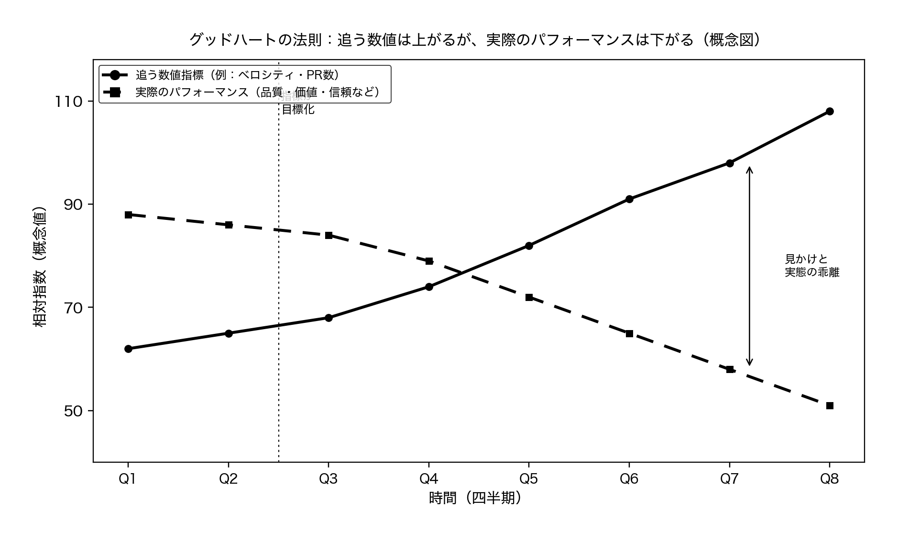
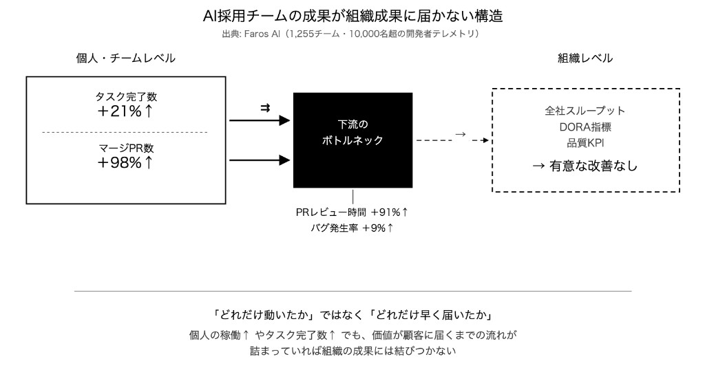

# 第2回 数値の誤解〜開発生産性は定量化できるのか〜

連載タイトル：誤解だらけの開発生産性〜DMM.comで見てきた誤解〜

---

書籍URL : https://www.amazon.co.jp/dp/4798194972

連載第1回で、開発生産性を語る前に何のため・どの指標・誰が何のために使うかを揃える話をしました。
本回は、開発生産性は定量化できるのかという問いに向き合います。測れないから諦めるという話ではなく、単一指標や評価直結が生む誤解を解体します。

## 「数字で示せ」と言われたあと、現場で起きること

DMMの開発現場でも、指標の話はこういった着地になりがちです。

リーダーが「開発生産性 指標」と検索すると、コード行数、機能リリース数、ストーリーポイント、デプロイ頻度、変更のリードタイムといった候補が並びます。どれも一理ある。どれも完璧ではない、という感触だけが残ります。エンジニアはプルリクエスト（PR）数やデプロイ頻度、プロジェクトマネージャー（PM）はユーザー価値やリリースの予定どおりさ、QA（品質保証）はバグの少なさとテスト時間、管理職は売上貢献とコスト効率を見ています。同じ「開発生産性」という言葉を使って会議しても、分子も分母も、そもそも何を良くしたいのかが揃っていない。テックリードはコードの複雑度と見積もり精度のずれを示しても、スピードが落ちているとしか受け取られないというもどかしさがあります。技術的負債の返済に時間を使うべきだとわかっていても、新機能が優先され、説明の言葉が届かない。数字が求められるほど、測れない価値のほうが見えにくくなる。

例えば、DMM内のチームでも普段の振り返りの場で、開発生産性に関する付箋を見てみると「時間が足りない」「仕様変更が多い」といった指摘が上がってきます。
そうなるとチーム目標として数値の目標を準備して対応しますが、ストーリーポイントを水増しして見積もりを合わせたり、簡単なタスクばかり選んでベロシティを稼いだり、リリース頻度だけ見られるから小さな変更を細切れに出したりします。リファクタリングや技術調査は評価に乗りにくく、誰も手を出さなくなります。数字を上げる仕事と、本当に必要な仕事のあいだに溝ができ、それは広がっていきます。計画の信頼性を取り戻すために指標をそろえようとしたはずが、指標そのものが新たな圧力になっているという構図です。

## 定量化はできる。破綻するのは「一つの数字」に集約すること

開発生産性を定量化できないというより、一つの数字に閉じ込めようとすると破綻するという見方のほうが現場に近いです。

**立場が違えば、分子と分母も違う**

開発生産性は、アウトプットをインプットで割った比率として語られがちです。分子にコード量を置くか売上を置くか、分母に人数を置くか人月を置くかで、出る数字の意味は変わります。広木大地さんの整理では、仕事量としてどれだけこなしたか（レベル1）、価値があると期待して選んだ施策をどれだけ届けたか（レベル2）、売上やKPIへの実貢献（レベル3）の三階層に分けて考えるとすれ違いが減ります（[「開発生産性について議論する前に知っておきたいこと」](https://qiita.com/hirokidaichi/items/53f0865398829bdebef1)、Qiita、2022）。経営の関心はレベル3に寄りやすく、現場の会話はレベル1に聞こえやすい。レベル3が低いからといって、すぐにレベル1の効率だけが悪いわけではありません。

物的生産性は労働時間あたりのコード行数やリリース数のように数値化しやすい一方、品質や価値は乗りにくい。付加価値生産性はユーザー価値や事業への貢献に近いが、結果が出るまで時間がかかる。どちらか一方だけを追うと、もう一方の話が消えます。

**数値指標が先行指標になると危ない**

グッドハートの法則は、指標が目標になるとその指標は機能しなくなると述べています。キャベルの法則も、状態が数値を作るのであって、数値が状態を作るわけではないと指摘しています。Petersenらの体系的レビュー（2011）でも、単純な output/input 比は歪みを生み、メトリクスを評価に直結させるとゲーミングを誘発しやすいと繰り返し報告されています。ストーリーポイントの水増し、PRの細切れ、レビューを薄くしてマージ数を稼ぐ。いずれも指標を上げるための行動であり、本質的な改善とは別物です。

指標を改善しても、事業の成果に接続しないことがあります。Faros AI の *The AI Productivity Paradox*（2025）では、1,255チーム・1万人超のテレメトリを分析し、タスク完了数やマージPR数は伸びても、組織レベルのスループットや品質KPIには有意な改善が見られず、PRレビュー時間の増加やバグ発生率の上昇が報告されています。

チームの活動量だけが改善したように見え、価値が顧客に届くまでの流れのボトルネックに吸収される、いわゆる**消える生産性**の例です。PR数は伸びたのに組織の成果に届かないのは、グッドハートの法則が組織規模で起きている状態と言えます。

AIで実装の入口が速くなるほどコード量やPR数は伸びやすく、活動量指標だけが良くなったように見える罠が強まります。一方で、リファクタリングや技術的負債の返済は数字に乗りにくく、測れないから説明できないという不満が残ります。連載第3回では、技術的負債の誤解としてこの壁に触れます。

信頼が積み上がっているときは、意図したタイミングで成果物が届くことが重視されます。遅延が続くと、なぜ遅れたのか説明できない不安から、数字で測ろうとする圧力が強まります。数値は信頼の代替にはなりにくく、測り方を誤ると信頼を削ります。追う数値だけを先に立てると、チームの改善が組織の成果に届かないまま、見かけの指標だけが先行していきます。

**測るなら「対」と「束」で**

DORA（DevOps Research and Assessment）の Four Keys は、デプロイ頻度と変更リードタイムでスピードを、変更失敗率とサービス復元時間で安定性を捉え、どちらか一方だけを追わない設計です（[DORA metrics guide](https://dora.dev/guides/dora-metrics/)）。フォースグレンらの [*The SPACE of Developer Productivity*](https://dl.acm.org/doi/10.1145/3453928)（ACM Queue, 2021）も、満足度、成果、活動量、コミュニケーション、効率の多次元で見るべきだとしています。単一指標の代わりに、緊張関係を含めた指標の束を選ぶことが、定量化の現実的な形です。

DORAとSPACEは対立する指標ではなく、重ねて使う枠組みです。ざっくりした違いは次のとおりです。

| 観点 | DORAメトリクス | SPACE |
|---|---|---|
| 何を測るか | DevOpsのスピードと安定性 | 開発者の生産性とウェルビーイング |
| 焦点 | ソフトウェアを速く、信頼性高く届ける | チームが生産的で健全に働けること |
| 考え方 | スピードと安定性を対で捉える | 満足度と成果をセットで捉える |
| 向いている場面 | デリバリー速度を上げたいエンジニアリング組織 | 開発者体験と協働を重視する組織 |
| 使い方を誤ると…… | 品質を欠いたスピード追求が燃え尽きを招く | ソフトな指標だけではプロジェクト成果がぼやける |
| いつ使うか | DevOpsパフォーマンスの最適化 | 開発者へのより良い体験の設計 |

DORAとSPACEはセットで使うのが前提です。DORAだけを公式指標にすると、デプロイ頻度やリードタイムは改善してもレビュー待ちや障害対応で開発者の負荷が増え、満足度が落ちていることに気づきにくくなります。SPACEだけを重視すると、サーベイ上の満足度やチームの雰囲気は守れても、変更が本番に届くまでの遅れや失敗率の悪化には届きにくい。DORAは届け方の速さと壊れにくさを、SPACEはその速さを支える人と仕組みの状態を別のレンズで見る枠組みです。

重ねるときの役割分担はシンプルです。DORAでスピードと安定性の対を追い、どちらかが悪化していないかを確認する。SPACEで満足度、成果、活動量、協働、効率の束を見て、活動量だけが伸びていないか、満足度が先に削られていないかを確認する。デプロイは増えたが活動量の水増しで疲弊している、リードタイムは短いが失敗率が上がっている、といったずれは、片方の数字だけでは見逃しやすい。

どちらか一方を全社の公式指標にしないことが大切です。経営向けにはDORAの四指標を、チーム改善の場ではSPACEのサーベイやワークフロー指標を、それぞれの目的に合わせて使い分けることをお勧めします。対と束をセットにしたダッシュボードは、単一指標の誤解を防ぐための補正レンズとして機能します。

## ダッシュボードの前に、三つの問いをそろえる

では、明日から何をすればよいでしょうか。数値をやめるのではなく、数値の設計と使い方を変えます。
指標を一つ決める前に、第1回と同じ三つの問いを指標ごとに書き出してみてください。

- 何のためにこの数値を見るのか
- 誰が、何の判断に使うのか
- 個人の評価や人事に直結させないか

そのうえで、最低でも二軸のセットを選びます。例として、変更リードタイムと変更失敗率のように、速さと安定性の対をデリバリー指標に置く。仕事量の指標を別に置くなら、チーム単位で改善のためだけに使うと明言する。四半期ごとに指標がゲーム化されていないか、実際の価値創出とずれていないかを見直します。

関係者ごとに「開発生産性で何を重視しているか」を15分ずつヒアリングし、表にまとめるだけでも会話は変わります。エンジニアは持続可能な開発速度とコード品質、QAはテスト時間とバグの段階、PMはユーザー価値と計画の信頼性、管理職は売上とコスト。これらはそれぞれ正しい視点です。統合するのは一つの数字ではなく、共通のゴールと、指標の役割分担です。

合意した数値とその理由は、議事メモやダッシュボードの横に、なぜこの指標を見ているかを短く残してください。数値を武器に理論武装するのではなく、遅れたときや改善するときに同じ材料を見ながら話すための道具にします。

指標がゲーム化されていないか確認するときは、次の三つをチームで見ます。

- 指標を上げるためだけの行動が増えていないか
- 指標が上がってもユーザー満足度や障害件数、計画の信頼性が伴っているか
- リファクタリングや調査のような見えにくい仕事が継続的に時間を確保できているか

このうちの一つでもずれていれば、指標の見直しか、評価との切り離しを検討します。

現場で明日からできることは、使っている指標を一枚のメモに書き、三つの問いに答え、上司やPMと15分すり合わせることです。ダッシュボードを増やす前に、誰のための数字かをそろえるだけで、指標を上げることが目的化した会話は止まりやすくなります。

## 数字をやめるのではなく、使い方を変える

開発生産性は定量化できます。ただし、一つの数字で測れ、測れば信頼が生まれる、全員が同じ数字を見ているという前提は誤解です。立場によって分子と分母が異なり、指標が評価に直結すると形骸化し、チームの改善が組織の成果に届かないこともあります。これは数値を否定しているわけではなく、数値の設計と対話のあり方を直すための提案です。

次回は数字に乗りにくい技術的負債をどう扱うか、第3回「技術的負債の誤解〜測れないから説明できないを越える〜」で扱います。測ることと、測れない価値を伝えることは、セットで考える必要があります。

---

## 参考文献

- 広木大地. 「開発生産性について議論する前に知っておきたいこと」. Qiita, 2022. https://qiita.com/hirokidaichi/items/53f0865398829bdebef1
- Petersen, K. et al. "Measuring and predicting software productivity: A systematic map and review." 2011. https://romisatriawahono.net/lecture/rm/survey/software%20engineering/Software%20Product%20Lines/Petersen%20-%20Measuring%20and%20predicting%20software%20productivity%20-%202011.pdf
- DORA. DORA metrics guide. https://dora.dev/guides/dora-metrics/
- Forsgren, N. et al. "The SPACE of Developer Productivity." ACM Queue, 2021. https://dl.acm.org/doi/10.1145/3453928
- Faros AI. *The AI Productivity Paradox* (*AI Engineering Impact Report*, July 2025). https://www.faros.ai/blog/ai-software-engineering
