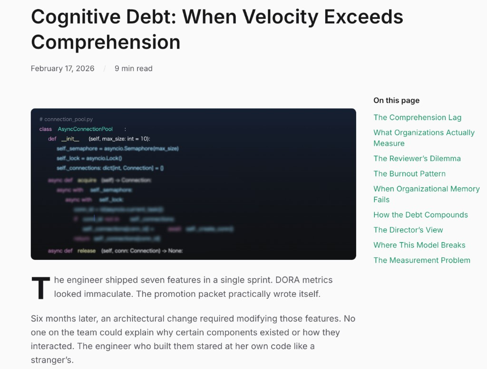
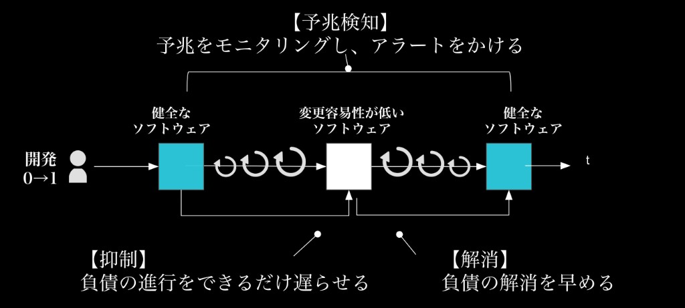

# 第3回 技術的負債の誤解〜「測れないから説明できない」を越えることと認知的負債について〜

連載タイトル：誤解だらけの開発生産性〜DMM.comで見てきた誤解〜

---

書籍URL : https://www.amazon.co.jp/dp/4798194972

連載第2回で、開発生産性は1つの数字に閉じ込めると破綻するという話をしました。本回はその数字に乗りにくい代表格、技術的負債を扱います。「技術的負債があります」と口で言っても、経営会議では具体的な数値を求められて言葉に詰まる。DMM.comの現場でも繰り返し見てきたこの壁を、測れないことと説明できないことに分けて解体します。

## 「技術的負債を解消したい」としても、工数も根拠も出せない

開発現場でよく観測されるのは、障害が頻発したり影響調査の範囲に時間がかかるほど、「技術的負債を計画的に返済したい」と懇願する場面が出てくることです。コードの複雑さで変更の影響が読めず、リリースをしても思いもよらない箇所で障害が発生。ポストモーテムを書くことに業務が圧迫され、再発防止の振り返りでも「ちゃんとコードレビューをしていれば大丈夫だったかもしれない」「STG環境でちゃんとテストができていれば防げたかも知れない」という言葉が並ぶものの、新規開発で工数は取られ、技術的負債を返却する工数は取れません。

一方、技術的負債というのは、どのぐらい負債があるのかの計測と返却したときの効果試算が難しい代物でもあります。
返済の工数と期間、必要な予算。そして本当に技術的負債を返却したら開発は早くなるのか。正しく技術的負債を返却できるスキルをもったチームなのか。この問いにエンジニアは答えられないといけません。

## 測れないのではなく、測り方と説明の言葉がそろっていない

技術的負債は**測れないから説明できない**というのは誤解です。
従来の単一的な測りやすい指標（Four Keysや静的解析）では説明しずらいですが、これから述べていく多角的な視点を組み合わせることで説明可能になります。

**負債は「時間」として先に流出している**

ここで1つの調査データを紹介します。Stripe / Harris Poll（2018）の *The Developer Coefficient* は、5カ国で開発者1,000名超とCxO 1,000名超を対象にした調査で、開発者の週平均労働時間41.1時間のうち、技術的負債への対応に13.5時間、バッドコード対応に3.8時間、合計17.3時間が費やされると報告しています。これらの時間を合わせると週の約42%にもなる時間です。新しい価値を作る前に、既存システムの維持と修復で時間が先に失われています。負債は帳簿に載らなくても、時間という形で毎週流出しています。

この数字は「自社も必ず同じ比率だ」と決めつけるためのものではなく、現場の体感を定量の問いに変える基準線として使えます。週次の時間を新規開発・保守修復・調査や待ち時間に分けるだけでも、どこで速度が失われているかを議論できるようになります。

**内部品質を上げるほど、長期では安く高品質なソフトウェアが作れる**

スピードを優先するなら品質を犠牲にするしかないという論調もありますが、連載第1回でも紹介したMartin Fowlerの *Is High Quality Software Worth the Cost?* では、内部品質についてはこのトレードオフの立て方そのものがずれているという旨を紹介しました。
ユーザーが評価できる外部品質と異なり、モジュール分割や命名といった内部品質は外から見えません。それでも開発者がこだわるのは、仕事の大半が既存コードの読み解きと変更だからです。理想の設計との差分（cruft）が増えるほど、変更の見当がつくまでの時間が伸びます。
「きちんと書くから時間がかかる」と説明すると、品質にはコストがかかると受け取られて議論で不利になりがちです。しかし実際には逆で、内部品質が高いほど将来の変更が安く済み、トータルコストは安くつきます。内部品質への投資はコストではなく、将来のコスト削減への投資です。

## 「測れない」の正体は認知的負債

もう1つ見落とせないのが、コードもシステムも動いているのに、なぜそう動くのか、なぜその設計になったのかを誰も説明できない状態です。これを**認知的負債（Cognitive Debt）**と呼びます。
技術的負債がコードや設計そのものに溜まるのに対し、認知的負債は人間側の理解の欠如にあります。テストもパスし、デプロイ回数も安定するので、開発速度の指標にはほとんど表れません。
AIエージェントを使った開発である「Loop Engineering」が進むほど、このずれは広がりやすくなるでしょう。

**認知的負債についての2つのレポート**

関連したレポートとしてRockoderの [*Cognitive Debt: When Velocity Exceeds Comprehension（速度が理解力を上回るとき）*](https://www.rockoder.com/beyondthecode/cognitive-debt-when-velocity-exceeds-comprehension/) では、
AIエージェントを使った開発において**出力の加速**と**理解の形成**を切り離すと指摘しています。何がなぜ作られ、ほかとどう関係するかを本当に理解する作業は、人間の処理速度に縛られたままです。

この出力と理解のギャップそのものが認知的負債です。表面化するのは数ヶ月後、設計変更や障害対応で誰も説明できない場面に至ったときです。理解があれば10分で済む修正が、理解がなければ4時間の調査に化ける。出荷したなら理解しているはず、という前提が崩れたいま、理解を測れない以上は短期のスピードばかりが最適化されやすくなります。

合わせて、[Addy Osmaniの *Loop Engineering*](https://addyosmani.com/blog/loop-engineering/) のレポートでも、
エージェントが自律的に反復するほど、自**分が理解していないコードが先に増える**と述べており、テストが通りマージも進むのでPR数やマージ数だけを見れば活動は活発に見えます。一方で理解の負債だけは静かにたまります。ループが回るほど、もういいかと受け入れる誘惑も強まります。Osmaniはこれをcognitive surrenderと名付け、ループ設計が思考を避けるための言い訳にもなりうると述べています。それでもエンジニアであり続けるにはループの出力を読み、検証し、理解を意図的に確保する設計が必要です。同じループでも、理解を深める人と避ける人では結果は真逆になります。

この2つのレポートに共通するのは、認知的負債はコードの劣化ではなく、**出力が理解を追い越したときに溜まる負債だ** という見立てです。従来の評価指標ではAIエージェントやループが速くなるほど、活動量の指標だけが良く見え、理解の不足は見えにくくなります。請求は遅れて届き、障害対応や設計変更の現場で、誰も説明できないまま時間だけが溶けていきます。本回の冒頭で述べた、返済を懇願しても工数も根拠も出せないという話にも直結します。それは、チーム自身が何を直し、返済すると何が戻るかを説明できなければ、返済の議論そのものが止まってしまうからです。

ここまでの負債が放置されやすいのは、**今は動くから後でリファクタリングする** という判断が短期的には合理的に見えるからです。けれどその後はなかなか来ません。新機能が優先され、負債は雪だるま式に増え、修正コストは後になるほど膨らみます。
リファクタリングに工数を割いても、短期のベロシティやリリース数にはすぐ出にくい。返済そのものは活動量の指標に載りにくく、負債の利息だけが障害や手戻りとしてあとから請求される。投資や活動は増えているのに、成果の数字に出ません。

## 予兆で検知し、返済の根拠をつくる

冒頭の問い、返済にいくら・何週間かかり、返済すると何が戻るかに答えるには、まず予兆で負債の増え方を捉え、可視化と運用の分け方をそろえる必要があります。測れないのではなく、どこを見て何を説明するかがそろっていない、というのが本回の答えです。

### 予兆検知・抑制・解消を分けて運用する

技術的負債は、予兆検知・抑制・解消の3つに分けて運用すると整理しやすくなります。予兆検知は、いつ手を打つかを決めるための定点観測です。抑制は、新しい負債の流入を止める仕組みで、スプリントごとにリファクタリングやライブラリ更新の工数が先に確保されているかを見ます。解消は、リプレイスも視野に入れて期限と体制を決め、既存チームで進めるか専門チームを切り出すかを選びます。この3つを混ぜて考えてしまうと、いつも火消しばかりで返済計画が立たないという状態に陥りやすくなります。

### 4観点で予兆を定点観測する

「[技術負債の『予兆検知』と『状況異変』のススメ](https://speakerdeck.com/i35_267/ji-shu-fu-zhai-no-yu-zhao-jian-zhi-to-zhuang-kuang-yi-bian-nosusume)」では、プロダクトごとに勘所を決めつつ、次の4観点で検知する整理を示しています。

| # | 観点 | 読み方 |
|---|---|---|
| 1 | 計画と実績の差分 | 見積もりと実績のズレが四半期を通じて広がるなら、複雑性の蓄積を疑う |
| 2 | 変更・レビュー時間の増加 | 同じ規模の変更でも開発やレビューに時間が伸びれば、属人化や理解の不足の兆候と考える |
| 3 | 障害と再発防止策 | 件数だけでなく、再発防止策が追いついているか、同じ箇所を繰り返していないか確認する |
| 4 | エンゲージメントの低下 | 障害対応やポストモーテムの負荷が士気を削っていないか確認する |

現場でも4つすべてを一度に追うより、プロダクトごとに当たりやすい2つを選んで四半期単位で定点観測するという進め方が現実的です。障害が多いサービスなら障害と再発防止策、リリース遅延が目立つなら計画と実績の差分、から始められます。

### 静的解析と多角的な可視化

可視化の手段として静的解析ツールが使えます。循環的複雑度やコード重複率を自動算出し、修復に必要な工数として負債規模を共有できます。負債の利息を払う以前に、どこにどれだけあるか＜＜負債でしょうか？　何を、なのか入れたほうが良さそうです！＞＞を把握しようとする活動自体が時間を消費するという点も重要です。静的解析やダッシュボードは贅沢ではなく、返済の議論の前提をそろえるための先行コストとして位置づけられます。

一方で**限界もあります**。設計の質やドメイン境界の崩れといったアーキテクチャ上の負債は静的解析だけでは捉えきれません。認知的負債も同様で、理解の不足はツールの出力には出てきません。運用が甘いと誤検知でトリアージに時間を取られます。Gitのコミットやプルリクエスト（PR）のライフサイクル、チケット、障害件数、見積もりと実績の差分をあわせて多角的に見る必要があります。レビュー待ち時間の伸びや、リリース直後のバグ割合の変化は、コード品質ツールだけでは説明しきれない予兆になります。

### 明日からできること

現場で取り組めるのは、次の3つです。

1. プロダクトごとに4観点から2つを選び、四半期でトレンドを見る
2. スプリント計画に返済工数を行として明示し、抑制が機能しているかを振り返る
3. 静的解析や予兆の変化を1枚にまとめ、いま何が失われているかを上長との会話のたたき台にする

可視化は、開発側と事業側が同じ論点を共有するための共通言語です。

## おわりに

技術的負債は測れないから説明できないというのは誤解です。従来の活動量指標とは別に認知的負債の理解、技術的負債がおこる予兆検知という別の物差しで説明しながら理解を構築していくことが大事です。
次回は、人手が足りないからAIで補うという前提を解体します。第4回「人月の誤解〜『人が足りない』『AIで増やせる』の誤解〜」で扱います。

---

## 参考文献

- Stripe / Harris Poll. *The Developer Coefficient*, 2018. https://stripe.com/files/reports/the-developer-coefficient.pdf
- Martin Fowler. "Is High Quality Software Worth the Cost?". https://martinfowler.com/articles/is-quality-worth-cost.html
- Rockoder. "Cognitive Debt: When Velocity Exceeds Comprehension" (*Beyond the Code*). https://www.rockoder.com/beyondthecode/cognitive-debt-when-velocity-exceeds-comprehension/
- Addy Osmani. "Loop Engineering." https://addyosmani.com/blog/loop-engineering/
- Besker, U. et al. "Technical Debt Cripples Software Developer Productivity: A Longitudinal Study on Developers' Daily Software Development Work." 2018.
- 石垣雅人. 「技術負債の『予兆検知』と『状況異変』のススメ」. Speaker Deck, 2025. https://speakerdeck.com/i35_267/ji-shu-fu-zhai-no-yu-zhao-jian-zhi-to-zhuang-kuang-yi-bian-nosusume
- GitClear. *AI Copilot Code Quality* 2025 Data Report. https://www.gitclear.com/
- Faros AI. *The AI Productivity Paradox* (*AI Engineering Impact Report*, July 2025). https://www.faros.ai/blog/ai-software-engineering
- Robert M. Solow. "We'd better watch out." *New York Times Book Review*, 1987.
- Erik Brynjolfsson. "The Productivity Paradox of Information Technology: Review and Assessment." *Communications of the ACM*, 1993.
