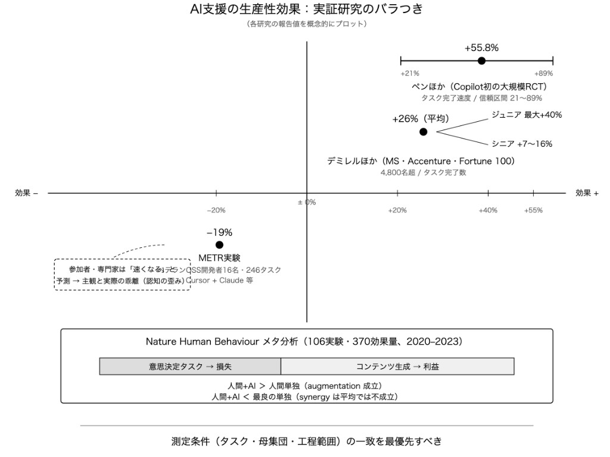
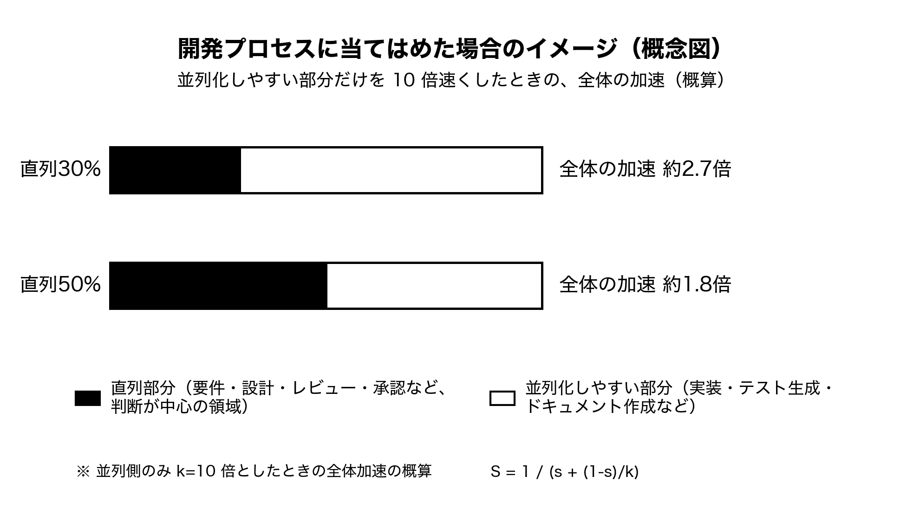
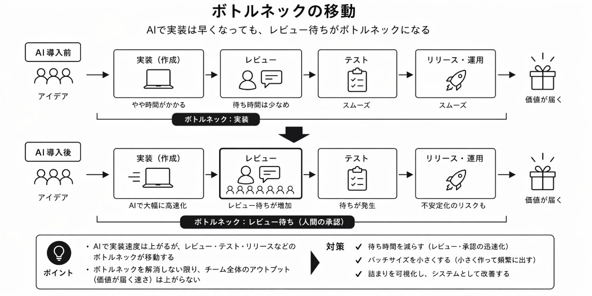
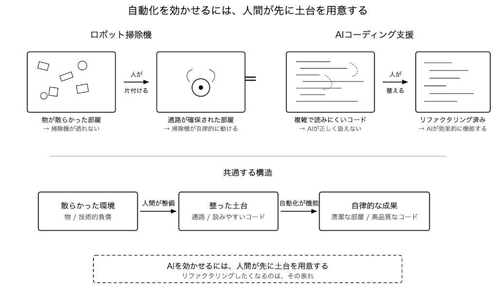
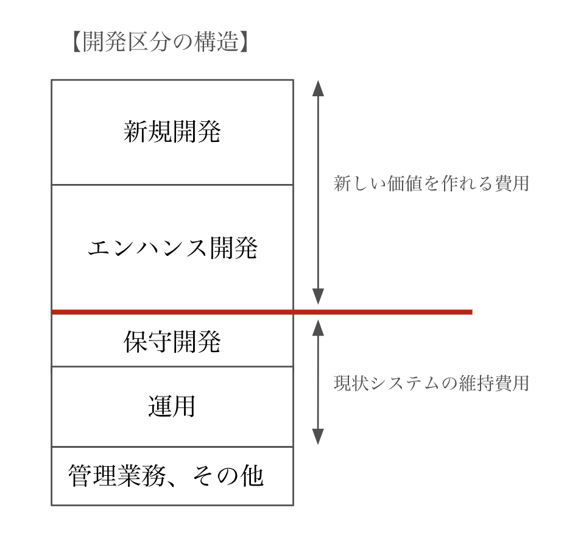

# 第4回 人月の誤解〜「人が足りない」「AIで増やせる」の幻想〜

連載タイトル：誤解だらけの開発生産性〜DMM.comで見てきた誤解〜

---

書籍URL : https://www.amazon.co.jp/dp/4798194972

連載第3回では、技術的負債と認知的負債という帳簿に乗りにくい負債を扱いました。その負債を抱えた現場に次に降ってくるのは開発量の要求です。「この機能に追加してほしい！」「足りないなら人を増やせ」といった声に、ここ数年はAIエージェントで開発量を確保すればいいという期待が加わりました。人月をAI人月に置き換えれば間に合うという読みも、DMM.comの現場で何度も出てきました。第4回では、この2つが同じ形の誤解であることを解きます。

## 「足りないなら増やせ」と言われた後に現場で起きること

技術的負債の改善活動が進んで影響調査もしやすくなった！　という現場感覚とは別に、営業は「この機能がないと次期契約が危ない」、マーケティングからは「新機能がないとプロモーションの材料がない」と言われる。

結論は予算がなく、現有リソースでどうにかしてほしい、というものになります。採用に踏み出しても、面談から入社までに3カ月から半年、その後のオンボーディングにさらに数カ月かかるため、四半期のタイムリミットには届きません。★★四半期というキーワードが唐突に出てきた？　説明を足した方が良いかもです！★★過去に業務委託で急いで人を入れてやり直しになった組織があったり、メンバーの残業は積み上がったりして、これ以上の受け入れ余力はありません。

そこでAIエージェントを開発プロセスに組み込みました。プロンプトを渡すとコードが返り、書く速さはたしかに上がります。一方で生成物を理解せずそのまま取り込めば、認知的負債が膨らみます。しっかり品質を見ようとすると実装は速いのにレビュー待ちで時間が溶けて、チームとしては遅く感じる。このねじれは、現場でよく聞こえてきます。

一方で、AIエージェントは従量課金が世界的トレンドにもなっており、1人あたりでも月額数万円から数十万円、1〜2週間で導入も始めらます。こういった部分でも人を採用するより安く、開発期間が短くなる比較も目に入ります。流動性という意味では、予算もリードタイムも増減のしやすさもAIのほうが有利に見えます。そのため、足りない分をAIで埋めて人月の代わりにAI予算として積むという発想がここで生まれます。

## 人月もAIも、増やしているのは同じ側

**人数を足しても、納期は線形に縮まない**

これは、連載第1回でも触れたブルックスの法則です。フレデリック・ブルックスの『人月の神話』は、遅れているプロジェクトに人員を足しても納期が早まるとは限らず、むしろ遅れることがあると述べています。

加わったメンバーは仕様と設計とコードベースの説明を受ける時間が必要で、既存メンバーは教育とレビューに時間を取られます。人数が増えればコミュニケーションの経路も増え、作業の再分割と統合のやり直しも起きるため、順序に依存するタスクは人月を積んでも短くなりません。

**「AIで速くなる」の数字は、割れている**

AIによって効果ができるのは「並列側」というのが本回の論点です。計4,800名を対象にした研究★★何の研究なのか添えたほうが良さそうです！★★ではタスク完了数が約26%増えたとある一方で、ベテランのOSS（オープンソースソフトウェア）開発者16名が246タスクに取り組み、AIを使った群が平均19%遅いという結果でした。参加者も専門家も速くなると予測していたのに、実測は逆です。

異なるGitClearの分析では、AI導入後に書いてすぐ消される行が倍増し、重複コードのブロックが約10倍に増えています。入口の速さは下流の品質とは切り離せず、生成では効きやすく、判断を伴うタスクでは損しやすいという傾向も報告されています。★★「効きやすく」と「損しやすい」なので、対比が効いていないかも★★

**天井を決めているのは、並列化できない判断の側**

ジーン・アムダールが示した法則（アムダールの法則）があります。ある仕事のうち、並列化できる部分をどれだけ速くしても並列化できない部分はそのまま残るため、全体の短縮には上限があります。並列化できない部分が3割なら約3.3倍、5割なら2倍程度で止まります。

これを開発に当てはめると、並列化しやすいのは実装やテスト生成です。一方、課題の特定や設計判断、要件定義、レビュー、承認は並列化しにくい。直列が全体の30%なら残りを10倍速くしても全体は約2.7倍、50%なら約1.8倍にとどまります。

人を足すこともAIを足すことも、並列側の処理能力を増やす手段です。天井の高さを決めているのは直列側の割合なので、そこに触らないかぎり、投入量をどれだけ積んでも同じ壁に当たります。

**ボトルネックは消えない。移動するだけ**

Faros AIの分析（1,255チーム、1万名超）では、AIの採用度が高いチームでタスク完了数やマージされたプルリクエスト（PR）数は増えた一方、PRレビュー時間が91%増え、人間の承認が律速になっていました。組織レベルでは、AIを採用するのとDORA（DevOps Research and Assessment）メトリクスの改善に有意な相関が見られなかったと報告されています。DORAの2025年版レポートはAIを増幅器と表現しています。流れが整った組織では実装の速さがレビューやリリースと噛み合う一方、レビュー待ちが大きい組織では生成量だけが先に増え、そこで起きるのが消える生産性です。効率化で空いた時間が、次に何へ使うかが決まっていないと、待ち時間や細かい確認、惰性の作業に吸われて組織の成果には届きません。個人の書く速さは上がっても、チームの出口が動かないという感覚の正体のひとつでもあります。

## AIを並べた先で、考える時間が先に消える

AIエージェントを並べて動かすと、人間の側には3つの「待ち」が生まれます。
1つ目はAIエージェントのタスクが枯渇して止まる指示待ち、2つ目は成果物がレビューされないまま溜まる検収待ち、3つ目はHuman in the Loop（HITL）でよくある質問と確認が絶えず飛んでくるチャットの細かい対応による待ちです。一番重いのは3つ目で、日々の対応に追われると、プロジェクトについて深く考える時間から先に削られていきます。

## 増やす前に、直列側を短くする

### コードの差分より先に、意図をレビューする

直列部分の多くはレビューと合意形成です。500行の差分を全部読む前提を残したまま生成量を増やせば、レビュー待ちが伸びるだけです。
AIエージェントを使ううえでも、そもそも既存のシステムが綺麗でないとAIリーダブルではないため★★AIリーダブルではないため→AIの可読性が低いため　とかが良いかも？★★うまくAIが理解できずに品質が高い出力が出ません。
これはロボット掃除機に近い話でもあります。よく見るのはロボット掃除機が自動で掃除をしてくれるというコンセプトにも関わらず、まず人がやるのはロボット掃除機が掃除をしやすいように先に床の物をどけて、ロボット掃除機の通り道を片付けを始めるという現象があります。これと一緒でAIを効かせるには仕様や意図、検証の土台を先に整える必要があるという構造です。

何を実現したいかという意図、仕様、制約、受け入れ基準をレビュー対象に置き、コードはその成果物として扱います。ハーネスを整えるとも言えます。検証の基準は、コードを書く前の仕様の段階で決めておきます。テストカバレッジが基準を満たし、静的解析のエラーがなく、既存のパターンに沿った変更は自動承認にします。小さな設計変更はエンジニアとテックリードで決め、上位の承認は影響範囲の大きい判断に限る。人間が機械より多く読む側ではなく、上流で深く考える側に回るという分担になります。

### 工数を「価値」と「維持」に分けて見る

違う観点で人月（工数）をどこに投下するべきかという観点もあります。
毎月使える人月は人件費で決まっており、その内訳を新しい価値に使える工数と、いまのシステムを維持運用する工数に分けます。新規開発とエンハンス開発が前者、保守開発、運用、会議や採用などの管理業務が後者で、ある現場では後者が全体の約4割を占めていました。プロジェクトマネージャー（PM）や上長から見ると、エンジニアはずっと開発しているリソースに見えますが、区分ごとの数字を出すとその見え方は変わります。

そのうえでAIの投下先を、開発を速くして出口の成果量を増やす方向と、運用や管理業務を置き換えて入口の工数を増やす方向の2つに分けます。AIエージェントによる速さを獲得する側面では「開発を早くする」という箇所に目が行きがちですが、運用として障害が多く、ポストモーテム作成や障害分析あたりをAIエージェントに置き換えて新規開発の工数に回すという面でも効果は出ることになります。

## おわりに

人が足りないからAIで増やすというのは、少し誤解がある思考です。人月もAIも並列側を厚くする手段で、天井を決めているのは判断と合意の側です。投入量を増やす前に、まずはどこが直列になっているかを見ます。そこを短くしないまま量★★何の量か記載してあげると良さそうです！★★だけを積むと、レビュー待ちと疲労が先に増えます。空いた時間の行き先も、先に決めておく。

★★上記を表す図解が入っても良さそうです…！★★

次回は、その直列部分を担う人がどう評価されるのかを扱います。第5回「評価の誤解〜エンジニアだけが生産性を求められる構造〜」で、開発生産性がエンジニアだけの責任になる構造を解体します。

---

## 参考文献

- フレデリック・ブルックス. 『人月の神話【新装版】』丸善出版, 2014年（原著 *The Mythical Man-Month*, 1975/1995）.
- Demirer, M. et al. The Effects of Generative AI on High-Skilled Work: Evidence from Three Field Experiments with Software Developers（企業内ランダム化実験（Copilot））. https://demirermert.github.io/Papers/Demirer_AI_productivity.pdf
- Peng, S. et al. "The Impact of AI on Developer Productivity: Evidence from GitHub Copilot," 2023.
- METR. *Measuring the Impact of Early-2025 AI on Experienced Open-Source Developer Productivity*, 2025. https://arxiv.org/pdf/2507.09089
- Vaccaro, M. et al. "When combinations of humans and AI are useful." *Nature Human Behaviour*, 2024. https://www.nature.com/articles/s41562-024-02024-1
- GitClear. *AI Copilot Code Quality* 2025 Data Report. https://www.gitclear.com/　★★リンクはトップですがOK?★★
- Faros Research *The AI Productivity Paradox Report 2025* (*AI Engineering Impact Report*, July 2025). https://www.faros.ai/blog/ai-software-engineering
- DORA. *2025 State of AI-Assisted Software Development*. https://dora.dev/research/2025/dora-report/
- Ranganathan, A., Ye, X M. "AI Doesn't Reduce Work—It Intensifies It." *Harvard Business Review*. https://hbr.org/2026/02/ai-doesnt-reduce-work-it-intensifies-it
- BCG. *Where's the Value in AI?*, 2024. https://www.bcg.com/publications/2024/wheres-value-in-ai
- 逆瀬川ちゃん. 「新しい時代の開発と組織について」, 2026. https://nyosegawa.github.io/posts/development-and-organization-in-agent-era
- Ankit Jain. "How to Kill the Code Review." *Latent.Space*. https://www.latent.space/p/reviews-dead
