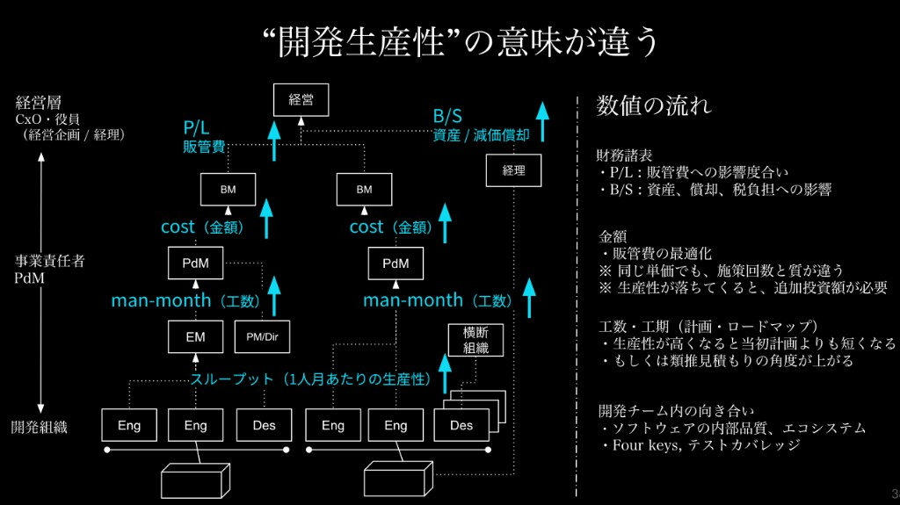

# 第5回 評価の誤解〜エンジニアだけが生産性を求められる構造〜

連載タイトル：誤解だらけの開発生産性〜DMM.comで見てきた誤解〜

---

書籍URL : https://www.amazon.co.jp/dp/4798194972

連載第4回では、人を足してもAIを足しても、納期の天井を決めているのは判断と合意の側だと書きました。その判断を担った人に、次に返ってくるのが**評価**です。変更のリードタイムは短くなり、障害も減っています。それでも会議の場では、開発は早くなっているがいまいち実感として全体が速くなっていないという問題が出てきます。これは視野が開発フェーズだけに寄っていたり、開発生産性の意味が役割や役職によって意味が変わっていたりすることが原因です。最終回となる第5回では、開発生産性がエンジニアだけの責任になる構造を解体します。

## 聞かれるのは、誰の作業が遅かったのか

チームはプルリクエスト（PR）のリードタイムを縮め、リリース後の障害も減らしています。レビューの待ち時間も、前の四半期より短くなっています。それでも、企画が立ってから＜＜どこに届くか記載した方が良さそうです＞＞届くまでのリードタイムで見ると、遅いのは実装の前であることが多い。企画の合意が揺れ、要件定義が固まるまでに週＜＜1週間？　1週間の時間？＞＞が溶け、開発に渡った時点で四半期の残り時間はすでに短い。開発フェーズだけをどれだけ頑張っても、全体として＜＜どこに届くか記載した方が良さそうです＞＞届く時期はほとんど動きません。

報告の場で開発側の数字を出すと、返ってくる問いは別の場所にあります。生産性は何パーセント上がったのか。隣のチームのリリース回数と比べてどうなのか。説明を求められるのは、開発リーダー個人です。企画や要件定義で止まっていた時間は、その問いの主語には入りません。

品質に使った時間は、その表には出てきません。技術的負債の返済にスプリントの一部を割くと、機能のリリース数は一時的に減ります。レビューで差し戻し、曖昧な仕様を事業側に戻す作業に追われた週も、完了件数が伸びません。評価のシートが完了件数と工期だけだと、その週は生産性が落ちた週として記録に残ります。確認を厚くしてバグを止めた人より、確認を薄くして件数を稼いだ人のほうが開発生産性は高く見えます。

遅れの会話も同じところに着地します。なぜ遅れたのか、次に何を変えるのかではなく、誰の作業が遅かったのかが先に聞かれます。計画を動かし、優先順位を途中で変えた側は、その問いの主語には入りません。実装した人が、未達の原因として記録に残ります。

会議のあと、リーダーは個人の完了件数を週次で集計し始めます。件数が落ちた週は、返済を止めて小さな変更を積みます。レビューのコメントは短くなり、曖昧な仕様も実装側で吸収するようになります。数字は戻ります。戻ったあとに増えるのは差し戻しと、リリース後の問い合わせです。評価を守る行動が、前の四半期で減らした障害を別の形で戻します。

事業側が知りたいのは、次の企画をこの時期に置いてよいかです。完了件数の増減からは、その問いに答えられません。答えられないぶん、問いは開発リーダーの速度に戻ります。

内部の数字は良くなっているのに、評価だけが苦しいままです。足りないのは説明の上手さだけではありません。測っているレイヤーと、責任を置いている人がずれています。開発が速くなった恩恵も、レイヤーによって異なります。実装の待ち時間が減ったことは開発チームには見えますが、企画の時期が動いていない事業側には、同じ改善として届きません。

## 開発生産性が上がる恩恵はレイヤーごとに異なる

開発生産性という言葉は便利な言葉が故に組織内で異なる意味で使われることがたびたびあります。そのため「開発生産性が上がった」というときに受ける恩恵も変わってきます。

まず開発チームが見ているのはスループットです。これは1人月あたりにどれだけ生産量を出せるかという内部の速さと安定性です。DORA（DevOps Research and Assessment）のFour Keysは、このレイヤーの状態を対で捉える指標です（[DORA metrics guide](https://dora.dev/guides/dora-metrics/)）。

しかし、一段上のマネージャーやプロジェクトマネージャー（PM）が見ているのは、人月と工期です。計画した機能がきちんとスケジュールどおりにユーザーに届いたか。投資工数が予想どおりだったか、見積もりと実績がどれだけずれたかというものです。さらに上のレイヤーの事業側では、人月は金額に読み替わります。同じ単価でも、届く施策の回数と質が変わり、届かなければ追加の投資が必要となります。経営と経理が見ているのは、損益計算書の販管費と、貸借対照表のソフトウェア資産や減価償却です。現場がスループットを上げたと言うとき、経営が聞いているのは販管費と資産に効いたのかという問いです。

＜＜何を上げたいのか明記しませんか？　スループット？　開発生産性？＞＞上げたい意味も、レイヤーによって異なります。エンジニアが見ているのはテストやレビューの速さ、手を動かせる時間、負債を減らせるかどうかという観点です。PMや開発マネージャーが見ているのは、プロセスのリードタイムと、予測どおりに仮説を回せるか、人員の見通しが立つかどうかという観点です。事業側や経営側が見ているのは早く安く、届く範囲が足りているかどうかという観点です。内製にこだわらず外に出す判断も、このレイヤーには入ります。

事業側にとっての速さは、プルリクエストが何時間でマージされたかではありません。仮説が一定の確率で価値になるなら、四半期に何回その仮説を出せるか、1施策のリードタイムがどれだけ縮むかが価値になります。回転が落ちると、取りにいけた利益を取り逃がします。開発のスループットをいきなり損益に飛ばさず、工数、金額、財務の順に、一段ずつ入力と出力として渡します。

ある改修でリードタイムが3日から2日になっても、事業側の問いは別です。その1日で、欲しい時期に欲しい範囲は届いたのか。同じ人数で、施策の回数は増えたのか。届いた変更は、使われない資産として償却の負担だけを増やしていないか。件数の改善は、この三つのどれかに翻訳されて初めて、上のレイヤーの評価の材料になります。

各レイヤーの入力と出力は、次のように一段ずつつながります（石垣雅人「[『開発生産性』はエンジニア"だけ"のモノではなくなった？](https://codezine.jp/article/detail/18829?p=2)」、CodeZine）。

| レイヤー | 入力（input） | 処理（model） | 出力（output） |
|---|---|---|---|
| 開発組織 | 人 | ソフトウェア開発 | 1人月あたりの生産性（スループット） |
| PM、EM | 1人月あたりの生産性（スループット） | 価値提供速度の未来予測 | 工数・スケジュール（工数の手戻りコスト削減など） |
| BM、PdM | 工数・スケジュール | 工数×単価を人的予算の基本として、戦略・戦術の遂行計画 | P/L（一般管理費） |
| 経理 | 開発したプロダクト | ソフトウェア資産計上か費用かの振り分け | 税負担・減価償却費（P/L） |

レイヤーをまたぐこの**価値の変換**は、開発の改善が事業の言葉に届く経路として整理できます（石垣雅人「[『開発生産性を上げる改善』って儲かるの？](https://speakerdeck.com/i35_267/is-development-productivity-profitable)」、開発生産性カンファレンス2024）。経路を共有しないまま現場の件数だけを開発生産性が上がったという評価で置くと、上のレイヤーの問いへ渡す材料がの外側に残ります。計画を信じて立てられるかも、資産に効いたかも、実装者の完了件数には最初から載っていません。

だからFour Keysが改善しても、事業側に良くなった実感が生まれないとき、**圧力はもう一度エンジニアの速度に戻ります**。測るレイヤーの選び間違いに見えがちです＜＜前文とのつながりがちょっと弱いかもしれません。もうちょっと丁寧に説明してあげるとグッと締まりそうです＞＞。実際に起きているのは、責任の置き場所を一番下に固定したまま、上の問いを下の単位で埋めようとすることです。

## 誰が遅いかをやめて、どのレイヤーの約束がずれたかを見る

明日から変えるのは、評価シートの項目数ではありません。問いの主語です。

遅れが出たとき、最初の一文を変えます。誰の作業が遅かったかを聞く前に、**どのレイヤーの約束がずれたか**を前提に置きます。事業側が欲しい時期に、欲しい範囲が届かなかったのか。見積もりの前提が、途中で仕様と優先順位ごと動いたのか。合意のあとで実装の速度が落ちたのか。この三つは別の約束です。全部を実装者の速度に足すと、直す場所が一つに見え、直しても遅れが残ります。

説明の言葉も、上のレイヤーが受け取れる単位にオーバーラップして寄せます。技術的負債はそのままでは評価の語彙になりません。届ける速度が落ちるリスクと言い換えます。内部品質に使った時間も、作業が遅い理由にはしません。見積もりのばらつきを減らす投資として前提に置きます。返済の週にリリース件数が落ちるのは、次の四半期の工期の振れを先に払っている状態です。この言い換えがないと、良い判断をした週ほど評価が下がります。負債の返済に2日使ったなら、その2日で次の見積もりの振れがどれだけ狭まるかを一行で残します。狭まらない返済は、投資の説明になっていません。理由のメモがない返済は、評価の場ではただの遅れに戻ります。

さらに、三つの軸は個人の評点にはしません。三つの軸はあくまでチームの振り返りと事業側との短い対話のときに使います。ビジネスインパクトは、届いたものが顧客と売上のどの問いに答えたか。持続可能性は、負債とレビューと人の理解が、次の変更を遅くしていないか。効率性は、速度と失敗率が対で動いているか。15分で足りるのは、点数を付けることではありません。この三つの軸のうち、どれが今ずれているかを同じテーブルで見ることです。

対話でそろえておきたいのは、なぜこの週は件数より返済を先にしたのか、前提が崩れたら約束のどのレイヤーを動かすのかという点です。評価のときにそのやり取りを思い出せれば、個人の速度だけが責任のすべてにはなりにくくなります。

## おわりに

開発生産性がエンジニアだけの責任だ！　というのは誤解です。レイヤーごとに価値が異なるのに、その主語を実装者の件数に固定すると、上のレイヤーの問いが現場の速度として降りてきます。誰が遅いかを聞く前に、どの約束がずれたかをそろえます。それが評価の置き場所を直す一歩です。＜＜最終回なので、今までの連載に対する結びの言葉があると嬉しいです！＞＞

---

## 参考文献

- DORA. DORA metrics guide. https://dora.dev/guides/dora-metrics/
- 石垣雅人. 「『開発生産性』はエンジニア"だけ"のモノではなくなった？──開発組織から経営層までが開発生産性を考える時代へ」. CodeZine, 2024. https://codezine.jp/article/detail/18829?p=2
- 石垣雅人. 「『開発生産性を上げる改善』って儲かるの？ に答えられるようにする」. Speaker Deck, 開発生産性カンファレンス2024, 2024/06/28. https://speakerdeck.com/i35_267/is-development-productivity-profitable
