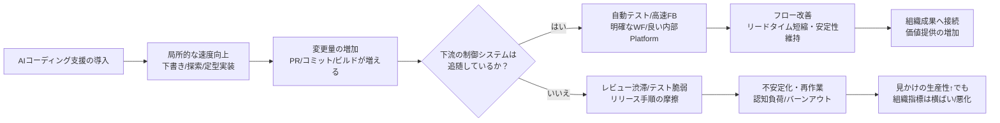

# ソフトウェア開発における開発生産性議論の研究整理と実務示唆

## エグゼクティブサマリー

ソフトウェア開発の「生産性」は、単一の指標で測れないうえ、改善策も“銀の弾丸”にはなりにくい、というのが研究史の出発点です。ブルックス（Fred Brooks）の議論は、開発が難しい理由を「本質的（essence）」と「偶有的（accidents）」に分け、本質的複雑性（複雑性・同調性・可変性・不可視性）が残る限り、単一技術で桁違いの改善を期待するのは誤りだと示しました。citeturn7view1turn7view0turn0search3

測定の面では、近年の主流は「アウトプット量」より「フロー（リードタイム/サイクルタイム/スループット）」「品質・安定性」「開発者体験」を同時に見る方向です。DORAメトリクスは、スピード（デプロイ頻度・変更のリードタイム）と安定性（変更失敗率・復旧時間）を対にして捉える枠組みを与えます。citeturn8view5turn27view0 さらにSPACEは、開発者生産性を「Satisfaction/Performance/Activity/Communication/Efficiency」の“緊張関係にある多次元”として扱い、単一指標最適化の副作用を強く警告します。citeturn24view0

AIの影響は「個人の作業が速くなる」ことと「チーム/組織の生産性が上がる」ことが一致しない点が争点です。Nature Human Behaviour の2020–2023年（106実験・370効果量）のメタ分析は、人間＋AIは平均すると「人間単独よりは良い（augmentation）」一方で「最良の人間またはAI単独には劣る（synergyは平均で成り立たない）」こと、意思決定タスクで損失が出やすく、コンテンツ生成で利益が大きいことを示しました。citeturn8view1

業界レポート側では、DORA（2025）が「AIは増幅器（amplifier）」であり、強い組織はより強く、弱い組織は弱点が露呈する、と総括します。約5,000人規模の調査で、AI利用は90%と“ほぼ普遍”、生産性向上を感じる人が80%超である一方、AI生成コードをほとんど/まったく信頼しない層も約30%存在し、導入はスループット/プロダクト成果に正の相関が出たが、安定性とは負の関係が残る、と述べています。citeturn17view1turn17view2turn17view0 これと整合的に、HBRのRanganathan & Yeは、AIが「仕事を減らす」のではなく期待値上昇やタスク拡張によって「仕事を強める」可能性（生産性上昇と同時に認知的疲労・長時間労働など）を提示しています。citeturn10view0turn9view1

総合すると、実務上の要諦は「AI導入＝生産性向上」と短絡しないことです。AIは局所最適（作成/調査/下書き）を押し上げますが、レビュー・テスト・リリース・運用など下流が追随しないと不安定化や再作業で相殺されます（DORAの“増幅器”仮説）。citeturn17view1turn21view0

## 理論的基礎

ブルックス（Fred Brooks）の『ソフトウェア工学における本質的複雑性（No Silver Bullet）』は、開発生産性議論の“地図”を与えました。

第一に、ソフトウェア構築には「本質的作業」と「偶有的作業」があり、過去の大きな改善の多くは偶有的困難（例：コンピュータ資源制約、扱いにくい言語等）を取り除くことで得られたが、偶有的作業を仮にゼロにしても、全体の大半が本質的作業なら桁違い改善にならない、という問題設定です。citeturn7view0turn7view1

第二に、本質的複雑性として、ソフトウェアが持つ（少なくとも）4つの性質を挙げます。すなわち **complexity（複雑性）**、**conformity（同調性：外部制約への適合）**、**changeability（可変性）**、**invisibility（不可視性）**です。これらは仕様・設計・テストという概念構築の難しさに根差し、表記やツールの改善だけでは消えません。citeturn7view1turn7view0turn0search3

この枠組みが生産性議論に与える示唆は、「どの工程が本質で、どこが偶有か」を明示しない改善論は、効果の見積もりも評価も誤る、という点です。たとえばAIコーディング支援は、偶有的作業（下書き・定型実装・探索）を短縮しやすい一方、概念設計・統合・妥当性確認（本質）を置き換えにくいので、測定が“タイピング速度”や“コード量”に偏ると過大評価が生じます（本質作業の比率が上がるため）。citeturn7view1turn17view1turn8view1

## 測定手法

開発生産性の測定は、歴史的に「投入（工数/コスト）」と「産出（コード量/機能量/成果）」の比（例：SLOC/工数、FP/工数）で議論されてきましたが、その単純化が歪みを生むことを体系的レビューが繰り返し指摘しています。citeturn29view2turn26view0turn26view1

DORAのソフトウェアデリバリ性能指標は、スピードを示す **deployment frequency** と **change lead time**、安定性を示す **change fail rate** と **time to restore service** を中心に設計され、継続的に追うべき“フロー×安定性”の最小セットを提供します。citeturn8view5turn27view0 一方でDORA自身も、ツールやチーム形態によって計測実装が難しい（例：インシデントとデプロイの紐づけ）ことを前提にし、計測設計が実務の肝になります。citeturn29view1turn27view0

SPACEは、開発者生産性を（1）満足・ウェルビーイング（S）、（2）成果/品質（P）、（3）活動量（A）、（4）協働（C）、（5）効率・フロー（E）という多次元で捉え、「指標は単発ではなく緊張関係（trade-off）込みの束で扱うべき」とします。たとえば活動量が増えても、長時間労働や悪いシステムの“力技”で増えているだけなら、生産性の実態は悪化し得る、という指摘です。citeturn24view0turn26view1

加えて近年は、開発者の「時間」を中心にした計測（サイクルタイム/著者時間）が、実験（介入の効果測定）に適したメトリクスとして再評価されています。entity["organization","Meta Platforms, Inc.","tech company"]のDiff Authoring Time（DAT）は、IDE・OS・VCSなどのテレメトリを統合して「変更を作るのに要した時間」を捉え、20以上のプロジェクトで実験・ケーススタディに使用したと報告しています。citeturn29view0turn28search1 これは「アウトプット量」よりも「フローの摩擦」を直接測る方向性で、AI時代の評価軸（“下書きが速い”より“価値が届くまでの時間”）と整合します。citeturn17view1turn29view0

日本語文献では、ファンクションポイント法（FP法）の国際標準化動向や、機能規模（FP）に基づく生産性計測の考え方が整理されています。citeturn26view4 また、国内事例として、SLOCの規模尺度としての問題を踏まえFP生産性を採用しつつ、分布特性（対数正規分布）や平均の扱いなど実務上の落とし穴を論じた資料もあります。citeturn26view3

## 実証研究

開発生産性の実証研究は大きく（A）「生産性概念・測定の実証」と（B）「測定可能な指標を運用に落とす実証」に分かれます。

（A）について、体系的マップ/レビューは、単純な比（例：生産量/工数）のリスクを示し、多変量の生産性評価（例：Data Envelopment Analysis）や、統計的工程管理、シミュレーションなどの方向性を推奨しつつも、全体として証拠の質・比較可能性の不足を課題に挙げています。citeturn29view2 加えて、職務レベルに焦点を当てたシステマティックレビューでは、ソフトウェア技術者の生産性評価として、伝統的なSLOC/Timeや計画単位/Timeが主に使われている、と整理されています（ここでも“何を産出とみなすか”が揺れる）。citeturn26view0

（B）について、DORAメトリクスは実務で広く参照されますが、調査票ベースで粗い粒度・低頻度になりがちで、個別マイクロサービス粒度に落としてリアルタイム算出する提案も出ています。entity["people","Janick Rüegger","software engineering researcher"]らは、DevOpsツールからDORAメトリクスを完全自動で計測・計算し、37マイクロサービスを4週間観察した産業ケーススタディを報告しています。citeturn29view1 この系譜は「測定が遅い/粗いと改善サイクルが回らない」という、計測基盤そのものの生産性論を示唆します。citeturn29view1turn17view1

もう一つの重要線は、リポジトリ由来メトリクス（SLOC、コミット、所有など）の妥当性検証です。entity["people","Edson Oliveira","software engineering researcher"]らは、コード/コミット由来の生産性メトリクスを整理し、SLOC/Timeがコーディング習慣によって誤認を生む脅威（短いコード＝保守性と相関し得るのに、生産性が下がったように見える等）を明示しています。citeturn26view1turn28search8 ここから実務的には、メトリクスを“評価”に直結させるほどゲーミングを誘発し、測定対象（価値・品質・フロー）とズレる、という古典的問題が再確認されます。citeturn24view0turn26view1turn8view5

## 業界レポート

業界レポートは、組織レベルでの「生産性＝価値創出」を強く意識し、測定・投資配分・変革設計（組織能力）を議論します。

BCG（2024）は、AI投資が広がる一方で「価値の実現とスケール」が難しいことを、1,000人規模のCxO/上級幹部調査（59か国、20超セクター）で示します。74%がAI活用から“目に見える価値”を十分に示せておらず、4%のみが全社横断で先進的能力を整え継続的に大きな価値を生む、と区分しています（e.g., leaders）。citeturn9view5turn8view4 ここで示される含意は、開発生産性（IT/開発部門の効率）を“散発的な生産性向上”として扱うだけでは、事業価値に接続しにくい、という点です。citeturn9view5turn8view4

DORA（2025）は、AI支援開発を「ツール導入」ではなく「組織の仕事システムの変革」と捉えます。調査は100時間超の定性データと、世界の約5,000人の技術専門家アンケートに基づき、AIはチームを“修正する”のではなく、既存の強み/弱みを増幅する、と述べます。citeturn17view1turn17view2turn13view0 その上で、社内プラットフォーム品質、ワークフローの明確さ、チームの連携といった基盤が、AIの便益を組織パフォーマンスへ接続する鍵だとしています。citeturn17view1turn17view2

Faros AI（2025）は、AI導入の“テレメトリに基づく生産性パラドックス”を前面に出し、10,000人・1,255チームのワークフローデータ分析として、エンジニアが「より多くのコード変更を完了」しても「会社のメトリクスは横ばい」になり得る、と要約しています。citeturn21view0turn19view0 ただし、公開されているのは主に要旨で、詳細指標や算出法はフルレポート側に依存するため、第三者が再現可能な形での検証は限定的です（ここは学術研究と役割が異なる点として留意が必要です）。citeturn21view0

MIT Sloan（2025）は、AIの利用が広範・普遍化すれば、AI自体は持続的競争優位の源泉になりにくい（市場全体を押し上げるが特定企業だけを有利にしない）と主張し、差別化は従業員の創造性の涵養など別経路に求めるべきだと論じます。citeturn9view3 これは「開発生産性」の議論を、単なる効率化ではなく、プロダクト設計力・顧客価値・組織能力へ広げる論点を提供します。citeturn9view3turn9view5

California Management Review（Insights）は、AIと生産性に関する“証拠の証拠（メタ分析/システマティックレビュー）”をもとに、AI導入と集計レベルの生産性向上の関係が一貫しない、というメッセージを明確に打ち出しています。citeturn9view4 これは、現場の「速くなった感」と組織の「価値が増えた」のギャップを、研究として位置づける材料になります。citeturn9view4turn21view0

image_group{"layout":"carousel","aspect_ratio":"16:9","query":["2025 DORA State of AI-assisted Software Development report cover","BCG Where's the Value in AI 2024 report cover","AI Doesn't Reduce Work It Intensifies It Harvard Business Review illustration"],"num_per_query":1}

## AI影響

AIが開発生産性に与える影響の理解は、「人間＋AIの協働設計」と「ソフトウェア開発のシステム制約」の両方を要します。

まず一般原則として、Nature Human Behaviourのメタ分析は、2020–2023年に発表された106実験の統合結果として、人間＋AIは平均すると“最良の単独（人間またはAI）”に負ける（synergyが平均では成立しない）一方、人間単独よりは改善する（augmentation）という二面性を示しました。また利益は意思決定タスクよりコンテンツ生成で大きく、さらに「人間がAIより優れている領域」では組み合わせが改善しやすいが、「AIが人間より優れている領域」では組み合わせが悪化しやすい、という条件依存性を報告しています。citeturn8view1 これを開発チームに翻訳すると、AIを“最良の一撃”として使う（自動化）か、“人間の生産性底上げ”として使う（支援）か、評価基準を最初に分けないと、導入効果が評価不能になる、という示唆になります。citeturn8view1turn24view0

次にソフトウェア開発固有の実証では、結果が割れています。Googleの開発者を対象にした実験研究（タスク時間を主要アウトカム）は、AI機能に曝露された群の方がタスク完了が速い（平均で96分 vs 114分、21–26%の短縮と推定されるが信頼区間は大きい）と報告しています。citeturn7view3turn6view4 一方、entity["organization","Model Evaluation & Threat Research","ai safety research org"]（METR）のランダム化比較試験は、経験豊富なOSS開発者16名が成熟プロジェクトで246タスクをこなす設定で、AIツール許可条件の方が平均19%遅くなり、参加者・専門家の予測（速くなる）とも逆だった、と報告しました。citeturn7view2turn6view3 この対立は、「タスクの現実性（既存コードベース・品質基準・文脈負荷）」「検証コスト」「ツール習熟」「統合/レビュー/テストの制約」といった条件が、効果の符号まで変えうることを示しています。citeturn6view3turn17view1

より大規模なフィールド実験として、entity["people","Mert Demirer","economics researcher"]らは、企業内のランダム化実験を3件（entity["company","Microsoft","tech company"]、entity["company","Accenture","consulting company"]、匿名企業）分析し、サンプルサイズ（例：Microsoft 1,746人、Accenture 320人、匿名企業 3,054人）や割付方法の違いを整理しています。結果の読み取りには準拠率や割付（ITT/IV）の違いが重要で、平均効果が小さい/不確実な場合でも、在籍年数が短い層などで採用率・効果が大きいといった異質性が観察される点が重要論点になります。citeturn27view1

組織レベルでは、DORA（2025）が「AI導入はスループットやプロダクト成果に正の相関が出たが、安定性とは負の関係が残る」「制御システム（自動テスト、成熟したバージョン管理、速いフィードバック）なしに変更量が増えると不安定化する」と記述しており、AIによる加速が“下流で弱点を露呈”させるという中心仮説を提示します。citeturn17view1turn17view2 ここにFaros AIの「エンジニアの変更量増加が会社指標に接続しない」という要旨を重ねると、AIは“入口（作成）”を広げるが、レビュー/テスト/リリース/運用/意思決定のボトルネックを同時に解かない限り、全体スループットは上がらない、というシステム論的帰結が得られます。citeturn21view0turn17view1

最後に人間系の副作用として、HBRのRanganathan & Yeは、AIツールが生産性を上げても、期待値上昇・タスク拡張・認知負荷増大によって「仕事が強まる」リスクを指摘しています（8か月研究で生産性の急増と同時に認知的疲労や長時間労働が示された、という要約が掲載されています）。citeturn10view0turn9view1 開発組織では、アウトプット加速の圧力がレビュー待ち・品質不安・オンコール負荷に転化すると、離職やバーンアウトとして“隠れたコスト”が顕在化しやすく、SPACEのS（満足・ウェルビーイング）を落とすことで中期的総生産性を下げる、という形で議論を組み立てるのが実務的です。citeturn24view0turn17view1turn9view1

## 表

以下は、指定条件（主に2000–2026、AIは2020–2026重視、公開アクセス優先）に沿って選んだ代表文献の比較です。数値は各原典の表現・推定に依存するため、意思決定では「測定条件（タスク/母集団/工程範囲）」の一致を最優先してください。citeturn29view2turn24view0turn17view1

### 生産性測定手法に関する代表研究の比較

| 文献（年） | 主要な「生産性」観 | 測定/分析の焦点 | データ規模・方法 | 強み | 限界・注意点（実務示唆） |
|---|---|---|---|---|---|
| Forsgren ほか（SPACE）（2021）citeturn24view0 | 多次元（S/P/A/C/E）の緊張関係 | 体験・成果・活動・協働・フロー | 枠組み提示（実務利用例で説明） | 単一指標罠を回避しやすい | 指標設計が重い。導入初期は「最小セット（例：E×P×S）」から始めるのが現実的。citeturn24view0 |
| entity["people","Kai Petersen","software engineering researcher"]（2011）citeturn29view2 | 測定・予測の方法論整理 | 生産性測定/予測のエビデンス地図 | 38研究のシステマティックマップ | 研究領域の俯瞰と妥当性論点が整理される | 単純比（output/input）のリスクを強調。比較可能な設計（妥当性脅威、モデル比較）がないと結論が不安定。citeturn29view2 |
| Hernández‑López ほか（2013）citeturn26view0 | 職務レベルの生産性評価 | 何が入力/出力として使われているか | システマティックレビュー | 実務で使われがちな指標の実態を整理 | SLOC/Time等に偏りやすい。AI時代は「検証・再作業」を別計測しないと誤る。citeturn26view0turn17view1 |
| Oliveira ほか（2020）citeturn26view1turn28search8 | リポジトリ指標の妥当性 | SLOC/Time、複雑度、所有、コミット等 | 指標類型化と脅威整理 | “測れるもの”の限界が具体化 | コーディング習慣、保守性との関係で逆転し得る。評価に使うほどゲーミング誘発。citeturn26view1turn24view0 |
| Rüegger ほか（2024）citeturn29view1 | DORAを運用可能な計測にする | DORAメトリクスの自動算出 | 37マイクロサービス/4週間の産業ケース | DORAを“現場の改善ループ”に接続 | インシデント定義、デプロイ同定など計測設計が前提。ツール統合が未熟だと計測自体が負担。citeturn29view1turn27view0 |
| Beller ほか（DAT）（2025）citeturn29view0turn28search1 | 時間ベース（変更を作る時間） | Diff Authoring Time（DAT） | テレメトリ統合、20+プロジェクトで実験等 | 介入効果（実験）に向く | プライバシー/計測範囲設計が難しい。AI導入評価には“フロー全体”との接続が必要。citeturn29view0turn17view1 |

### AIと開発生産性に関する実証研究の比較

| 研究（年） | データ規模 | 方法 | 主要結果（要旨） | 限界・解釈上の注意 |
|---|---:|---|---|---|
| Google開発者実験（2024）citeturn7view3turn6view4 | N=93前後（条件別46–47） | 実験（AI機能曝露 vs 非曝露）、時間を主要アウトカム | AI曝露群がタスク完了が速い（平均96分 vs 114分、短縮推定）citeturn7view3turn6view4 | タスクが限定的で、工程全体（レビュー/運用等）への波及は別問題。効果推定の不確実性が大きい（CIが広い）と記述。citeturn6view4 |
| METR RCT（2025）citeturn7view2turn6view3 | 16人/246タスク | ランダム化比較試験（AI許可/不許可）、実リポジトリ | AI許可の方が平均19%遅い。参加者・専門家は速くなると予測していたが逆。citeturn7view2turn6view3 | 熟練・文脈重い・品質基準高い状況での結果。一般化は条件依存（著者も示唆）。citeturn6view3 |
| Demirer ほか（2024–2025草稿）citeturn27view1 | 1,746人/320人/3,054人 | 企業内ランダム化実験（アクセス割付/段階導入） | 採用・受容率、アウトカム（PR/コミット/ビルド等）に異質性。短在籍などで採用が高い傾向。citeturn27view1 | ITT/IV、準拠率、割付粒度の違いで平均効果が不明瞭になり得る。指標は工程カバー範囲の制約あり。citeturn27view1 |
| DORA（2025）citeturn17view1turn17view2turn17view0 | 約5,000人 + 定性100時間超 | 調査・分析（相関・クラスター分析等） | AI利用90%。生産性向上を感じる層80%超。スループット/プロダクト成果に正の相関、安定性に負の関係が残る。citeturn17view1turn17view2 | 因果ではなく相関が中心。とはいえ“下流の制御システム不足で不安定化”という仮説を明示。citeturn17view2 |
| Nature Human Behaviour メタ分析（2024）citeturn8view1 | 106実験/370効果量（2020–2023） | システマティックレビュー＋メタ分析 | 人間＋AIは平均すると“最良単独”に負け、意思決定で損失、生成で利益が大きい。相対性能で符号が変わる。citeturn8view1 | ソフトウェア開発に特化ではない。だが協働設計・評価基準（synergy/augmentation）の分離に強い示唆。citeturn8view1 |

## 概念図と参考リンク一覧



参考リンク（DOI / PDF / レポートURL）
```text
Brooks, “No Silver Bullet — Essence and Accidents of Software Engineering”
- PDF: https://www.cs.unc.edu/techreports/86-020.pdf
- IEEE Computer版（概要/ページ）: https://www.computer.org/csdl/magazine/co/1987/04/01663532/13rRUwcS1zv

HBR: “AI Doesn’t Reduce Work—It Intensifies It” (Ranganathan & Ye, 2026-02-09)
- https://hbr.org/2026/02/ai-doesnt-reduce-work-it-intensifies-it
関連Tips（要旨が読める）: https://hbr.org/tip/2026/02/protect-your-team-from-ai-fueled-overload

Nature Human Behaviour: “When combinations of humans and AI are useful: A systematic review and meta-analysis” (2024)
- https://www.nature.com/articles/s41562-024-02024-1

DORA 2025 State of AI-assisted Software Development
- DORAページ: https://dora.dev/research/2025/dora-report/
- Google Cloud（日本語抄訳）: https://cloud.google.com/blog/ja/products/ai-machine-learning/announcing-the-2025-dora-report
- Google Cloud（英語）: https://cloud.google.com/blog/products/ai-machine-learning/announcing-the-2025-dora-report
- DORA metrics guide: https://dora.dev/guides/dora-metrics/
- Four Keys/指標解説: https://cloud.google.com/blog/products/devops-sre/using-the-four-keys-to-measure-your-devops-performance

BCG (2024) Where’s the Value in AI?
- レポートページ: https://www.bcg.com/publications/2024/wheres-value-in-ai
- プレスリリース（調査設計/主要数字）: https://www.bcg.com/press/24october2024-ai-adoption-in-2024-74-of-companies-struggle-to-achieve-and-scale-value

MIT Sloan (2025) “Why AI Will Not Provide Sustainable Competitive Advantage”
- https://shop.sloanreview.mit.edu/store/why-ai-will-not-provide-sustainable-competitive-advantage

California Management Review (2025) “Seven Myths about AI and Productivity: What the Evidence Really Says”
- https://cmr.berkeley.edu/2025/10/seven-myths-about-ai-and-productivity-what-the-evidence-really-says/

SPACE framework (2021)
- PDF（公開コピー）: https://people.uncw.edu/vetterr/classes/csc550-spring2023/The%20SPACE%20of%20Developer%20Productivity.pdf
- DOI（参考）: https://dl.acm.org/doi/10.1145/3453928

Petersen (2011) Measuring and predicting software productivity: A systematic map and review
- PDF: https://romisatriawahono.net/lecture/rm/survey/software%20engineering/Software%20Product%20Lines/Petersen%20-%20Measuring%20and%20predicting%20software%20productivity%20-%202011.pdf

Hernández-López et al. (2013) Software engineering job productivity — a systematic review
- PDF: https://www.rcolomo.com/papers/186.pdf

Oliveira et al. (2020) Code and Commit Metrics of Developer Productivity
- PDF: https://www.igor.pro.br/publica/papers/EMSE2020.pdf

Rüegger et al. (2024) Fully Automated DORA Metrics Measurement for Continuous Improvement
- PDF: https://homepages.ecs.vuw.ac.nz/~craig/publications/icssp2024-ruegger.pdf

Beller et al. (2025) What’s DAT? Three Case Studies of Measuring Software Development Productivity at Meta With Diff Authoring Time
- PDF: https://arxiv.org/pdf/2503.10977

Google開発者タスク速度の実験（2024）
- PDF: https://arxiv.org/pdf/2410.12944

METR（2025）AIが熟練OSS開発者を遅くしたRCT
- PDF: https://arxiv.org/pdf/2507.09089

Demirer et al.（Copilotの企業内ランダム化実験）
- PDF: https://demirermert.github.io/Papers/Demirer_AI_productivity.pdf

Faros AI (2025) AI Productivity Paradox（公開要旨）
- https://www.faros.ai/ai-productivity-paradox

国内：FP法の標準化動向（2013）
- PDF: https://www.zai-keicho.or.jp/data/pdf/software/Sekisan_201309.pdf

国内：FP生産性の分析事例（BIPROGY）
- PDF: https://www.biprogy.com/pdf/tec_info/12902.pdf
```