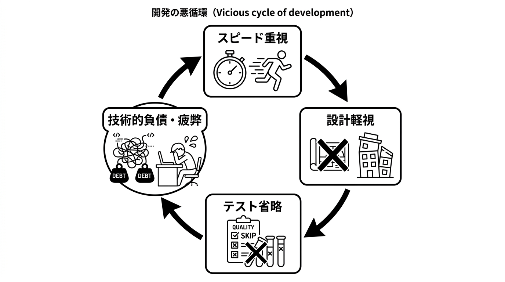
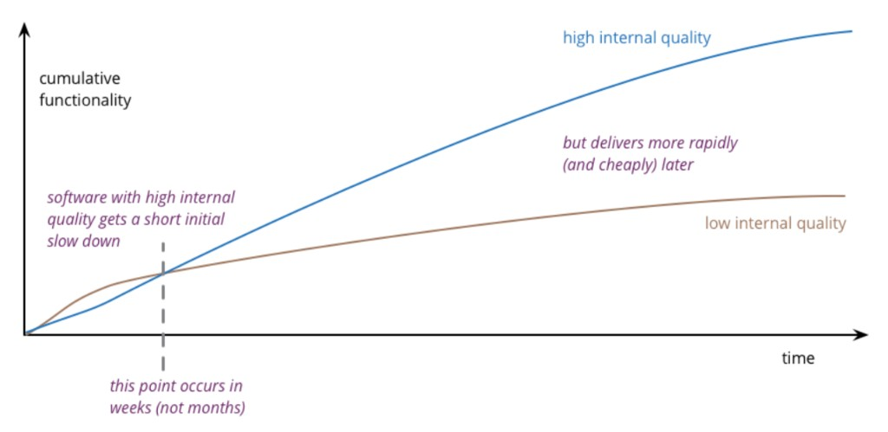
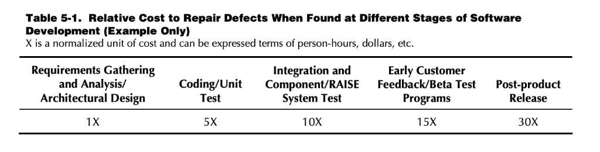
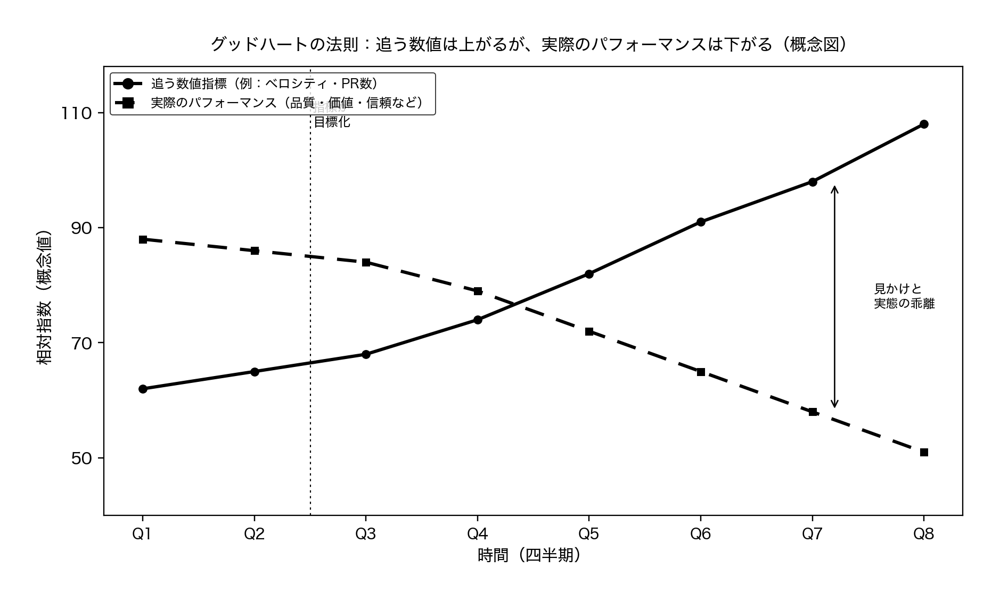
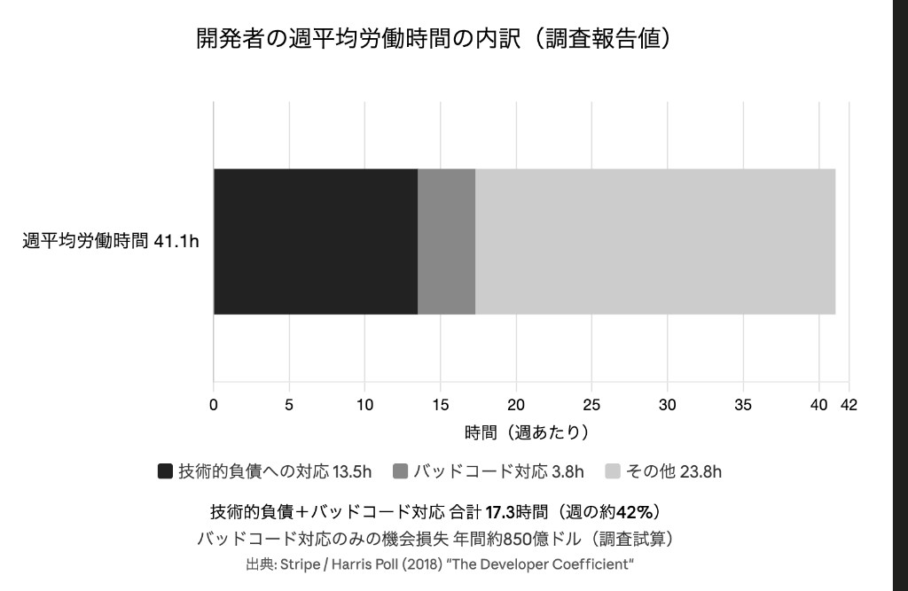
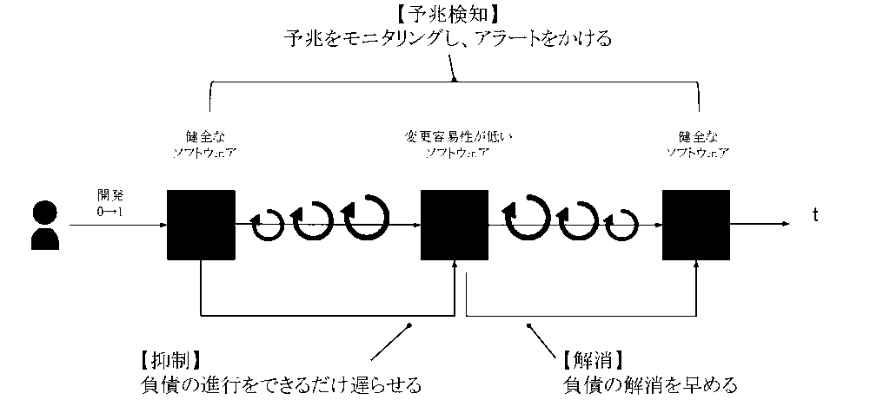
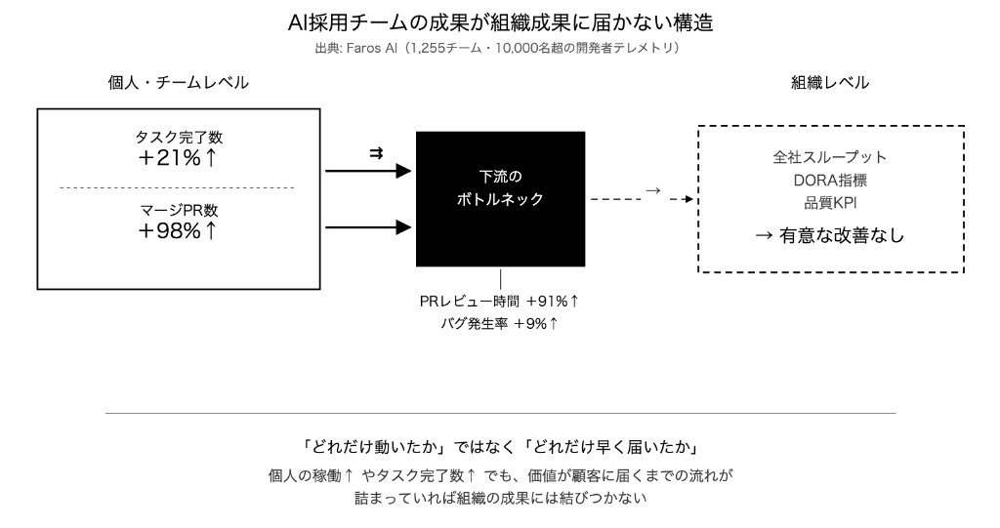
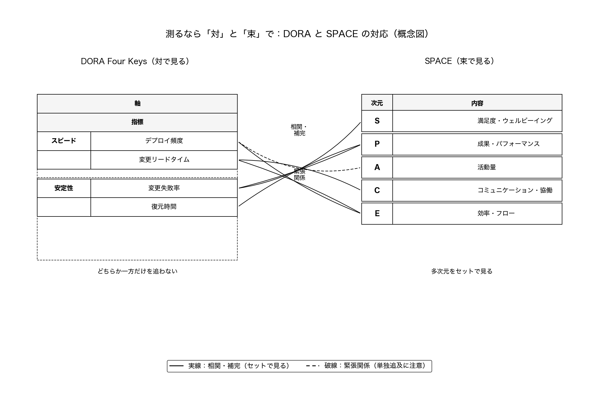
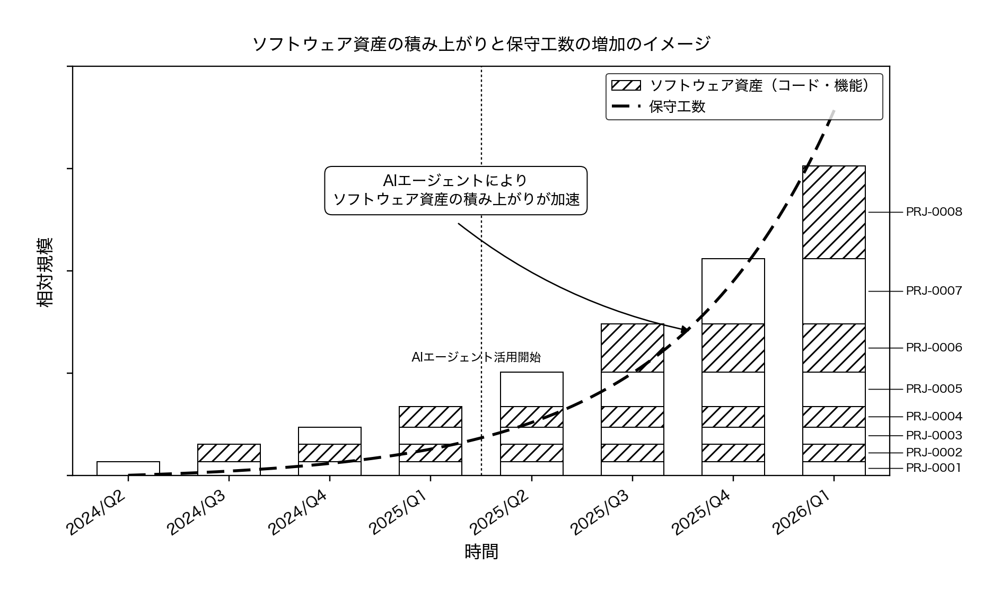
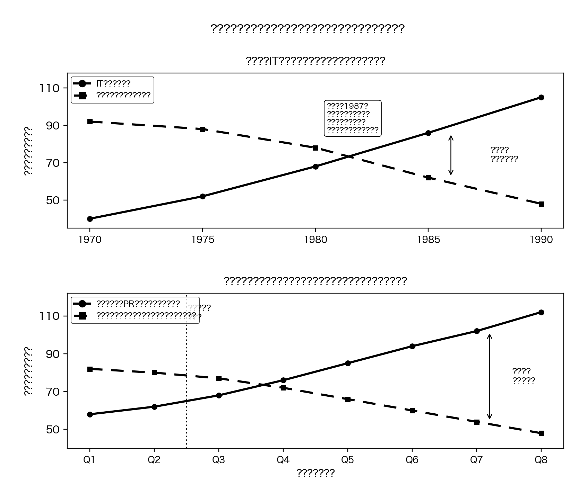

<!--
_class: title
_paginate: false
-->

# わたしたちは 開発生産性を誤解していた

30-40分トーク / 書籍 × 連載「誤解だらけの開発生産性」

石垣雅人 / DMM.com

---

## 今日の問い

「うちの開発、もう少し早くならないか」

この一言のあと、現場で何が起きるか。

 

- 言われる側も、言う側も、居心地が悪い
- 数字で語れと迫られ、測れない仕事が残る
- AI加速と採用停滞が、その溝をさらに広げる

<!--
書籍『わたしたちは開発生産性を誤解していた。』の入口。万能の手法カタログではない。
-->

---

## 今日の地図

5つの誤解を、同じ型でたどります。

 

1. **速く出せば生産性が上がる**
2. **小手先指標による誤解**
3. **測れないから説明できない**
4. **人月の誤解**
5. **標準化の誤解**

 

各セットは **ストーリー概要 → 解説 → 問い**

<!--
物語はフィクション、DMM事例は個別チーム名なし。解決策カタログではなく正しい問いへ。
-->

---

<!-- _class: section -->

# セット1
## 速く出せば生産性が上がるという誤解

短期は速く見える。中長期では崩れる。

---

<!-- _class: story -->

## 「うちの開発って、遅くないか？」

フィクション：書籍第1章より

 

- 部長から突然、開発生産性の改善を求められた
- 同じ週、PMから「来月末リリース必須」
- 要件は大枠のまま、実装が始まる

---

<!-- _class: story -->

## 速さを追った先の一日

- 仕様変更が週に何度も来る
- QAの検証時間が削られ、リリース日だけ動かない
- リリース後30分で障害報告が殺到する

 

これが「開発生産性向上」の結果なのか

---

<!-- _class: explain -->

## 親の主張：速く出せば生産性が上がる？

短期の体感では「速い」。中長期では崩れる。

 

よく見る連鎖：

1. 設計軽視 → 手戻り
2. 品質省略 → 障害の利息
3. 負債蓄積 → 変更が遅くなる
4. チーム疲弊 → 判断力が落ちる

出典：書籍第1章図版

---

<!-- _class: explain -->

## テストを削ればスピードが上がるという誤解

信じがち：検証時間を削れば、リリースは間に合う

- 削った時間は、障害対応として利息で返ってくる
- 内部品質は「速さの敵」ではない

Martin Fowler, Is High Quality Software Worth the Cost?

 

問い：今回のリリースで、削ってよい品質は合意済みか

---

<!-- _class: explain -->

## 動くものを早く出せば仕様は固まるという誤解

信じがち：「変化に柔軟」＝計画不要。まず画面を出す

- 大枠のまま実装すると、仕様変更のたびに設計ごとやり直しになる
- 「変化に柔軟」と「計画不要」は別物

NIST (2002) — 設計段階の1が、後工程で跳ねる

 

問い：動く前に決める最小セットは何か

---

<!-- _class: explain -->

## 「もっと早く」と押せばアウトプットは増えるという誤解

信じがち：プレッシャーをかければ、出せる量が増える

- 圧力は活動量を増やしても、判断力と改善意欲を削る
- 疲弊 → 品質低下 → さらなる残業、のループが回る
- SPACEでも、知覚的生産性に効くのはツールより熱意・支援・フィードバック

 

問い：何を止めて、何を急ぐのか

---

<!-- _class: dmm -->

## 速さの前に揃える三点

活動量指標の前に、関係者でこれを揃える。

 

1. **何のために** 開発生産性を上げるのか
2. **どの指標で** 測定するのか
3. **誰の、何の判断に** その数値を使うのか

 

本質は PR数でもデプロイ頻度でもなく、 
**約束の信頼性**（いつまでに、どの品質で届くか）

---

<!-- _class: dmm -->

## 決済基盤改修で起きた翻訳ミス

- 影響範囲が大きい基盤改修。本来は設計に時間をかける案件
- レポートライン側の意図：**計画の信頼性・期待値の伝達**
- 現場への届き方：**「とにかく早く」＝スピードが正義**

 

意図と翻訳がずれたまま、忙しさと不安だけが残る。

<!--
連載第1回。個別チーム名は出さない。
-->

---

<!-- _class: section -->

# セット2
## 小手先指標による誤解

測ること自体は誤りではない。 
壊れるのは「単一・評価直結・立場無視」。

---

<!-- _class: story -->

## 「数字で示せ」と言われたあと

フィクション：書籍第3〜4章より

 

- 部長は「測れないものは改善できない」と言う
- コード行数・リリース数・ストーリーポイントが並ぶ
- どれも一理ある。どれも完璧ではない

---

<!-- _class: story -->

## 指標が目的化したチーム

- ストーリーポイントの水増し
- 簡単なタスクばかり選んでベロシティを稼ぐ
- リリース頻度のため、変更を細切れに出す

 

リファクタリングや調査は、評価に乗りにくく消えていく。

---

<!-- _class: explain -->

## 測れる数字が正しい生産性という誤解

信じがち：測れる数字＝正しい生産性

立場が違えば、分子も分母も違う。

 

| レベル | 見ているもの | 寄りやすい立場 |
|---|---|---|
| 1 | 仕事量（どれだけこなしたか） | 現場の会話 |
| 2 | 届いた施策 | PM |
| 3 | 売上・KPIへの実貢献 | 経営 |

広木大地「開発生産性について議論する前に知っておきたいこと」(2022)

 

指標が目標になると機能しなくなる（Goodhart）

 

問い：この数字は、誰の・何の判断用か

---

<!-- _class: explain -->

## エンジニアだけが生産性を求められればよいという誤解

信じがち：開発生産性はエンジニアだけの問題だ

- 事業側が見るのは **計画の信頼性**（欲しいタイミングで届くか）
- Four Keys の改善 ≠ 事業側の「良くなった」実感
- 内部健全性の指標を、事業満足の代理にしない

 

書籍第6章図版

 

問い：遅れの説明責任を、誰が・何の言葉で持つか

---

<!-- _class: dmm -->

## ダッシュボードの前に聞く三問

指標を一つ決める前に：

1. 何のためにこの数値を見るのか
2. 誰が、何の判断に使うのか
3. 個人の評価・人事に直結させないか

 

数字をやめるのではなく、**使い方を変える**

---

<!-- _class: section -->

# セット3
## 測れないから説明できないという誤解

測れないことと、 
説明できないことは分ける。

---

<!-- _class: story -->

## 「技術的負債があります」で詰まる

フィクション：書籍第3章より

 

- テックリードは返済の必要性を感じている
- 経営会議では「いくら、何週間、返済すると何が戻るか」を求められる
- 言葉に詰まり、新規開発の優先が続く

---

<!-- _class: explain -->

## 負債は測れないから語れないという誤解

信じがち：負債は測れないから、経営には語れない

- 従来の活動量指標に出ないだけ
- 時間の流出・影響範囲・コスト換算なら語れる

Stripe / Harris Poll (2018) — 自社同一とは限らない。議論の基準線

 

問い：いま失っている開発時間は、だいたい何か

---

<!-- _class: explain -->

## 今動けばよくて、負債はあとで解消すれば良いという誤解

信じがち：今出荷できればよい。利息はあとで払う

- 利息は「あとで」ではなく、次の変更から既に払っている
- 予兆／抑制／解消を混ぜると、火消し専業になる

書籍第3章図版

 

問い：今スプリントで止める利息はどれか

---

<!-- _class: explain -->

## 売上に直結しない作業は優先度を下げてよいという誤解

信じがち：売上に直結しない作業は後回しでよい

- 売上直結しない ≠ 価値がない
- 変更速度・障害コスト・開発スタミナに効く
- 内部品質への投資は、中長期の速さそのもの

 

四観点のうち、当たりやすい二つから定点観測する：

1. 計画と実績の差分
2. 変更・レビュー時間の増加
3. 障害と再発防止策
4. エンゲージメントの低下

 

問い：やらない場合の、来四半期のコスト増は何か

---

<!-- _class: dmm -->

## 現場で始めた三つの打ち手

1. 四観点から二つを選び、四半期でトレンドを見る
2. スプリント計画に返済工数を行として明示する
3. 速度低下をコスト増として一枚にまとめ、上長とのたたき台にする

 

可視化とコスト換算は、共通言語をつくるための先行コスト。

---

<!-- _class: section -->

# セット4
## 人月の誤解

「足りない」を人数に還元すると外れる。

---

<!-- _class: story -->

## 「現有リソースでどうにかしてほしい」

フィクション：書籍第5章より

 

- 競合対応と機能追加の圧力
- 採用してもオンボーディングに時間がかかり、期限に間に合わない
- 「足りないのは、本当に人数なんだろうか」

---

<!-- _class: explain -->

## 人を増やせば速くなるの誤解

信じがち：遅れているなら、人を足せば速くなる

- 逼迫時の増員は、調整・オンボーディングが先に膨らむ
- 『人月の神話』：遅れているプロジェクトへの人員追加は、さらに遅らせうる
- 足りないのは人数ではなく、**「何を作るか」を決める力**かもしれない

 

問い：ボトルネックは実装か、要件・優先順位・合意か

---

<!-- _class: explain -->

## AIを入れれば速くなるの誤解

信じがち：AIを入れれば、組織の生産性は上がる

- 個人の実装が速くなっても、ボトルネックはレビュー・合意・待ちに移る
- AIは**増幅器**。既存の強みも弱みも増幅する
- 既存プロセスに載せるだけでは、頭打ちか混乱が増える

Faros AI, The AI Productivity Paradox (2025)

 

問い：AI前提なら、何を止めて・何を人間が持つか

---

<!-- _class: dmm -->

## 「人が足りない」ときの三軸チェック

人数目標を立てる前に：

1. **戦略**：何を作るかは決まっているか
2. **技術環境**：1年前と同じ前提で人を数えていないか
3. **組織能力**：要件・優先順位・合意が詰まっていないか

 

人を増やす前に、何が本当のボトルネックかを見極める

---

<!-- _class: section -->

# セット5
## 標準化の誤解

全社で同じ数字を追わせること ≠ 
生産性が揃うこと

---

<!-- _class: story -->

## 上が決めた指標を、全員が追う組織

フィクション：書籍第7章より

 

- 全社統一の生産性ダッシュボードが展開される
- チームごとに文脈が違うのに、同じ数字で比較される
- 数値は揃うが、現場の「自分たちで考える」余白が消える

---

<!-- _class: explain -->

## 同じ数字を全チームに当てはめれば比較も改善も進むという誤解

信じがち：同じ数字なら、比較も改善も進む

- 比較のための統一は、文脈差を消し、ゲームを生む
- DORAとSPACEは「対」と「束」。片方を全社公式にしない

連載第2回図版

 

問い：この数字は比較用か、学習用か

---

<!-- _class: explain -->

## トップダウンで決めた指標を追えば現場の生産性は揃うという誤解

信じがち：上が決めた指標を追えば、現場は揃う

- 追従は「数値を追う組織」を作り、改善の主語を奪う
- 揃えるべきは指標のコピーではない
- **目的・使い方・次の打ち手の合意**が先

 

問い：チームが「止められる指標」「変えられる指標」を持っているか

---

<!-- _class: dmm -->

## 標準化の先にあるもの

- トップダウンの統一指標追従から抜ける
- 自分たちで指標を設計し、チームの生産性を考える側へ

 

重圧は消えない。翻訳しながら、判断できるようになる

---

<!-- _class: section -->

# 締め
## 指標は目的ではない

対話のきっかけとして使う

---

## 五つの誤解を一文で

1. **速さ**の前に、目的・指標・約束を揃える
2. **測れる数字**を、正しい生産性と取り違えない
3. **負債は測れないのではなく**、物差しと説明が足りない
4. **足りない**を人数やAIに還元する前に、ボトルネックを見極める
5. **全社統一**で揃うのは数字であって、現場の判断ではない

---

## 明日15分で揃える三問

上司やPMと、メモ一枚でよい。

 

1. 何のために開発生産性を向上させるのか
2. どの指標で測定するのか
3. その数値を誰の、何のために使うのか

 

指標の改善案を出す前に、何のための数字かを揃える

---

## Takeaways

1. 速さ・数字・負債・人月・標準化は、それぞれ別の誤解を持つ
2. スライドに残すのは主張と問い。カタログは口頭へ
3. 指標は目的ではなく、**対話のきっかけ**

---

## 続きはこちら

- 書籍『わたしたちは開発生産性を誤解していた。』
  - https://www.amazon.co.jp/dp/4798194972
- 連載「誤解だらけの開発生産性〜DMM.comで見てきた誤解〜」

 

ご質問・ご感想をお待ちしています

---

<!-- _class: title -->
<!-- _paginate: false -->

# Thank you

Q&A

---

<!--
予備スライド
-->

<!-- _class: section -->

# 予備

時間があれば / 質問向け

---

## 予備：無駄な資産の蓄積

速く出すこと ≠ 価値が届いたこと

連載第1回図版

---

## 予備：生産性パラドックス

投資や活動は増えても、成果の数字に出ないことがある。

連載第3回図版

---

## 予備：認知的負債

- 動いている。テストも通る。誰もなぜかを説明できない
- 出力の加速と、理解の形成が切り離される

 

技術的負債（コード側）＋ 認知的負債（人間側）
